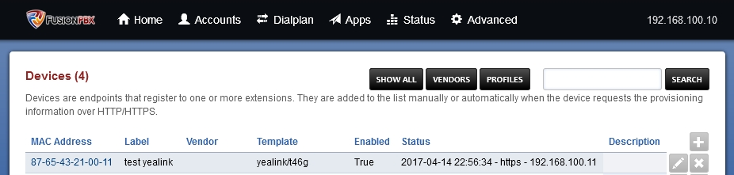
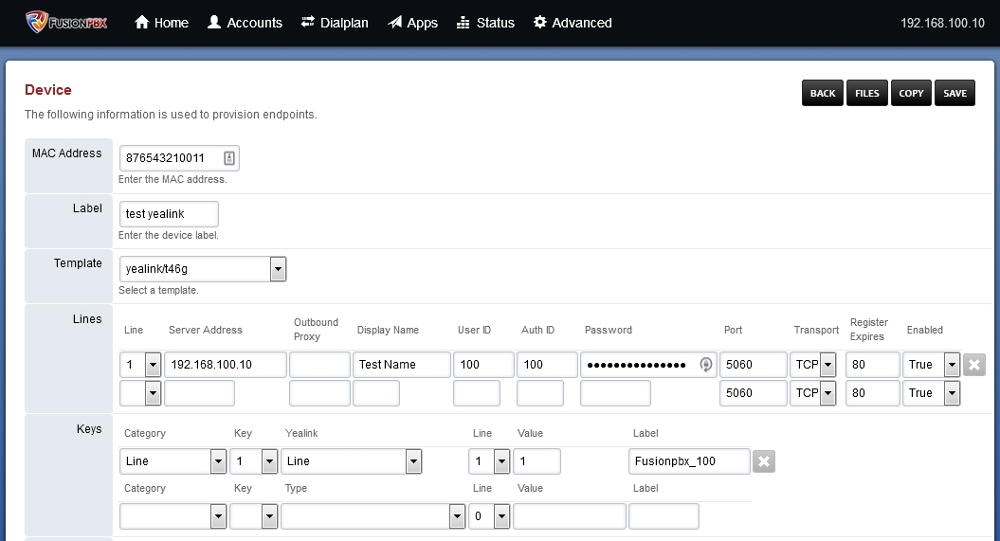
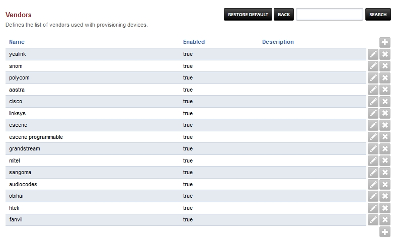
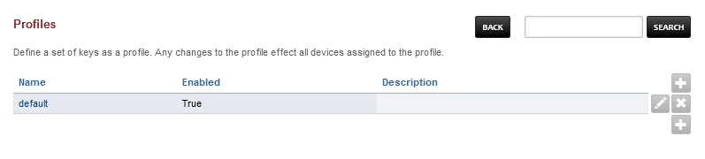

************
Devices
************

Used to define the information needed to assign SIP accounts and keys to provision the devices. 

* Click the plus icon to add a device.
* Click the edit pencil icon to edit a device.

* Enter the mac address of the phone.
* Add a label.
* Select from the drop down box the make/model.
* Populate the lines section.
* Populate the Key section.
* (Optional) Populate the Settings section. These settings are the same as the variables from Advanced > Default Settings > Provisioning and can be overridden in this settings section. Just set the variable for the device you are adding.
* Edit other fields as needed.
* Click Save

* To view steps on how to configure other devices to provision `click here for the provisioning section <http://docs.fusionpbx.com/en/latest/applications/provision.html>`_.

Device Vendors
----------------

Vendors can be added or removed to help fine tune the devices page when configuring specific vendor phones.

Profiles
----------

Define a set of keys as a profile. Any changes to the profile effect all devices assigned to the profile. 

