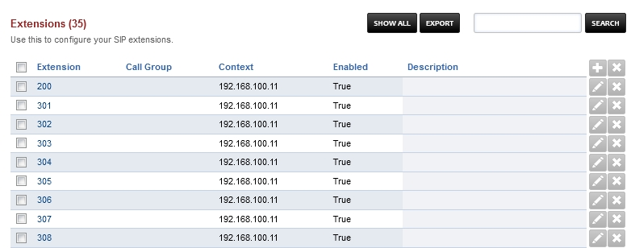

************
Extensions
************

**Extensions** define the information needed for an endpoint such as a hard phone, soft phone or some other device to connect to the SIP server. The extension is the SIP username and the password is the secret used for authentication. The domain name servers (DNS) to purposes it, locates the server to register to and is the realm that determines which domain the endpoint is registering to.

Basic Settings
~~~~~~~~~~~~~~~~

*  Extension 	
    Enter the alphanumeric extension. The default configuration allows 2 - 7 digit extensions.
*  Number Alias 	
    If the extension is numeric then number alias is optional. The primary purpose of this field is when the extension is not a number then the number alias is required. Note a numeric extension and number alias does not currently work.
*  Range 	
    Enter the number of extensions to create. Increments each extension by 1.
*  Voicemail Password 	
    Enter the numeric voicemail password here.
*  Account Code 	
    Used with billing systems if you don't have a billing system then its optional.
*  Effective caller ID Name 	
    Internal Caller ID name
*  Effective Caller ID Number 	
    Internal caller ID number usually set to the extension number.
*  Outbound Caller ID Name 	
    Used by the outbound route for external caller ID name. Business or Organization typically is set here.
*  Outbound Caller ID Number 	
    Used by the outbound route for external caller ID number here. Business or Organization number goes here.
*  Emergency Caller ID Name 	
    This is used when calling out to an emergency service like 911.
*  Emergency Caller ID Number 	
    This is used when calling out to an emergency service like 911.
*  Directory Full Name 	
    The first and last name used in the directory. You can call that directory with *411
*  Directory Visible 	
    Select whether to hide the name from the directory.
*  Directory Extension Visible 	
    Select whether announce the extension when calling the directory.
*  Limit Max 	
    Set max number of outgoing calls for this user.
*  Limit Destination 	
    Set the destination to send the calls when the max number of outgoing calls has been reached.
*  Voicemail Enabled 	
    Enable or disable voicemail for this extension.
*  Voicemail Mail To 	
    The email address for sending voicemail to email.
*  Voicemail File 	
    Select whether to send the voicemail as an attachment or as a link in the email.
*  Voicemail Keep Local 	
    Choose whether to keep the voicemail in the system after sending the email notification.
*  Missed Call 	
    Set the missed call to true and set the email address if you want to receive an email for missed calls that were routed through the dialplan to and was not answered by the extension.
*  Toll Allow 	
    Enter the toll allow value here. (Examples: domestic,international,local) This can be set to any name you want it sets a variable that can be a condition on the outbound routes.
*  Call Timeout 	
    Set the timeout for the call ringing.
*  Call Group 	
    You can define any call group you want the following groups are examples: sales, support, billing. These are used for group intercept or calls can be sent to the call group.
*  Call Screen 	
    If set will ask the caller to identify themselves. Their response will be recorded and offered to the person receiving the call.
*  Record 	
    Whether to record local, inbound, outbound, or all calls that were sent directly to this extension.
*  Hold Music 	
    Select music or ring tones that will be used for music on hold for this extension.
*  Context 	
    The context is set by default to match the domain name or IP addres. It is usually correct by default and doesn't need to be changed in most cases.

*  Enabled
    Extension enabled or disabled.
*  Description
    A description for the extension.

Advanced Settings
~~~~~~~~~~~~~~~~~~~

Advanced settings in extensions. Be sure to know what and why you are changing these settings or you will risk causing issues for the extention.

*  Auth ACL
    Advanced auth acl uses.
*  CIDR
    Advanced cidr uses.
*  SIP Force Contact
    Choose whether to rewrite the contact port, or rewrite both the contact IP and port.
*  SIP Force Expires
    To prevent stale registrations SIP Force expires can override the client expire.
*  MWI Account
    MWI Account with user@domain of the voicemail to monitor.
*  SIP Bypass Media
    Choose whether to send the media stream point to point or in transparent proxy mode.
*  Absolute Codec String
    Absolute Codec String for the extension.
*  Force ping
    Use OPTIONS to detect if extension is reacheable.
*  Domain
    The domain the extension is currently saved on.
*  Dial String
    Location of the endpoint.
    

Caller ID Select
~~~~~~~~~~~~~~~~

**Extension Caller ID input type select**

If you want extension caller ID name and number to be a input type text then make sure permission outbound_caller_id_select assigned to groups in Groups Manager.  By default outbound_caller_id_select is not assigned to any user groups.

**Extension Caller ID input type select**

If you want a select option for caller ID then you would want to assign outbound_caller_id_select permission to groups of your choice using Group Manager and define Caller ID information in Dialplan Destinations.
