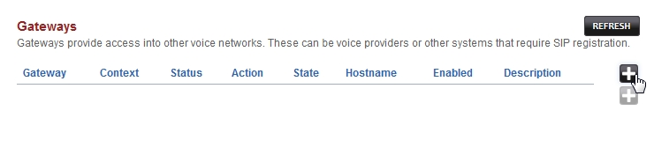
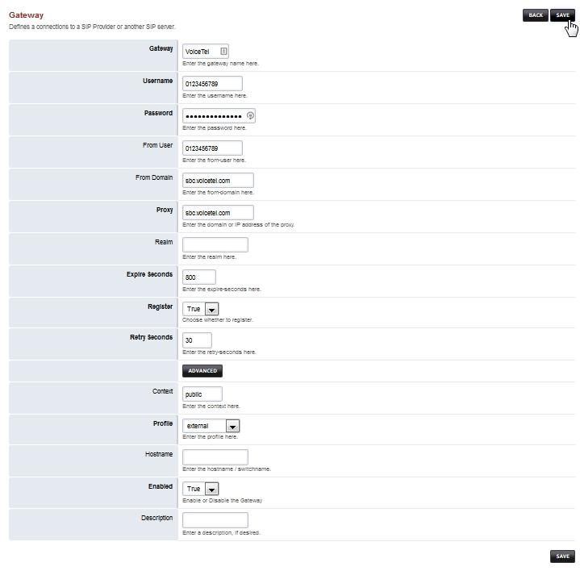

Gateway
=========

.. image:: ../_static/images/logo_right.png
        :scale: 85%
  

Gateways provide access into other voice networks. These can be voice providers or other systems that require SIP registration.  `Check out the Youtube video <https://youtu.be/YKOTACDYQ3A>`_ .

.. raw:: html

    

    <iframe width="100%" height="350" src="https://www.youtube.com/embed/YKOTACDYQ3A?rel=0" frameborder="0" ; encrypted-media" allowfullscreen></iframe>
    

**In this example we will be using** `VoiceTel <http://tiny.cc/voicetel>`_ .  **Each Gateway provider has their own setings to use.**    

`Click to visit <http://tiny.cc/voicetel>`_  

Select **Accounts** from the drop-down list and click on **Gateways**. 

.. image:: ../_static/images/fusionpbx_gateway.jpg
        :scale: 85%

Click the 

.. image:: ../_static/images/plus.png
        :scale: 85%

button on the right. Enter the gateway information below and Click on **Save** once complete.

::

  Gateway: VoiceTel 
  Username: 0123456789 
  Password: 1b3d5f7h9j 
  From user: 0123456789 
  From domain: sbc.voicetel.com 
  Proxy: sbc.voicetel.com 
  Register: true 
  Enabled: true 

|

