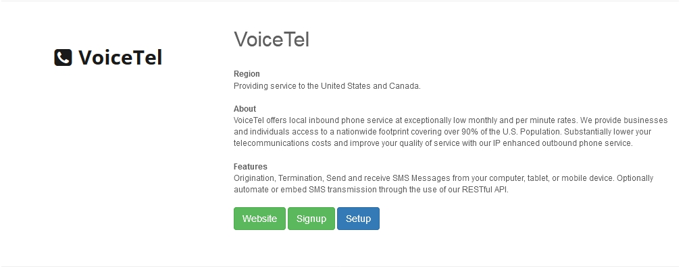
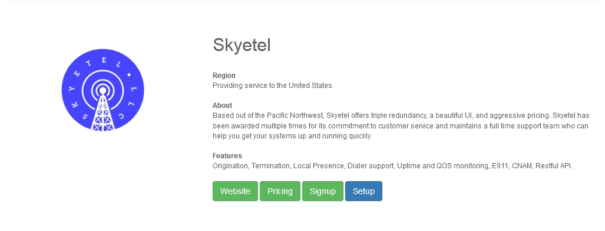

************
Providers
************

(Master Branch) List of VoIP providers that support FusionPBX.  This feature provides a simple and fast way to add gateways, outbound routes and access control lists that will enable calls through the carrier to the public switched telephone network (PSTN).

