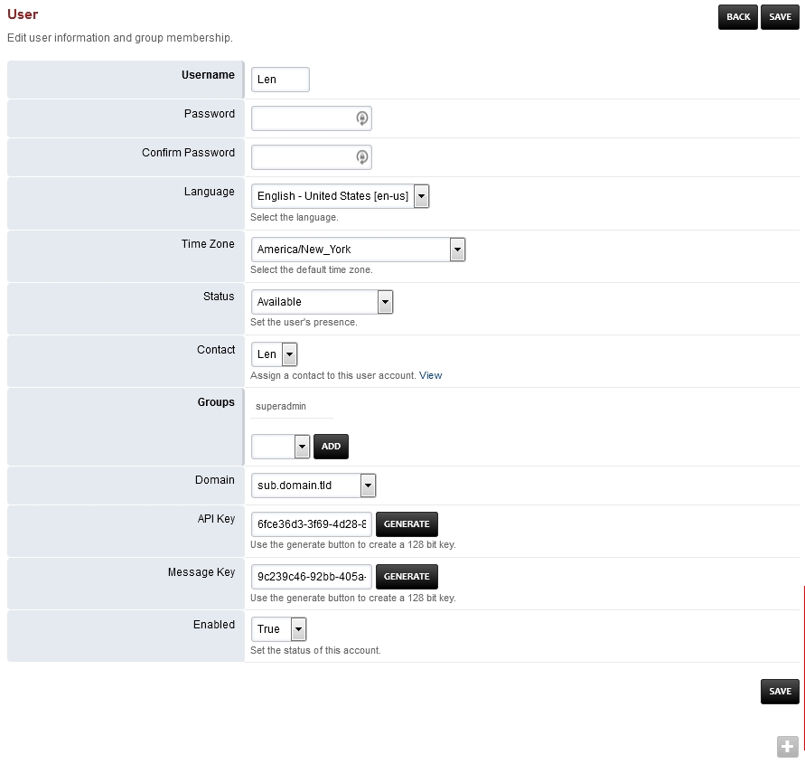

************
Users
************

Define the users information to login to the web interface.

*  Username
    User id to be used to login.
*  Password
    Secret password used to login.
*  Language
    Per user language to override the domain or global language.
*  Time Zone 	
    Per user time zone only needed if it needs to be different from the global time zone.
*  Status
    Set the user's presence.
*  Contact
    Assign a contact to this user account. View
*  Groups
    The group the user is assigned.
*  Domain
    The domain the user is assigned to.
*  API Key
    Generates an API Key
*  Message Key
    Generates a Key to use with Messages Application.
*  Enable
    Whether the user is enabled.

`Users Default Settings`_
---------------------------------------

Click the link above for Users default settings.

.. _Users Default Settings: /en/latest/advanced/default_settings.html#id31

