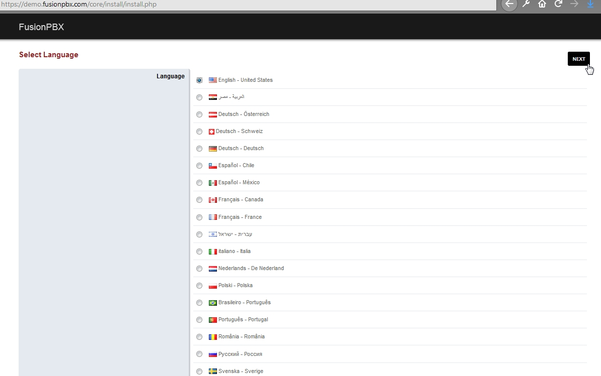

#######################
Password Reset
#######################

`Click here for the new youtube video on password recovery. <https://youtu.be/YrlfscQ_3ew>`_ 

.. raw:: html

    

    <iframe width="100%" height="350" src="https://www.youtube.com/embed/YrlfscQ_3ew?rel=0" frameborder="0" ; encrypted-media" allowfullscreen></iframe>
    

The current method to changing the superadmin password is actually to make a new superadmin user name and password.

.. note::
       In older installations of FusionPBX config.php is located in /var/www/fusionpbx/resources/

1. Move the config.php file temporarily.

::

 cd /etc/fusionpbx
 mv config.php config1.php
 cat config1.php | grep password

|
2. Go to the FusionPBX install login page in the web browser.  This will put FusionPBX into a recovery mode.  Choose the language for your region and **click next.**

.. note::

 You will type in your web browser either the ip hxxps://xxx.xxx.xxx.xxx or  the domain name hxxps://sub.domain.tld .
 

|

3.  In this step, you create what you want for the new superadmin user and password.  It has to be a user and password that **does not already exist.**

.. image:: ../_static/images/fusionpbx_password_recovery.jpg
        :scale: 85%

4. Database Host, Database Port, Database name should be pre filled.  To provide the Database Username and Database Password you will have to locate those in the config.php file that we moved eariler. The code block below shows an easy way to retrieve the database password. Once those are filled in click **next.**

::
 
 cd /etc/fusionpbx
 cat config1.php | grep password
        $db_password = 'databasepasswordfromconfig.php';

.. image:: ../_static/images/fusionpbx_database_configuration.jpg
        :scale: 85%

5. You should have a new config.php file in the /etc/fusionpbx/  directory.  Proceed to login to with the new superadmin user name and password.

|

-----------------------------------------------------

|

|

|

|

**Old Password Reset**
^^^^^^^^^^^^^^^^^^^^^^

| The steps below are outdated but useful for older installations up to version 4.0. Here are some rough steps to change the password of the database. The password can only be changed and not recovered.

|

| The database contains a table called **v_users** which contains the username, password and salt. The password is the md5 hash of the password and the salt. 

**Password Hash**
^^^^^^^^^^^^^^^^^

| Use the following commands to generate the password hash. Don't forget to provide your own salt and password.

::

 echo '<?php $salt = "random-salt-goes-here";$password = "put your password here"; echo md5($salt.$password)."\n"; ?>' > /tmp   /test.php

| Run the php file from command line.

::

 php /tmp/test.php

**SQLite**
^^^^^^^^^^^

| Install sqlite3 which can be be used to modify the database fusionpbx.db. Then open the database with the following:
 
::

 sqlite3 fusionpbx.db

**PostgreSQL**
^^^^^^^^^^^^^^^

| Connect to the PostgreSQL database. Once you are running psql you can use:

* \\l to list the databases.
* \\c to connect to one of them.
* After running the SQL Query then use \q to quit.

::

 su postgres
 psql
 \c fusionpbx

**Change the Password**
^^^^^^^^^^^^^^^^^^^^^^^^

The hashed password and the salt can be updated using the command:

::

 update v_users set password = 'replace-with-password-hash-from-php-script', salt = 'replace-with-your-random-salt' where       username = 'superadmin';
 
 
