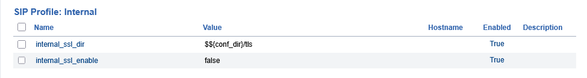
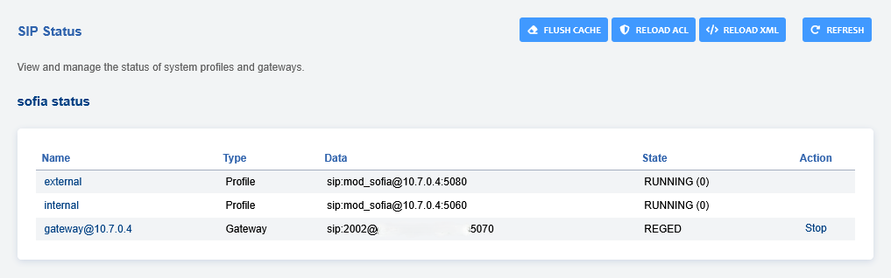
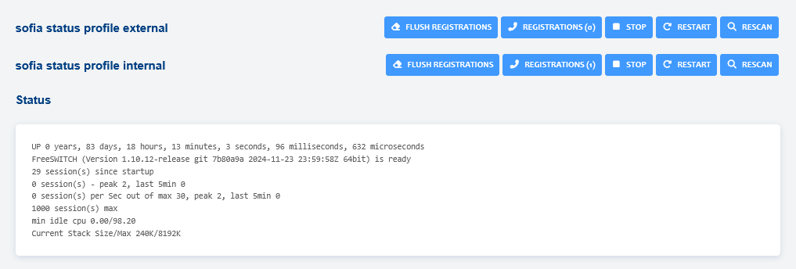
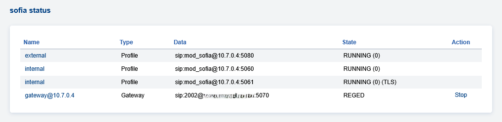

# SSL/TLS Setup

On a new installation of FusionPBX, TLS for SIP is available to use once
you run [letsencrypt.sh](../getting_started/lets_encrypt.md) and make
a few setting changes in FusionPBX.

## Configure TLS

Configuration for SIP to use TLS can be achieved with the following
steps.

-   First open an ssh terminal or console window.
-   cd /usr/src/fusionpbx-install.sh/debian/resources/
-   Execute [letsencrypt.sh](../getting_started/lets_encrypt.md)
-   Login to your FusionPBX installation.
-   Navigate to **Advanced** > **Variables**.
-   Scroll down to **SIP Profile: Internal**.

:::{note}   
This can be applied to any SIP Profile   
:::   

-   Set **internal_ssl_enable** value to **true** in lowercase.
-   Navigate to **Status** > **SIP Status**.
-   Click **FLUSH CACHE** at the top right.

-   Click **Rescan** on the profile.

-   You should now see at the right under **State** (RUNNING)(0)(TLS)

