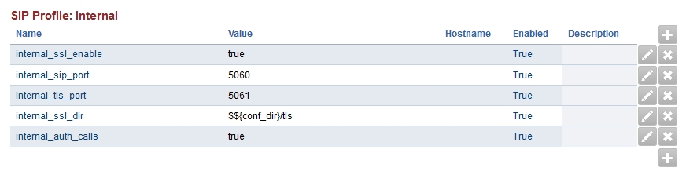
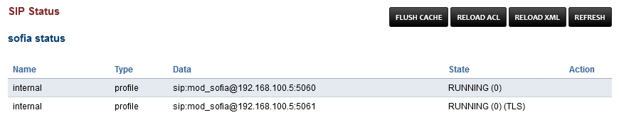

*****************
SSL/TLS Setup
*****************

On a new installation of FusionPBX, TLS for SIP is available to use once you run `letsencrypt.sh <../getting_started/lets_encrypt.html>`_ and make a few setting changes in FusionPBX.

Configure TLS
^^^^^^^^^^^^^^^

Configuration for SIP to use TLS can be achieved with the following steps.

* First open an ssh terminal or console window.

* cd /usr/src/fusionpbx-install.sh/debian/resources/

* Execute `letsencrypt.sh <../getting_started/lets_encrypt.html>`_

* Login to your FusionPBX installation.

* Go to Advanced > Variables.

* Scroll down to **SIP Profile:** Internal (This can be done on any SIP Profile)

* Set **internal_ssl_enable** value to **true** in lowercase.

* Go to Status > SIP Status.

* Click **FLUSH CACHE** at the top right.

* Click **Rescan** on the profile.

* You should now see at the right under **State** (RUNNING)(0)(TLS)

