Using SNGREP
^^^^^^^^^^^^^^^^

Main Screen
~~~~~~~~~~~~

* **Idx:** Line number column.

* **Method:** Type of SIP message column.

* **SIP From:** SIP message From column.

* **SIP To:** SIP message To column.

* **Msgs:** Numerical amount of messages column.

* **Source:** Source IP and port number column.

* **Destination:** Destination IP and port number column.

* **Call State:** Call identifier column. 

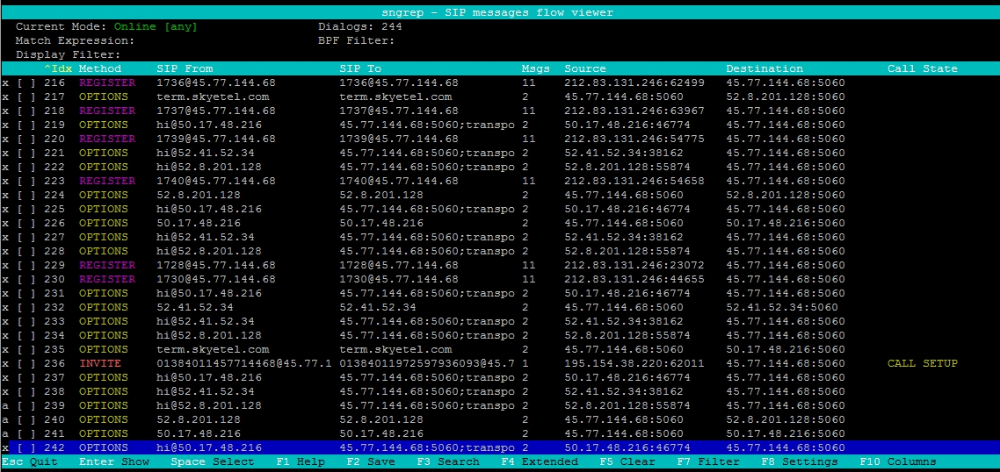

* **ESC Quit:** escape and quit sngrep.

* **Enter:** Show more information about the highlighted line item.

* **Space:** After pressing the spacebar, the line is selected.  With this you can select multiple lines and can be used with the F2 save option.

* **F1 Help:** Gives a help menu.

* **F2 Save:** Option to save the current capture session dialogs to a .pcap or .txt to a specific path and file name.

* **F3 Search:** Gives the option to search in a more specific and granular way.

* **F4 Extended:** Gives an extended view.

* **F5 Clear:** Clear the screen.

* **F7 Filter:** Like search but with more options to filter the end result.

* **F8 Settings:** Adjust SNGREP settings interface, capture options, call flow options,  and EEP/HEP Homer options.

* **F10:** Adjust what columns are displayed on the open sngrep window.

SPAM
~~~~~~

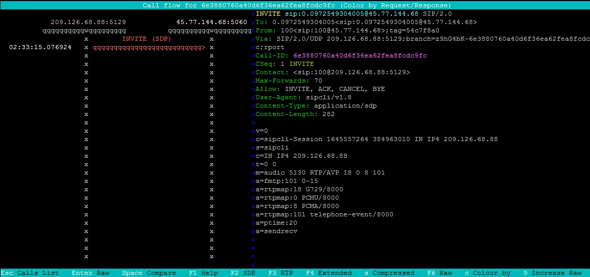

* **User-Agent:** Most spam attempts will show an unwanted User-Agent like what is shown in this example.

Registration
~~~~~~~~~~~~~~

.. image:: ../_static/images/additional_information/fusionpbx_sngrep_register.jpg
        :scale: 80%

Registration Expanded
~~~~~~~~~~~~~~~~~~~~~~~

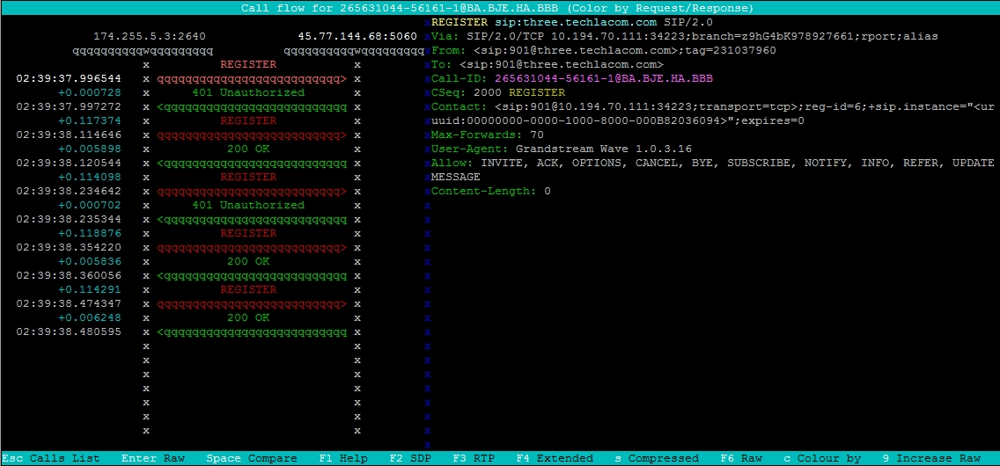

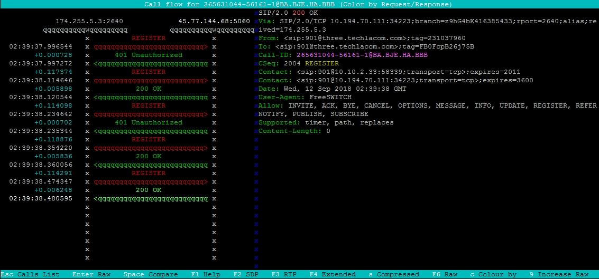

Call Setup
~~~~~~~~~~~~

**Invite**

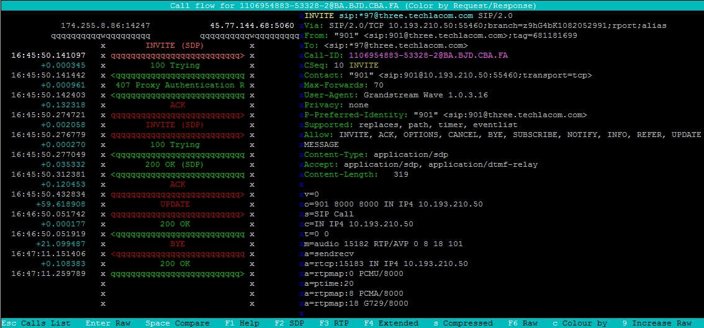

**200 OK**

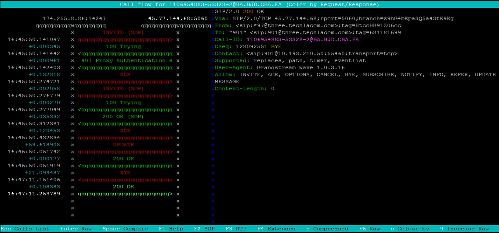

**Call Completed**

F3 Search
~~~~~~~~~~~

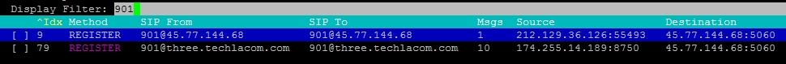

F7 Filter
~~~~~~~~~~~

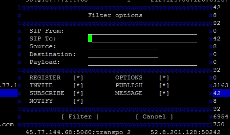

F8 Settings
~~~~~~~~~~~~~

**Interface**

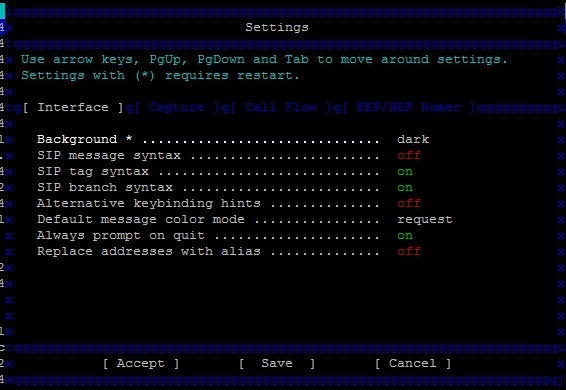

**EEP/HEP HOMER**

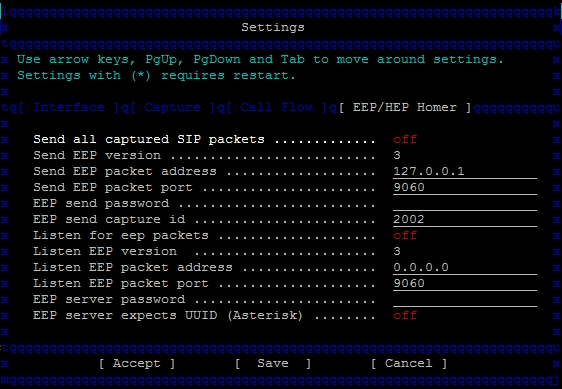

**Call Flow**

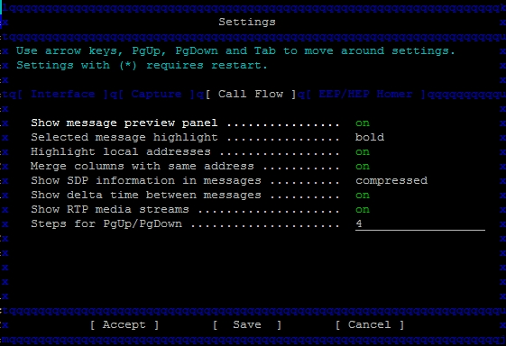

**Capture**

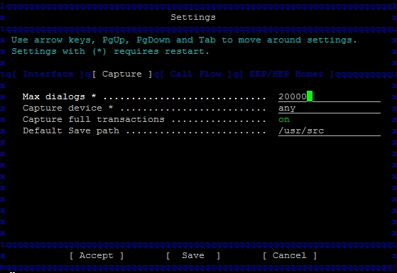

