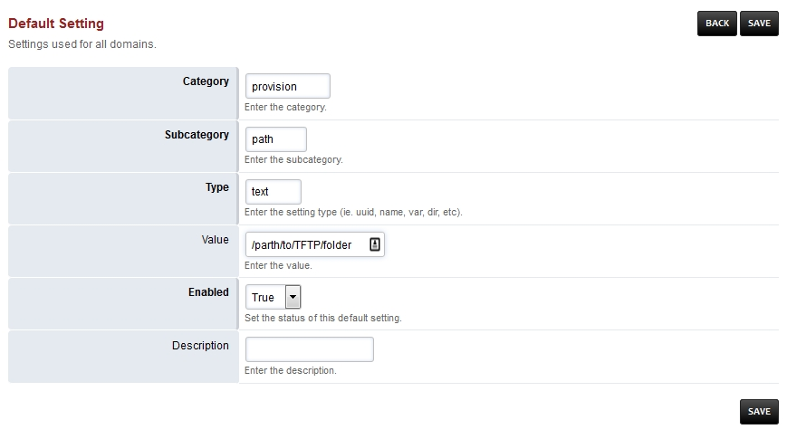

*******
TFTP
*******

Several models of phone out there that still only use TFTP for provisioning.  Even though they have reached end of life, some of the popular ones are the Cisco 7960 and 7940. Also would need to add the TFTP port to the server firewall but this should be allowed only to specific IP addresses as TFTP has no security. Recommend to use TFTP only as a last resort for phones that don't support HTTPS.

**Install TFTPD**

::

 apt-get install tftpd
 service xinetd

**Change the configuration**

::

 edit the /etc/xinetd.d/tftp
 
**Enable TFTP in FusionPBX Gui**

Goto Advanced > Default Settings > Provision
 
Set Enabled to **True** and define the path to where the TFTP files will be.
 

**Test TFTP**

::

 tftp x.x.x.x
 get 000000000000.cnf

**See the file getting requested for tftp**

::

 tail -f /var/log/syslog | grep tftp
 
