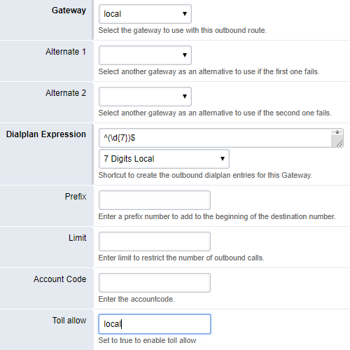
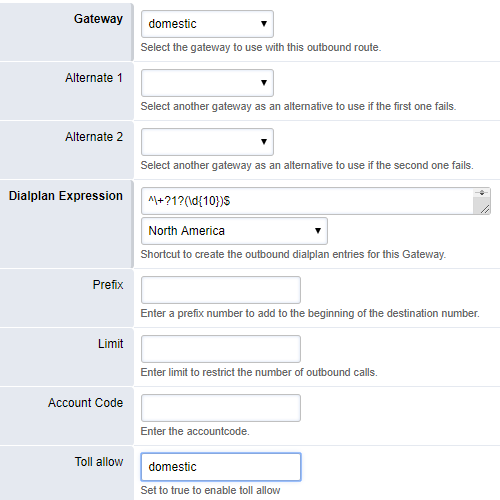
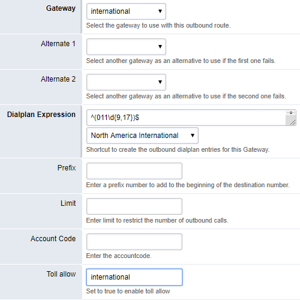
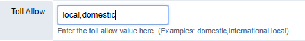
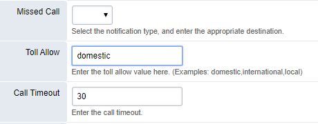
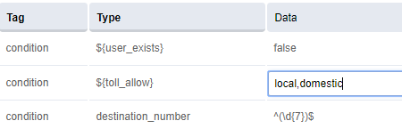

###########
Toll Allow
###########

Toll Allow is a variable that can be set per extension. It allows you to limit who can make what type of calls. Note that although the variable is provided in the extension configuration, the default dialplan DOES NOT make use of it. Therefore if you want to use it you need to add statements to the dialplan to enable it.

An example for the contents of the toll_allow variable would be:

You can then add information to your dialplan to process this variable.  In the example XML below, if the valid allow value isn't present then an extension shouldn't be able to dial out.  However extension -> extension should still work.

The following code are example XML for standard outbound routes (Dialplan->OutboundRoutes).  Effectively you are applying an additional condition to EACH outbound route that you want to limit.  So in the FusionPBX GUI select an outbound route and add

::

 condition, type "${toll_allow}", data "local".
 Order is important, this should be the FIRST condition of your outbound route.

You'll need to do that for all of your outbound routes, tag them local, domestic, or international depending on what they are.
On some installations this example file will be present in /usr/local/freeswitch/conf/dialplan/default/01_example.com.xml:

PERMIT TOLL CALLS
^^^^^^^^^^^^^^^^^^ 

This example assumes all calls are bad (except internal) unless they are flagged as good by the value of the toll_allow variable.

::

   <include>
   <extension name="local.example.com">
   <condition field="${toll_allow}" expression="local"/>
   <condition field="destination_number" expression="^(\d{7})$">
     <action application="set" data="effective_caller_id_number=${outbound_caller_id_number}"/>
     <action application="set" data="effective_caller_id_name=${outbound_caller_id_name}"/>
     <action application="bridge" data="sofia/gateway/${default_gateway}/1${default_areacode}$1"/>
   </condition>
   </extension>

   <extension name="domestic.example.com">
   <condition field="${toll_allow}" expression="domestic"/>
   <condition field="destination_number" expression="^(\d{11})$">
     <action application="set" data="effective_caller_id_number=${outbound_caller_id_number}"/>
     <action application="set" data="effective_caller_id_name=${outbound_caller_id_name}"/>
     <action application="bridge" data="sofia/gateway/${default_gateway}/$1"/>
   </condition>
   </extension>

   <extension name="international.example.com">
   <condition field="${toll_allow}" expression="international"/>
   <condition field="destination_number" expression="^(011\d+)$">
     <action application="set" data="effective_caller_id_number=${outbound_caller_id_number}"/>
     <action application="set" data="effective_caller_id_name=${outbound_caller_id_name}"/>
     <action application="bridge" data="sofia/gateway/${default_gateway}/$1"/>
   </condition>
   </extension>
   </include>

| 

PREVENT TOLL CALLS
^^^^^^^^^^^^^^^^^^ 

 
This example takes the opposite approach and is how to PREVENT toll calls.
The below example takes the opposite approach. It assumes that all calls are good unless they are flagged as bad.

Put this in your advanced dialplan. In the toll allow of whatever extension you wanted to restrict put the value 'local'.  This example **restricts from calling 10 or 11 digit numbers.**

::

   <extension name="localcalls" >
   <condition field="${toll_allow}" expression="local"/>
   <condition field="destination_number" expression="(^\d{10}$|^\d{11}$)">
   <action application="hangup"/>
   </condition>
   </extension>
  
TOLL ALLOW EXAMPLE
^^^^^^^^^^^^^^^^^^

This example outlines how to setup three levels of permitted call types. **local** **domestic** **international**

* Local calls in example assumes 7 digit phone numbers.
* Domestic calls in example assumes 10 or 11 digit North American numbers.
* International calls in example assumes 011 Noth American international prefix.

Create new outbound route for each permission level.  In this example there is a gateway for each type of route.

	**Local** Outbound Route

|

	**Domestic** Outbound Route

|

	**International** Outbound Route

|

Edit extensions with proper toll_allow variables to permit use of new outbound routes.
	Each extension can have multiple permissions listed in toll_allow.

Extension with **local** and **domestic** calling permission can dial out via both the "local" and "domestic" outbound routes above

| 
Extension with only **domestic** variable assigned can only dial the 10 or 11 digit numbers in the "domestic" outbound route

Outbound routes can also have multiple toll_allow patterns.  For example, if you only define a single variable per extension, you would probably want the *domestic* permission to include *local* calls

Edit **local** outbound route to include extensions with only *domestic* defined.

With the above toll_allow condition test, if an extension has either "local" or "domestic" assigned they are allowed to use the **local** outbound route
