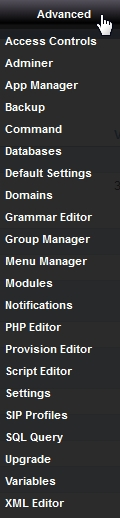

************
Advanced
************

|
In the Advanced menu you will find Access Controls, Adminer, App Manager, Backup, Command, Databases, Default Settings, Domain, Grammer Editor, Group Manager, Menu Manager, Modules, Notifications, PHP Editor, Provision Editor, Script Editor, Settings, SIP Profiles, SQL Query, Upgrade, Variables and XML Editor.

|
Welcome to the adding a domain section.  Here you will find how to add a domain so that you can reach the specific tenant from
the multi-tenant domain side menu to configure and allow secure administration from the world wide web. 

.. toctree::
  :maxdepth: 3
  :glob:

  advanced/domains.rst
  advanced/upgrade.rst

