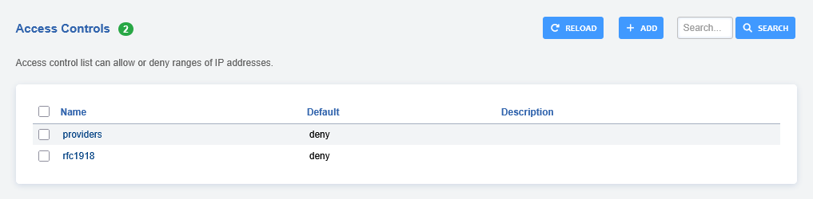
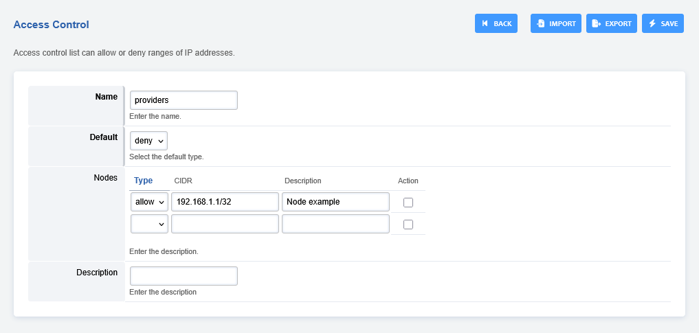
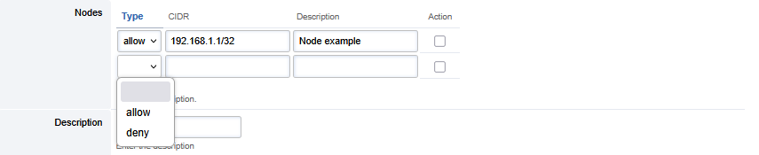
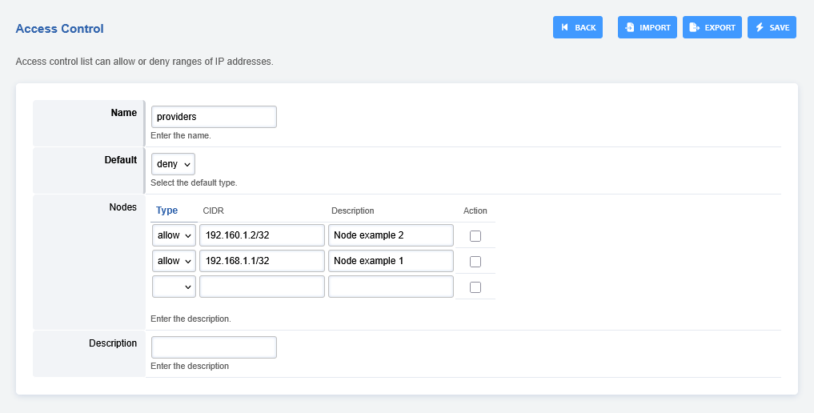

# Access Controls

Access control list can allow or deny ranges of IP addresses. There are
several purposes for using the ACL.

**providers - access conroll list**

The main purpose of the Providers list is for your voip provider (carrier) IP addresses 
to the CIDR.

Be careful with what and how you use ACL. Most common mistakes result in    
calls not working between extensions and other undesirable results.   

:::{improtant}   
Make sure you keep the **providers** access control (formerly known as   
"domains") as default "**deny**".   

Do not put your public ip or phone IP addresses in the domains access control list.   

Avoid putting both the domain and cidr on the same node.   
:::   

If adding a single IP address to the CIDR field make sure to add /32   
at the end of the IP address.   

## Access Control Example

- Goto **Advanced** > **Access Controls**.



- Click the **providers** tab.



- Under **nodes** select the **Type** to **allow** or **deny**.



- Add the desired IP address under **CIDR** and add a description (optional).
- Then click save. 



:::{note}   
In the example below, make sure to change the 12.34.56.0 to   
your VoIP providers IP address if adding to the providers access control list.   
:::   

```
    Type choose allow
    CIDR enter the 12.34.56.0/32
    Domain (Leave Blank, used for advanced scenarios)
    Description (Carrier Name)
```

- Click save.
- Then navigate to **Status** > **Sip Status** and click **reloadacl**.

:::{note}   
Under **Status** > **Log viewer** you should notice the ip added. This can be   
seen also from command line fscli by using **reloadacl**.   
:::

```
    [NOTICE] switch_utils.c:545 Adding 12.34.56.0/32 (allow) [] to list domains
```
