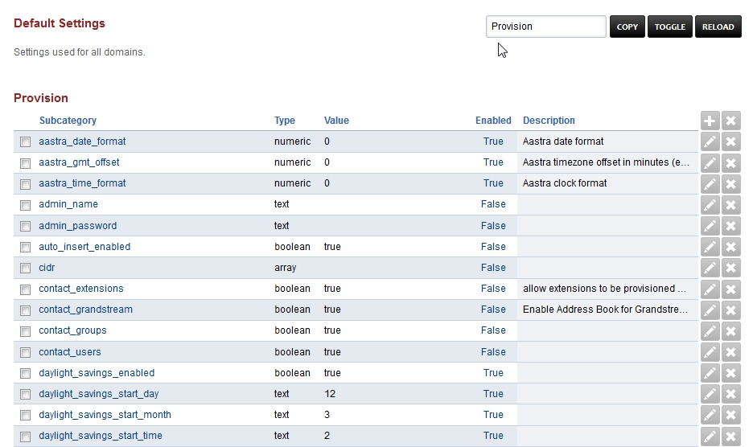

# Default Settings

Default Settings used for all domains. Branding can be done in this
section, [see here to
adjust](../advanced/domains.html#override-a-default-setting-for-one-domain)
or copy settings to specific domains.

Default Settings have several different categories. Click on the
category to view more details.

## [Cache](default_settings/cache.html)

Option to use file cache for xml and not memcache.

  ------------------------------------------------------------------------
  Default Setting Default     Default      Default       Default Setting
  Subcategory     Setting     Setting      Setting       Description
                  Name        Value        Enabled       
  --------------- ----------- ------------ ------------- -----------------
  method          text        memcache     TRUE          Cache methods
                                                         file or memcache.

  location        text        /tmp         TRUE          Location for the
                                                         file cache.
  ------------------------------------------------------------------------

## [Call Center](default_settings/call_center.html)

FusionPBX menu [Apps \> Call Center](../applications/call_center.html)

Defaults for the amount of agent rows for Call Center.

  --------------------------------------------------------------------------------------
  Default Setting Subcategory    Default     Default      Default       Default Setting
                                 Setting     Setting      Setting       Description
                                 Name        Value        Enabled       
  ------------------------------ ----------- ------------ ------------- ----------------
  agent[add_rows]{#add_rows}     numeric     5            TRUE          Number of
                                                                        default \"add\"
                                                                        rows.

  agent[edit_rows]{#edit_rows}   numeric     1            TRUE          Number of
                                                                        default \"edit\"
                                                                        rows.
  --------------------------------------------------------------------------------------

## [CDR](default_settings/cdr.html)

FusionPBX menu [Apps \> CDR](../applications/call_detail_record.html)

CDR Stat hour limit, call leg, format, limit, http[enabled]{#enabled},
archive database, and storage type settings can be set here.

  ---------------------------------------------------------------------------------------------------------
  Default Setting Subcategory                      Default     Default      Default      Default Setting
                                                   Setting     Setting      Setting      Description
                                                   Name        Value        Enabled      
  ------------------------------------------------ ----------- ------------ ------------ ------------------
  stat[hours_limit]{#hours_limit}                  numeric     24           FALSE        

  b[leg]{#leg}                                     array       outbound     FALSE        

  b[leg]{#leg}                                     array       inbound      FALSE        

  b[leg]{#leg}                                     array       local        FALSE        

  format                                           text        json         TRUE         

  limit                                            numeric     800          TRUE         

  http[enabled]{#enabled}                          boolean     TRUE         TRUE         

  archive[database_driver]{#database_driver}       text        pgsql        FALSE        Archive Database
                                                                                         Driver

  archive[database_host]{#database_host}           text                     FALSE        IP/Hostname of
                                                                                         Archive Database

  archive[database_password]{#database_password}   text                     FALSE        Archive Database
                                                                                         Password

  archive[database_port]{#database_port}           text        5432         FALSE        Archive Database
                                                                                         Port

  archive[database_username]{#database_username}   text                     FALSE        Archive Database
                                                                                         Username

  storage                                          text        db           TRUE         

  archive[database]{#database}                     boolean     FALSE        FALSE        Enable Dedicated
                                                                                         CDR Database
                                                                                         Access

  archive[database_name]{#database_name}           text        fusionpbx    FALSE        Archive Database
                                                                                         Name
  ---------------------------------------------------------------------------------------------------------

## [Dashboard](default_settings/dashboard.html)

FusionPBX menu [Home \> Dashboard](../home/dashboard.html)

Different user level settings that control what is seen and not seen on
the dashboard for each user access level.

  -------------------------------------------------------------------------------------------------------
  Default       Default   Default Setting Value                 Default   Default Setting Description
  Setting       Setting                                         Setting   
  Subcategory   Name                                            Enabled   
  ------------- --------- ------------------------------------- --------- -------------------------------
  admin         array     voicemail                             TRUE      Enable Dashboard Voicemail
                                                                          block for users in the admin
                                                                          group.

  admin         array     missed                                TRUE      Enable Dashboard Missed Calls
                                                                          block for users in the admin
                                                                          group.

  admin         array     recent                                TRUE      Enable Dashboard Recent Calls
                                                                          block for users in the admin
                                                                          group.

  admin         array     limits                                FALSE     Enable Dashboard Domain Limits
                                                                          block for users in the admin
                                                                          group.

  admin         array     counts                                TRUE      Enable Dashboard Domain Counts
                                                                          block for users in the admin
                                                                          group.

  admin         array     ring[groups]{#groups}                 TRUE      Enable Dashboard Ring Group
                                                                          Forwarding controls for users
                                                                          in the admin group.

  admin         array     caller[id]{#id}                       FALSE     Enable changing Caller ID name
                                                                          and number.

  superadmin    array     voicemail                             TRUE      Enable Dashboard Voicemail
                                                                          block for users in the
                                                                          superadmin group.

  superadmin    array     missed                                TRUE      Enable Dashboard Missed Calls
                                                                          block for users in the
                                                                          superadmin group.

  superadmin    array     recent                                TRUE      Enable Dashboard Recent Calls
                                                                          block for users in the
                                                                          superadmin group.

  superadmin    array     limits                                FALSE     Enable Dashboard Domain Limits
                                                                          block for users in the
                                                                          superadmin group.

  superadmin    array     counts                                TRUE      Enable Dashboard System Counts
                                                                          block for users in the
                                                                          superadmin group.

  superadmin    array     call[routing]{#routing}               TRUE      Enable Dashboard Call Routing
                                                                          controls for users in the
                                                                          superadmin group.

  superadmin    array     caller[id]{#id}                       FALSE     Enable changing Caller ID name
                                                                          and number.

  superadmin    array     ring[groups]{#groups}                 TRUE      Enable Dashboard Ring Group
                                                                          Forwarding controls for users
                                                                          in the superadmin group.

  user          array     voicemail                             TRUE      Enable Dashboard Voicemail
                                                                          block for users in the users
                                                                          group.

  user          array     missed                                TRUE      Enable Dashboard Missed Calls
                                                                          block for users in the users
                                                                          group.

  user          array     recent                                TRUE      Enable Dashboard Recent Calls
                                                                          block for users in the users
                                                                          group.

  user          array     call[routing]{#routing}               TRUE      Enable Dashboard Call Routing
                                                                          controls for users in the users
                                                                          group.

  user          array     ring[groups]{#groups}                 TRUE      Enable Dashboard Ring Group
                                                                          Forwarding controls for users
                                                                          in the users group.

  user          array     caller[id]{#id}                       FALSE     Enable changing Caller ID name
                                                                          and number.

  admin         array     call[routing]{#routing}               TRUE      Enable Dashboard Call Routing
                                                                          controls for users in the admin
                                                                          group.

  superadmin    array     system                                TRUE      Enable Dashboard System Status
                                                                          block for users in the
                                                                          superadmin group.

  agent         array     call[center_agents]{#center_agents}   TRUE      Enable Dashboard Call Center
                                                                          Agent Status block for users in
                                                                          the agent group.
  -------------------------------------------------------------------------------------------------------

## [Destinations](default_settings/destinations.html)

FusionPBX menu [Dialplan \> Destinations](../dialplan/destinations.html)

Destinations specific defaults.

  -------------------------------------------------------------------------------------
  Default Setting Subcategory   Default      Default      Default       Default Setting
                                Setting Name Setting      Setting       Description
                                             Value        Enabled       
  ----------------------------- ------------ ------------ ------------- ---------------
  dialplan[details]{#details}   boolean      TRUE         TRUE          

  -------------------------------------------------------------------------------------

## [Domains](default_settings/domain.html)

FusionPBX menu [Advanced \> Domains](../advanced/domains.html)

Domain specific defaults.

+-----+---+---------------------------------------+----+-------------+
| D   | D | Default Setting Value                 | D  | Default     |
| efa | e |                                       | ef | Setting     |
| ult | f |                                       | au | Description |
| S   | a |                                       | lt |             |
| ett | u |                                       | S  |             |
| ing | l |                                       | et |             |
| Su  | t |                                       | ti |             |
| bca | S |                                       | ng |             |
| teg | e |                                       | E  |             |
| ory | t |                                       | na |             |
|     | t |                                       | bl |             |
|     | i |                                       | ed |             |
|     | n |                                       |    |             |
|     | g |                                       |    |             |
|     | N |                                       |    |             |
|     | a |                                       |    |             |
|     | m |                                       |    |             |
|     | e |                                       |    |             |
+=====+===+=======================================+====+=============+
| dia | t | {sip[i                                | TR | > The dial  |
| l[s | e | nvite_domain]{#invite_domain}=\${doma | UE | > string    |
| tri | x | in[name]{#name}},leg[timeout]{#timeou |    | > used      |
| ng] | t | t}=\${call[timeout]{#timeout}},presen |    |             |
| {#s |   | ce[id]{#id}=\${dialed[user]{#user}}@\ |    |             |
| tri |   | ${dialed[domain]{#domain}}}\${sofia[c |    |             |
| ng} |   | ontact]{#contact}(\*/\${dialed[user]{ |    |             |
|     |   | #user}}@\${dialed[domain]{#domain}})} |    |             |
+-----+---+---------------------------------------+----+-------------+
| te  | n | default                               | TR | > The       |
| mpl | a |                                       | UE | > template  |
| ate | m |                                       |    | > used      |
|     | e |                                       |    |             |
+-----+---+---------------------------------------+----+-------------+
| m   | u | b4750c3f-2a86-b00d-b7d0-345c14eca286  | TR | > The menu  |
| enu | u |                                       | UE | > uuid      |
|     | i |                                       |    |             |
|     | d |                                       |    |             |
+-----+---+---------------------------------------+----+-------------+
| la  | c | en-us                                 | TR | > Choose    |
| ngu | o |                                       | UE | > the       |
| age | d |                                       |    | > language  |
|     | e |                                       |    |             |
+-----+---+---------------------------------------+----+-------------+
| c   | a |                                       | F  | > Allow     |
| idr | r |                                       | AL | > only      |
|     | r |                                       | SE | > specific  |
|     | a |                                       |    | > ip        |
|     | y |                                       |    | > addresses |
|     |   |                                       |    | > access    |
+-----+---+---------------------------------------+----+-------------+
| c   | c | us                                    | TR | > The       |
| oun | o |                                       | UE | > country   |
| try | d |                                       |    | > code      |
|     | e |                                       |    |             |
+-----+---+---------------------------------------+----+-------------+
| bri | t | outbound                              | TR | outbound,l  |
| dge | e |                                       | UE | oopback,lcr |
|     | x |                                       |    |             |
|     | t |                                       |    |             |
+-----+---+---------------------------------------+----+-------------+
| pag | n | 100                                   | TR | Set the     |
| ing | u |                                       | UE | maximum     |
|     | m |                                       |    | number of   |
|     | e |                                       |    | records     |
|     | r |                                       |    | displayed   |
|     | i |                                       |    | per page.   |
|     | c |                                       |    | (Default:   |
|     |   |                                       |    | 50)         |
+-----+---+---------------------------------------+----+-------------+
| ti  | n | America/Los[Angeles]{#angeles}        | TR | Time zone   |
| me[ | a |                                       | UE | used.       |
| zon | m |                                       |    | Follows     |
| e]{ | e |                                       |    | UNIX format |
| #zo |   |                                       |    |             |
| ne} |   |                                       |    |             |
+-----+---+---------------------------------------+----+-------------+

## [Editor](default_settings/domain.html)

FusionPBX menu Advanced \> php editor, grammar editor, provision editor,
and xml editor.

Editor specific defaults.

  ----------------------------------------------------------------------------------------
  Default Setting Subcategory Default   Default   Default    Default Setting Description
                              Setting   Setting   Setting    
                              Name      Value     Enabled    
  --------------------------- --------- --------- ---------- -----------------------------
  indent[guides]{#guides}     boolean   FALSE     FALSE      Set the default visibility of
                                                             indent guides for Editor.

  invisibles                  boolean   FALSE     FALSE      Set the default state of
                                                             invisible characters for
                                                             Editor.

  line[numbers]{#numbers}     boolean   FALSE     FALSE      Set the default visibility of
                                                             line numbers for Editor.

  theme                       text      Cobalt    FALSE      Set the default theme.

  font[size]{#size}           text      14px      FALSE      Set the default text size for
                                                             Editor.

  live[previews]{#previews}   boolean   FALSE     FALSE      Enable or disable live
                                                             previewing of syntax, text
                                                             size and theme changes.
  ----------------------------------------------------------------------------------------

## [Email](default_settings/email.html)

This is where you configure email settings to receive email
notifications of voicemail, missed calls and fax.

Here are some example settings for some of the most common email
providers.

-   [SMTP2GO](http://docs.fusionpbx.com/en/latest/advanced/default_settings/smtp2go.html)
-   [GMAIL](http://docs.fusionpbx.com/en/latest/advanced/default_settings/gmail.html)

+---------+-------+----------+--------+-----------------------------+
| Default | De    | Default  | D      | Default Setting Description |
| Setting | fault | Setting  | efault |                             |
| Subc    | Se    | Value    | S      |                             |
| ategory | tting |          | etting |                             |
|         | Name  |          | E      |                             |
|         |       |          | nabled |                             |
+=========+=======+==========+========+=============================+
| smt     | text  | mail.ser | TRUE   | > email providers server    |
| p[host] |       | ver.prov |        | > address                   |
| {#host} |       | ider.com |        |                             |
+---------+-------+----------+--------+-----------------------------+
| smt     | text  | <emailex | TRUE   | > smtp from emaill address  |
| p[from] |       | ample@em |        |                             |
| {#from} |       | ailprovi |        |                             |
|         |       | der.com> |        |                             |
+---------+-------+----------+--------+-----------------------------+
| smt     | nu    | 587      | TRUE   | port number of the mail     |
| p[port] | meric |          |        | server provider             |
| {#port} |       |          |        |                             |
+---------+-------+----------+--------+-----------------------------+
| smtp[f  | text  | V        | TRUE   | > smtp from name            |
| rom_nam |       | oicemail |        |                             |
| e]{#fro |       |          |        |                             |
| m_name} |       |          |        |                             |
+---------+-------+----------+--------+-----------------------------+
| smt     | text  | TRUE     | TRUE   | > If smtp auth is required  |
| p[auth] |       |          |        |                             |
| {#auth} |       |          |        |                             |
+---------+-------+----------+--------+-----------------------------+
| smtp    | text  | > user   | TRUE   | > typically the email user  |
| [userna |       | > name   |        | > name                      |
| me]{#us |       |          |        |                             |
| ername} |       |          |        |                             |
+---------+-------+----------+--------+-----------------------------+
| smtp    | text  | > supe   | TRUE   | > typically the email       |
| [passwo |       | rsecurep |        | > password                  |
| rd]{#pa |       | assword! |        |                             |
| ssword} |       |          |        |                             |
+---------+-------+----------+--------+-----------------------------+
| smtp[se | text  | tls      | TRUE   | > tls or ssl depending on   |
| cure]{# |       |          |        | > the provider.             |
| secure} |       |          |        |                             |
+---------+-------+----------+--------+-----------------------------+
| smtp[va | bo    | TRUE     | TRUE   | set to false to ignore SSL  |
| lidate_ | olean |          |        | certificate warnings e.g.   |
| certifi |       |          |        | for self-signed             |
| cate]{# |       |          |        | certificates                |
| validat |       |          |        |                             |
| e_certi |       |          |        |                             |
| ficate} |       |          |        |                             |
+---------+-------+----------+--------+-----------------------------+
| method  | text  | smtp     | TRUE   | smtp[\|sendmail\|](##SU     |
|         |       |          |        | BST##|sendmail|)mail\|qmail |
+---------+-------+----------+--------+-----------------------------+

Error log for failed or sucessfully sent messages.

-   [Email
    Log](http://docs.fusionpbx.com/en/latest/advanced/default_settings/email_error_log.rst)

## [Fax](default_settings/fax.html)

[Apps \> Fax Server](../applications/fax_server.html)

Specific default settings for fax server.

+----------+------+----------+-------+------------------------------+
| Default  | Def  | Default  | De    | Default Setting Description  |
| Setting  | ault | Setting  | fault |                              |
| Sub      | Set  | Value    | Se    |                              |
| category | ting |          | tting |                              |
|          | Name |          | En    |                              |
|          |      |          | abled |                              |
+==========+======+==========+=======+==============================+
| co       | text |          | TRUE  | Path to image/logo file      |
| ver[logo |      |          |       | displayed in the header of   |
| ]{#logo} |      |          |       | the cover sheet.             |
+----------+------+----------+-------+------------------------------+
| allowe   | a    | .pdf     | TRUE  | > Allowed extension to send  |
| d[extens | rray |          |       | > .pdf                       |
| ion]{#ex |      |          |       |                              |
| tension} |      |          |       |                              |
+----------+------+----------+-------+------------------------------+
| allowe   | a    | .tif     | TRUE  | > Allowed extension to send  |
| d[extens | rray |          |       | > .tif                       |
| ion]{#ex |      |          |       |                              |
| tension} |      |          |       |                              |
+----------+------+----------+-------+------------------------------+
| allowe   | a    | .tiff    | TRUE  | > Allowed extension to send  |
| d[extens | rray |          |       | > .tiff                      |
| ion]{#ex |      |          |       |                              |
| tension} |      |          |       |                              |
+----------+------+----------+-------+------------------------------+
| cover[   | text |          | FALSE | Default information          |
| header]{ |      |          |       | displayed beneath the logo   |
| #header} |      |          |       | in the header of the cover   |
|          |      |          |       | sheet.                       |
+----------+------+----------+-------+------------------------------+
| p        | text | letter   | TRUE  | Set the default page size of |
| age[size |      |          |       | new faxes.                   |
| ]{#size} |      |          |       |                              |
+----------+------+----------+-------+------------------------------+
| re       | text | fine     | TRUE  | Set the default transmission |
| solution |      |          |       | quality of new faxes.        |
+----------+------+----------+-------+------------------------------+
| variable | a    | f        | TRUE  | Enable T.38.                 |
|          | rray | ax[enabl |       |                              |
|          |      | e_t38]{# |       |                              |
|          |      | enable_t |       |                              |
|          |      | 38}=true |       |                              |
+----------+------+----------+-------+------------------------------+
| variable | a    | fa       | TRUE  | Send a T38 reinvite when a   |
|          | rray | x[enable |       | fax tone is detected.        |
|          |      | _t38_req |       |                              |
|          |      | uest]{#e |       |                              |
|          |      | nable_t3 |       |                              |
|          |      | 8_reques |       |                              |
|          |      | t}=false |       |                              |
+----------+------+----------+-------+------------------------------+
| variable | a    | ignore   | TRUE  | Ignore ringing to improve    |
|          | rray | [early_m |       | fax success rate.            |
|          |      | edia]{#e |       |                              |
|          |      | arly_med |       |                              |
|          |      | ia}=true |       |                              |
+----------+------+----------+-------+------------------------------+
| kee      | boo  | TRUE     | TRUE  | Keep the file after sending  |
| p[local] | lean |          |       | or receiving the fax.        |
| {#local} |      |          |       |                              |
+----------+------+----------+-------+------------------------------+
| s        | text | queue    | FALSE | > Send mode. queue is        |
| end[mode |      |          |       | > default.                   |
| ]{#mode} |      |          |       |                              |
+----------+------+----------+-------+------------------------------+
| send[re  | num  | 5        | TRUE  | Number of attempts to send   |
| try_limi | eric |          |       | fax (count only calls with   |
| t]{#retr |      |          |       | answer).                     |
| y_limit} |      |          |       |                              |
+----------+------+----------+-------+------------------------------+
| send[    | num  | 15       | TRUE  | Delay before we make next    |
| retry_in | eric |          |       | call after answered call.    |
| terval]{ |      |          |       |                              |
| #retry_i |      |          |       |                              |
| nterval} |      |          |       |                              |
+----------+------+----------+-------+------------------------------+
| sen      | num  | 3        | TRUE  | Number of unanswered         |
| d[no_ans | eric |          |       | attempts in sequence.        |
| wer_retr |      |          |       |                              |
| y_limit] |      |          |       |                              |
| {#no_ans |      |          |       |                              |
| wer_retr |      |          |       |                              |
| y_limit} |      |          |       |                              |
+----------+------+----------+-------+------------------------------+
| s        | num  | 30       | TRUE  | Delay before we make next    |
| end[no_a | eric |          |       | call after no answered call. |
| nswer_re |      |          |       |                              |
| try_inte |      |          |       |                              |
| rval]{#n |      |          |       |                              |
| o_answer |      |          |       |                              |
| _retry_i |      |          |       |                              |
| nterval} |      |          |       |                              |
+----------+------+----------+-------+------------------------------+
| send[no  | num  | 3        | TRUE  | Giveup reach the destination |
| _answer_ | eric |          |       | after this number of         |
| limit]{# |      |          |       | sequences.                   |
| no_answe |      |          |       |                              |
| r_limit} |      |          |       |                              |
+----------+------+----------+-------+------------------------------+
| send[    | num  | 300      | TRUE  | Delay before next call       |
| no_answe | eric |          |       | sequence.                    |
| r_interv |      |          |       |                              |
| al]{#no_ |      |          |       |                              |
| answer_i |      |          |       |                              |
| nterval} |      |          |       |                              |
+----------+------+----------+-------+------------------------------+
| stor     | text | base64   | FALSE | Store FAX in base64.         |
| age[type |      |          |       |                              |
| ]{#type} |      |          |       |                              |
+----------+------+----------+-------+------------------------------+
| s        | text |          | TRUE  | > SMTP from address.         |
| mtp[from |      |          |       |                              |
| ]{#from} |      |          |       |                              |
+----------+------+----------+-------+------------------------------+
| smt      | text |          | TRUE  | > SMTP from name. Depends on |
| p[from_n |      |          |       | > the server, can be full    |
| ame]{#fr |      |          |       | > email or everything before |
| om_name} |      |          |       | > the @ sign.                |
+----------+------+----------+-------+------------------------------+
| co       | text | times    | FALSE | Font used to generate cover  |
| ver[font |      |          |       | page. Can be full path to    |
| ]{#font} |      |          |       | .ttf file or font name       |
|          |      |          |       | alredy installed.            |
+----------+------+----------+-------+------------------------------+
| cover[   | text |          | TRUE  | Notice displayed in the      |
| footer]{ |      |          |       | footer of the cover sheet.   |
| #footer} |      |          |       |                              |
+----------+------+----------+-------+------------------------------+

## [Follow Me](default_settings/follow_me.html)

FusionPBX menu [Apps \> Follow Me](../applications/follow_me.html)

Specific defaults for Follow Me.

  --------------------------------------------------------------------------------------------
  Default Setting Subcategory        Default    Default    Default     Default Setting
                                     Setting    Setting    Setting     Description
                                     Name       Value      Enabled     
  ---------------------------------- ---------- ---------- ----------- -----------------------
  max[destinations]{#destinations}   numeric    5          FALSE       Set the maximum number
                                                                       of Follow Me
                                                                       Destinations.

  timeout                            numeric    30         FALSE       Set the default Follow
                                                                       Me Timeout value.
  --------------------------------------------------------------------------------------------

## [Ivr Menu](default_settings/ivr_menu.html)

FusionPBX menu [Apps \> IVR Menus](../applications/ivr.html)

Specific default for IVR Menu.

+--------------+----------+-----------+------------+----------------+
| Default      | Default  | Default   | Default    | Default        |
| Setting      | Setting  | Setting   | Setting    | Setting        |
| Subcategory  | Name     | Value     | Enabled    | Description    |
+==============+==========+===========+============+================+
| opt          | numeric  | 5         | TRUE       | > Number of    |
| ion[add_rows |          |           |            | > default      |
| ]{#add_rows} |          |           |            | > \"add\"      |
|              |          |           |            | > rows.        |
+--------------+----------+-----------+------------+----------------+
| optio        | numeric  | 1         | TRUE       | Number of      |
| n[edit_rows] |          |           |            | default        |
| {#edit_rows} |          |           |            | \"edit\" rows. |
+--------------+----------+-----------+------------+----------------+

## [Limit](default_settings/limit.html)

Limit specific default settings.

+--------------+----------+-----------+------------+-----------------+
| Default      | Default  | Default   | Default    | Default Setting |
| Setting      | Setting  | Setting   | Setting    | Description     |
| Subcategory  | Name     | Value     | Enabled    |                 |
+==============+==========+===========+============+=================+
| call[center  | numeric  | 3         | FALSE      | > Limit used in |
| _queues]{#ce |          |           |            | > Call Center   |
| nter_queues} |          |           |            | > Queues.       |
+--------------+----------+-----------+------------+-----------------+
| destinations | numeric  | 3         | FALSE      | Limit used in   |
|              |          |           |            | Destinations.   |
+--------------+----------+-----------+------------+-----------------+
| devices      | numeric  | 3         | FALSE      | > Limit used in |
|              |          |           |            | > Devices.      |
+--------------+----------+-----------+------------+-----------------+
| extensions   | numeric  | 3         | FALSE      | > Limit used in |
|              |          |           |            | > Extensions.   |
+--------------+----------+-----------+------------+-----------------+
| gateways     | numeric  | 3         | FALSE      | Limit used in   |
|              |          |           |            | Gateways.       |
+--------------+----------+-----------+------------+-----------------+
| ivr[me       | numeric  | 3         | FALSE      | > Limit used in |
| nus]{#menus} |          |           |            | > IVR Menus.    |
+--------------+----------+-----------+------------+-----------------+
| ring[grou    | numeric  | 3         | FALSE      | > Limit used in |
| ps]{#groups} |          |           |            | > Ring Groups.  |
+--------------+----------+-----------+------------+-----------------+
| users        | numeric  | 3         | FALSE      | Limit used in   |
|              |          |           |            | Users.          |
+--------------+----------+-----------+------------+-----------------+

## [Login](default_settings/login.html)

Login specific default settings.

+---------+-------+---------+--------+-------------------------------+
| Default | De    | Default | D      | Default Setting Description   |
| Setting | fault | Setting | efault |                               |
| Subc    | Se    | Value   | S      |                               |
| ategory | tting |         | etting |                               |
|         | Name  |         | E      |                               |
|         |       |         | nabled |                               |
+=========+=======+=========+========+===============================+
| pas     | text  | 9pG6s   | FALSE  | Display a Reset Password link |
| sword[r |       | gerhuh5 |        | on the login box (requires    |
| eset_ke |       | hetjnsr |        | smtp[host]{#host} be          |
| y]{#res |       | tjrjrdW |        | defined).                     |
| et_key} |       |         |        |                               |
+---------+-------+---------+--------+-------------------------------+
| domain[ | bo    | TRUE    | FALSE  | Displays a domain input or    |
| name_vi | olean |         |        | select box (if                |
| sible]{ |       |         |        | domain[name]{#name} array     |
| #name_v |       |         |        | defined) on the login box.    |
| isible} |       |         |        |                               |
+---------+-------+---------+--------+-------------------------------+
| domai   | array | pbx1.   | FALSE  | Domain select option          |
| n[name] |       | yourdom |        | displayed on the login box.   |
| {#name} |       | ain.com |        |                               |
+---------+-------+---------+--------+-------------------------------+
| message | text  | >       | TRUE   | Display a message at login.   |
|         |       | Welcome |        |                               |
|         |       | > to    |        |                               |
|         |       | > Fus   |        |                               |
|         |       | ionPBX! |        |                               |
+---------+-------+---------+--------+-------------------------------+

## [Provision](default_settings/provision.html)

In the Provisioning section, there are a few key options that have to be
set in order to turn auto provisioning on.

-   **enabled:** Must be enabled and set to **value true** and **enabled
    True**. It is disabled by default.
-   **http_auth_username:** Must be enabled and set to **value true**
    and **enabled True**. It is disabled by default. Be sure to use a
    strong username.
-   **http_auth_password:** Must be enabled and set to **value true**
    and **enabled True**. It is disabled by default. Be sure to use a
    strong password.

+--------+---+----------------------+---+-----------------------------+
| D      | D | Default Setting      | D | Default Setting Description |
| efault | e | Value                | e |                             |
| S      | f |                      | f |                             |
| etting | a |                      | a |                             |
| Subca  | u |                      | u |                             |
| tegory | l |                      | l |                             |
|        | t |                      | t |                             |
|        | S |                      | S |                             |
|        | e |                      | e |                             |
|        | t |                      | t |                             |
|        | t |                      | t |                             |
|        | i |                      | i |                             |
|        | n |                      | n |                             |
|        | g |                      | g |                             |
|        | N |                      | E |                             |
|        | a |                      | n |                             |
|        | m |                      | a |                             |
|        | e |                      | b |                             |
|        |   |                      | l |                             |
|        |   |                      | e |                             |
|        |   |                      | d |                             |
+========+===+======================+===+=============================+
| fanvi  | t | -20                  | T | Time zone ranges            |
| l[time | e |                      | R |                             |
| _zone] | x |                      | U |                             |
| {#time | t |                      | E |                             |
| _zone} |   |                      |   |                             |
+--------+---+----------------------+---+-----------------------------+
| fan    | t | UTC-5                | T | Time zone name example      |
| vil[ti | e |                      | R | United States-Eastern Time  |
| me_zon | x |                      | U |                             |
| e_name | t |                      | E |                             |
| ]{#tim |   |                      |   |                             |
| e_zone |   |                      |   |                             |
| _name} |   |                      |   |                             |
+--------+---+----------------------+---+-----------------------------+
| fan    | n | 4                    | T | Used with time zone and     |
| vil[lo | u |                      | R | time zone name              |
| cation | m |                      | U |                             |
| ]{#loc | e |                      | E |                             |
| ation} | r |                      |   |                             |
|        | i |                      |   |                             |
|        | c |                      |   |                             |
+--------+---+----------------------+---+-----------------------------+
| fan    | t | enter a value        | F | enter a value               |
| vil[re | e |                      | A |                             |
| alm]{# | x |                      | L |                             |
| realm} | t |                      | S |                             |
|        |   |                      | E |                             |
+--------+---+----------------------+---+-----------------------------+
| fan    | t | FusionPBX            | T | Name at top left of screen  |
| vil[gr | e |                      | R | 0\~12 characters            |
| eeting | x |                      | U |                             |
| ]{#gre | t |                      | E |                             |
| eting} |   |                      |   |                             |
+--------+---+----------------------+---+-----------------------------+
| fanvi  | n | 3                    | T | value 0-13 Date Format      |
| l[date | u |                      | R |                             |
| _displ | m |                      | U |                             |
| ay]{#d | e |                      | E |                             |
| ate_di | r |                      |   |                             |
| splay} | i |                      |   |                             |
|        | c |                      |   |                             |
+--------+---+----------------------+---+-----------------------------+
| fanvi  | n | 1                    | T | 1=12hr 0=24hr               |
| l[time | u |                      | R |                             |
| _displ | m |                      | U |                             |
| ay]{#t | e |                      | E |                             |
| ime_di | r |                      |   |                             |
| splay} | i |                      |   |                             |
|        | c |                      |   |                             |
+--------+---+----------------------+---+-----------------------------+
| fan    | n | 0                    | T | 1=on 0=off                  |
| vil[wi | u |                      | R |                             |
| fi_ena | m |                      | U |                             |
| ble]{# | e |                      | E |                             |
| wifi_e | r |                      |   |                             |
| nable} | i |                      |   |                             |
|        | c |                      |   |                             |
+--------+---+----------------------+---+-----------------------------+
| fanvi  | n | 3478                 | T | enter a stun port number    |
| l[stun | u |                      | R |                             |
| _port] | m |                      | U |                             |
| {#stun | e |                      | E |                             |
| _port} | r |                      |   |                             |
|        | i |                      |   |                             |
|        | c |                      |   |                             |
+--------+---+----------------------+---+-----------------------------+
| gran   | t | 0                    | T | Call Waiting 0=enabled      |
| dstrea | e |                      | R | 1=disable                   |
| m[call | x |                      | U |                             |
| _waiti | t |                      | E |                             |
| ng]{#c |   |                      |   |                             |
| all_wa |   |                      |   |                             |
| iting} |   |                      |   |                             |
+--------+---+----------------------+---+-----------------------------+
| cont   | b | TRUE                 | F | Enable Address Book for     |
| act[gr | o |                      | A | Grandstream based on users  |
| andstr | o |                      | L | and groups assigned to      |
| eam]{# | l |                      | S | contact.                    |
| grands | e |                      | E |                             |
| tream} | a |                      |   |                             |
|        | n |                      |   |                             |
+--------+---+----------------------+---+-----------------------------+
| grands | t | auto                 | T | See provision profile for   |
| tream[ | e |                      | R | codes.                      |
| gxp_ti | x |                      | U |                             |
| me_zon | t |                      | E |                             |
| e]{#gx |   |                      |   |                             |
| p_time |   |                      |   |                             |
| _zone} |   |                      |   |                             |
+--------+---+----------------------+---+-----------------------------+
| gr     | t | 1                    | T | GXV Android phones - fix    |
| andstr | e |                      | R | auto-ring bug.              |
| eam[ch | x |                      | U |                             |
| eck_si | t |                      | E |                             |
| p_user |   |                      |   |                             |
| _id]{# |   |                      |   |                             |
| check_ |   |                      |   |                             |
| sip_us |   |                      |   |                             |
| er_id} |   |                      |   |                             |
+--------+---+----------------------+---+-----------------------------+
| gran   | t | none                 | F | mydomain.com/app/provision  |
| dstrea | e |                      | A | to Fusionpbx provisioning.  |
| m[conf | x |                      | L | Phones will use firmware    |
| ig_ser | t |                      | S | url if this is set to: none |
| ver_pa |   |                      | E |                             |
| th]{#c |   |                      |   |                             |
| onfig_ |   |                      |   |                             |
| server |   |                      |   |                             |
| _path} |   |                      |   |                             |
+--------+---+----------------------+---+-----------------------------+
| grands | t | mydoma               | T | Grandstream firmware and    |
| tream[ | e | in.com/app/provision | R | provision.                  |
| firmwa | x |                      | U |                             |
| re_pat | t |                      | E |                             |
| h]{#fi |   |                      |   |                             |
| rmware |   |                      |   |                             |
| _path} |   |                      |   |                             |
+--------+---+----------------------+---+-----------------------------+
| grands | t | 1                    | F | Default VLAN for phone LAN  |
| tream[ | e |                      | A | port.                       |
| lan_po | x |                      | L |                             |
| rt_vla | t |                      | S |                             |
| n]{#la |   |                      | E |                             |
| n_port |   |                      |   |                             |
| _vlan} |   |                      |   |                             |
+--------+---+----------------------+---+-----------------------------+
| gran   | t | 1                    | F | Default VLAN for phone PC   |
| dstrea | e |                      | A | port.                       |
| m[pc_p | x |                      | L |                             |
| ort_vl | t |                      | S |                             |
| an]{#p |   |                      | E |                             |
| c_port |   |                      |   |                             |
| _vlan} |   |                      |   |                             |
+--------+---+----------------------+---+-----------------------------+
| gran   | t | dc=mydomain,dc=com   | F | Base DN                     |
| dstrea | e |                      | A |                             |
| m[ldap | x |                      | L |                             |
| _base_ | t |                      | S |                             |
| dn]{#l |   |                      | E |                             |
| dap_ba |   |                      |   |                             |
| se_dn} |   |                      |   |                             |
+--------+---+----------------------+---+-----------------------------+
| gr     | t | givenName sn title   | F | Which named attributes to   |
| andstr | e |                      | A | display on device. Must be  |
| eam[ld | x |                      | L | pulled in through           |
| ap_dis | t |                      | S | grandstream[ldap_n          |
| play_n |   |                      | E | ame_attr]{#ldap_name_attr}. |
| ame]{# |   |                      |   |                             |
| ldap_d |   |                      |   |                             |
| isplay |   |                      |   |                             |
| _name} |   |                      |   |                             |
+--------+---+----------------------+---+-----------------------------+
| gr     | t | mail                 | F | Mail attribute returned to  |
| andstr | e |                      | A | phone                       |
| eam[ld | x |                      | L |                             |
| ap_mai | t |                      | S |                             |
| l_attr |   |                      | E |                             |
| ]{#lda |   |                      |   |                             |
| p_mail |   |                      |   |                             |
| _attr} |   |                      |   |                             |
+--------+---+----------------------+---+-----------------------------+
| grands | t | (mail=%)             | F | Search filter for mail      |
| tream[ | e |                      | A | lookups                     |
| ldap_m | x |                      | L |                             |
| ail_fi | t |                      | S |                             |
| lter]{ |   |                      | E |                             |
| #ldap_ |   |                      |   |                             |
| mail_f |   |                      |   |                             |
| ilter} |   |                      |   |                             |
+--------+---+----------------------+---+-----------------------------+
| gr     | t | givenName sn title   | F | The NAME attributes         |
| andstr | e | mail                 | A | returned in the LDAP search |
| eam[ld | x |                      | L | result available to device  |
| ap_nam | t |                      | S |                             |
| e_attr |   |                      | E |                             |
| ]{#lda |   |                      |   |                             |
| p_name |   |                      |   |                             |
| _attr} |   |                      |   |                             |
+--------+---+----------------------+---+-----------------------------+
| grands | t | (cn=%)               | F | Search filter for name      |
| tream[ | e |                      | A | lookups                     |
| ldap_n | x |                      | L |                             |
| ame_fi | t |                      | S |                             |
| lter]{ |   |                      | E |                             |
| #ldap_ |   |                      |   |                             |
| name_f |   |                      |   |                             |
| ilter} |   |                      |   |                             |
+--------+---+----------------------+---+-----------------------------+
| grands | t | telephoneNumber      | F | Number attributes returned  |
| tream[ | e | mobile homePhone     | A | to the phone.               |
| ldap_n | x |                      | L |                             |
| umber_ | t |                      | S |                             |
| attr]{ |   |                      | E |                             |
| #ldap_ |   |                      |   |                             |
| number |   |                      |   |                             |
| _attr} |   |                      |   |                             |
+--------+---+----------------------+---+-----------------------------+
| gran   | t | (\|(te               | F | Search filter for number    |
| dstrea | e | lephoneNumber=%)(hom | A | lookups.                    |
| m[ldap | x | ePhone=%)(moblie=%)) | L |                             |
| _numbe | t |                      | S |                             |
| r_filt |   |                      | E |                             |
| er]{#l |   |                      |   |                             |
| dap_nu |   |                      |   |                             |
| mber_f |   |                      |   |                             |
| ilter} |   |                      |   |                             |
+--------+---+----------------------+---+-----------------------------+
| grands | t | super-secret         | F | Ldap bind user password.    |
| tream[ | e |                      | A |                             |
| ldap_p | x |                      | L |                             |
| asswor | t |                      | S |                             |
| d]{#ld |   |                      | E |                             |
| ap_pas |   |                      |   |                             |
| sword} |   |                      |   |                             |
+--------+---+----------------------+---+-----------------------------+
| gr     | t | mydomain.com         | F | Ldap server host name       |
| andstr | e |                      | A |                             |
| eam[ld | x |                      | L |                             |
| ap_ser | t |                      | S |                             |
| ver]{# |   |                      | E |                             |
| ldap_s |   |                      |   |                             |
| erver} |   |                      |   |                             |
+--------+---+----------------------+---+-----------------------------+
| gr     | t | ou=user              | F | Ldap base for users.        |
| andstr | e | s,dc=mydomain,dc=com | A |                             |
| eam[ld | x |                      | L |                             |
| ap_use | t |                      | S |                             |
| r_base |   |                      | E |                             |
| ]{#lda |   |                      |   |                             |
| p_user |   |                      |   |                             |
| _base} |   |                      |   |                             |
+--------+---+----------------------+---+-----------------------------+
| grands | t | cn=pbxadmi           | F | Ldap server bind username   |
| tream[ | e | n,dc=mydomain,dc=com | A |                             |
| ldap_u | x |                      | L |                             |
| sernam | t |                      | S |                             |
| e]{#ld |   |                      | E |                             |
| ap_use |   |                      |   |                             |
| rname} |   |                      |   |                             |
+--------+---+----------------------+---+-----------------------------+
| gran   | t | 720                  | T | 0=disabled, 5-720 minutes   |
| dstrea | e |                      | R |                             |
| m[phon | x |                      | U |                             |
| ebook_ | t |                      | E |                             |
| downlo |   |                      |   |                             |
| ad_int |   |                      |   |                             |
| erval] |   |                      |   |                             |
| {#phon |   |                      |   |                             |
| ebook_ |   |                      |   |                             |
| downlo |   |                      |   |                             |
| ad_int |   |                      |   |                             |
| erval} |   |                      |   |                             |
+--------+---+----------------------+---+-----------------------------+
| grands | t | 5                    | F | Layer 2 QoS 802.1p Priority |
| tream[ | e |                      | A | Value for RTP media         |
| qos_rt | x |                      | L |                             |
| p]{#qo | t |                      | S |                             |
| s_rtp} |   |                      | E |                             |
+--------+---+----------------------+---+-----------------------------+
| grands | t | 3                    | F | Layer 2 QoS 802.1p Priority |
| tream[ | e |                      | A | Value for SIP signaling     |
| qos_si | x |                      | L |                             |
| p]{#qo | t |                      | S |                             |
| s_sip} |   |                      | E |                             |
+--------+---+----------------------+---+-----------------------------+
| grands | t | 1                    | T | GXV Android phones - fix    |
| tream[ | e |                      | R | auto-ring bug.              |
| sip_on | x |                      | U |                             |
| ly_kno | t |                      | E |                             |
| wn_ser |   |                      |   |                             |
| vers]{ |   |                      |   |                             |
| #sip_o |   |                      |   |                             |
| nly_kn |   |                      |   |                             |
| own_se |   |                      |   |                             |
| rvers} |   |                      |   |                             |
+--------+---+----------------------+---+-----------------------------+
| gr     | t | mydomain.com         | T | Bug in Grandstream where    |
| andstr | e |                      | R | null stun[server]{#server}  |
| eam[st | x |                      | U | defaults to sip server/port |
| un_ser | t |                      | E |                             |
| ver]{# |   |                      |   |                             |
| stun_s |   |                      |   |                             |
| erver} |   |                      |   |                             |
+--------+---+----------------------+---+-----------------------------+
| gran   | t | 1                    | T | GXV Android phones - fix    |
| dstrea | e |                      | R | auto-ring bug.              |
| m[vali | x |                      | U |                             |
| date_i | t |                      | E |                             |
| ncomin |   |                      |   |                             |
| g_sip] |   |                      |   |                             |
| {#vali |   |                      |   |                             |
| date_i |   |                      |   |                             |
| ncomin |   |                      |   |                             |
| g_sip} |   |                      |   |                             |
+--------+---+----------------------+---+-----------------------------+
| grands | t | <h                   | F | Wallpaper Image JPEG        |
| tream[ | e | ttps://mydomain.com/ | A | 480x272 16-bit depth        |
| wallpa | x | files/wallpaper.jpg> | L | dithered                    |
| per_ur | t |                      | S |                             |
| l]{#wa |   |                      | E |                             |
| llpape |   |                      |   |                             |
| r_url} |   |                      |   |                             |
+--------+---+----------------------+---+-----------------------------+
| gran   | t | 1                    | F | Bluetooth Power - 0 - Off,  |
| dstrea | e |                      | A | 1 - On, 2 - Off & Hide Menu |
| m[blue | x |                      | L | From LCD                    |
| tooth_ | t |                      | S |                             |
| power] |   |                      | E |                             |
| {#blue |   |                      |   |                             |
| tooth_ |   |                      |   |                             |
| power} |   |                      |   |                             |
+--------+---+----------------------+---+-----------------------------+
| grands | t | 1                    | F | Bluetooth Handsfree - 0 -   |
| tream[ | e |                      | A | Off, 1 - On                 |
| blueto | x |                      | L |                             |
| oth_ha | t |                      | S |                             |
| ndsfre |   |                      | E |                             |
| e]{#bl |   |                      |   |                             |
| uetoot |   |                      |   |                             |
| h_hand |   |                      |   |                             |
| sfree} |   |                      |   |                             |
+--------+---+----------------------+---+-----------------------------+
| grands | t | 1                    | T | Attended Transfer Mode. 0 - |
| tream[ | e |                      | R | Static, 1 - Dynamic.        |
| auto_a | x |                      | U | Default is 0                |
| ttende | t |                      | E |                             |
| d_tran |   |                      |   |                             |
| sfer]{ |   |                      |   |                             |
| #auto_ |   |                      |   |                             |
| attend |   |                      |   |                             |
| ed_tra |   |                      |   |                             |
| nsfer} |   |                      |   |                             |
+--------+---+----------------------+---+-----------------------------+
| grands | t |                      | F | Syslog Server (name of the  |
| tream[ | e |                      | A | server, max length is 64    |
| syslog | x |                      | L | characters)                 |
| _serve | t |                      | S |                             |
| r]{#sy |   |                      | E |                             |
| slog_s |   |                      |   |                             |
| erver} |   |                      |   |                             |
+--------+---+----------------------+---+-----------------------------+
| gran   | t | 0                    | F | Syslog Level. 0 - NONE, 1 - |
| dstrea | e |                      | A | DEBUG, 2 - INFO, 3 -        |
| m[sysl | x |                      | L | WARNING, 4 - ERROR. Default |
| og_lev | t |                      | S | is 0                        |
| el]{#s |   |                      | E |                             |
| yslog_ |   |                      |   |                             |
| level} |   |                      |   |                             |
+--------+---+----------------------+---+-----------------------------+
| gran   | t | 0                    | F | Send SIP Log. 0 - Do not    |
| dstrea | e |                      | A | send SIP log in Syslog, 1 - |
| m[send | x |                      | L | Send SIP log in Syslog if   |
| _sip_l | t |                      | S | configured and set to DEBUG |
| og]{#s |   |                      | E | level. Default is 0         |
| end_si |   |                      |   |                             |
| p_log} |   |                      |   |                             |
+--------+---+----------------------+---+-----------------------------+
| gr     | t | 1                    | T | Screensaver. 0 - No, 1 -    |
| andstr | e |                      | R | Yes, 2 - On if no VPK is    |
| eam[sc | x |                      | U | active. Default is 1        |
| reensa | t |                      | E |                             |
| ver]{# |   |                      |   |                             |
| screen |   |                      |   |                             |
| saver} |   |                      |   |                             |
+--------+---+----------------------+---+-----------------------------+
| gran   | t | 0                    | T | Screensaver Source. 0 -     |
| dstrea | e |                      | R | Default, 1 - USB, 2 -       |
| m[scre | x |                      | U | Download. Default is 0.     |
| ensave | t |                      | E | \--for GXP2140/2160/2170    |
| r_sour |   |                      |   | only                        |
| ce]{#s |   |                      |   |                             |
| creens |   |                      |   |                             |
| aver_s |   |                      |   |                             |
| ource} |   |                      |   |                             |
+--------+---+----------------------+---+-----------------------------+
| gr     | t | 1                    | T | Show Date and Time. 0 - No, |
| andstr | e |                      | R | 1 - Yes. Default is 1       |
| eam[sc | x |                      | U |                             |
| reensa | t |                      | E |                             |
| ver_sh |   |                      |   |                             |
| ow_dat |   |                      |   |                             |
| e_time |   |                      |   |                             |
| ]{#scr |   |                      |   |                             |
| eensav |   |                      |   |                             |
| er_sho |   |                      |   |                             |
| w_date |   |                      |   |                             |
| _time} |   |                      |   |                             |
+--------+---+----------------------+---+-----------------------------+
| grands | t | 5                    | T | Screensaver Timeout.        |
| tream[ | e |                      | R | Minutes 3-60                |
| screen | x |                      | U |                             |
| saver_ | t |                      | E |                             |
| timeou |   |                      |   |                             |
| t]{#sc |   |                      |   |                             |
| reensa |   |                      |   |                             |
| ver_ti |   |                      |   |                             |
| meout} |   |                      |   |                             |
+--------+---+----------------------+---+-----------------------------+
| gr     | t |                      | F | Screensaver Server Path     |
| andstr | e |                      | A |                             |
| eam[sc | x |                      | L |                             |
| reensa | t |                      | S |                             |
| ver_se |   |                      | E |                             |
| rver_p |   |                      |   |                             |
| ath]{# |   |                      |   |                             |
| screen |   |                      |   |                             |
| saver_ |   |                      |   |                             |
| server |   |                      |   |                             |
| _path} |   |                      |   |                             |
+--------+---+----------------------+---+-----------------------------+
| gran   | t | 0                    | F | Screensaver XML Download    |
| dstrea | e |                      | A | Interval Number: 5 - 720.   |
| m[scre | x |                      | L | Default is 0 (disable auto  |
| ensave | t |                      | S | downloading)                |
| r_xml_ |   |                      | E |                             |
| downlo |   |                      |   |                             |
| ad_int |   |                      |   |                             |
| erval] |   |                      |   |                             |
| {#scre |   |                      |   |                             |
| ensave |   |                      |   |                             |
| r_xml_ |   |                      |   |                             |
| downlo |   |                      |   |                             |
| ad_int |   |                      |   |                             |
| erval} |   |                      |   |                             |
+--------+---+----------------------+---+-----------------------------+
| grands | t | 0                    | T | SRTP Mode. 0 - Disabled,    |
| tream[ | e |                      | R | 1 - Enabled but not forced, |
| srtp]{ | x |                      | U | 2 - Enabled and forced, 3 - |
| #srtp} | t |                      | E | Optional. Default is 0      |
+--------+---+----------------------+---+-----------------------------+
| hte    | t | 18                   | T | Time zone 18=EST 14=CST     |
| k[time | e |                      | R | 6=PST 9,10=MST              |
| _zone] | x |                      | U |                             |
| {#time | t |                      | E |                             |
| _zone} |   |                      |   |                             |
+--------+---+----------------------+---+-----------------------------+
| hte    | n | 1                    | T | DST off=0 on=1 auto=2       |
| k[dst] | u |                      | R |                             |
| {#dst} | m |                      | U |                             |
|        | e |                      | E |                             |
|        | r |                      |   |                             |
|        | i |                      |   |                             |
|        | c |                      |   |                             |
+--------+---+----------------------+---+-----------------------------+
| htek[  | n | 1                    | T | Year-Month-Day=0            |
| date_d | u |                      | R | Month-Day-Year=1            |
| isplay | m |                      | U | Day-Month-Year=2            |
| _forma | e |                      | E |                             |
| t]{#da | r |                      |   |                             |
| te_dis | i |                      |   |                             |
| play_f | c |                      |   |                             |
| ormat} |   |                      |   |                             |
+--------+---+----------------------+---+-----------------------------+
| h      | n | 1                    | T | 1=12hr 0=24hr               |
| tek[ti | u |                      | R |                             |
| me_for | m |                      | U |                             |
| mat]{# | e |                      | E |                             |
| time_f | r |                      |   |                             |
| ormat} | i |                      |   |                             |
|        | c |                      |   |                             |
+--------+---+----------------------+---+-----------------------------+
| poly   | t | \[*\]xxxx\|\[2-9\    | F |                             |
| com[di | e | ]11\|0T\|011xxx.T\|\ | A |                             |
| gitmap | x | [0-1\]\[2-9\]xxxxxxx | L |                             |
| ]{#dig | t | xx\|\[2-9\]xxxxxxxxx | S |                             |
| itmap} |   | \|\[1-9\]xxT\|*\*x.T | E |                             |
+--------+---+----------------------+---+-----------------------------+
| polyco | t | 1                    | T | Call Waiting 1=enabled      |
| m[call | e |                      | R | 0=disable                   |
| _waiti | x |                      | U |                             |
| ng]{#c | t |                      | E |                             |
| all_wa |   |                      |   |                             |
| iting} |   |                      |   |                             |
+--------+---+----------------------+---+-----------------------------+
| cidr   | a | 209.210.17.193/32    | F |                             |
|        | r |                      | A |                             |
|        | r |                      | L |                             |
|        | a |                      | S |                             |
|        | y |                      | E |                             |
+--------+---+----------------------+---+-----------------------------+
| http[  | t | admin                | T |                             |
| auth_u | e |                      | R |                             |
| sernam | x |                      | U |                             |
| e]{#au | t |                      | E |                             |
| th_use |   |                      |   |                             |
| rname} |   |                      |   |                             |
+--------+---+----------------------+---+-----------------------------+
| htt    | t | digest               | T |                             |
| p[auth | e |                      | R |                             |
| _type] | x |                      | U |                             |
| {#auth | t |                      | E |                             |
| _type} |   |                      |   |                             |
+--------+---+----------------------+---+-----------------------------+
| e      | t | TRUE                 | T |                             |
| nabled | e |                      | R |                             |
|        | x |                      | U |                             |
|        | t |                      | E |                             |
+--------+---+----------------------+---+-----------------------------+
| cidr   | a | 209.210.16.196/32    | F |                             |
|        | r |                      | A |                             |
|        | r |                      | L |                             |
|        | a |                      | S |                             |
|        | y |                      | E |                             |
+--------+---+----------------------+---+-----------------------------+
| a      | b | TRUE                 | F |                             |
| uto[in | o |                      | A |                             |
| sert_e | o |                      | L |                             |
| nabled | l |                      | S |                             |
| ]{#ins | e |                      | E |                             |
| ert_en | a |                      |   |                             |
| abled} | n |                      |   |                             |
+--------+---+----------------------+---+-----------------------------+
| htt    | b | FALSE                | F |                             |
| p[auth | o |                      | A |                             |
| _disab | o |                      | L |                             |
| le]{#a | l |                      | S |                             |
| uth_di | e |                      | E |                             |
| sable} | a |                      |   |                             |
|        | n |                      |   |                             |
+--------+---+----------------------+---+-----------------------------+
| admin[ | t |                      | F |                             |
| name]{ | e |                      | A |                             |
| #name} | x |                      | L |                             |
|        | t |                      | S |                             |
|        |   |                      | E |                             |
+--------+---+----------------------+---+-----------------------------+
| ad     | t |                      | F |                             |
| min[pa | e |                      | A |                             |
| ssword | x |                      | L |                             |
| ]{#pas | t |                      | S |                             |
| sword} |   |                      | E |                             |
+--------+---+----------------------+---+-----------------------------+
| path   | t |                      | F |                             |
|        | e |                      | A |                             |
|        | x |                      | L |                             |
|        | t |                      | S |                             |
|        |   |                      | E |                             |
+--------+---+----------------------+---+-----------------------------+
| out    | t |                      | F |                             |
| bound[ | e |                      | A |                             |
| proxy_ | x |                      | L |                             |
| primar | t |                      | S |                             |
| y]{#pr |   |                      | E |                             |
| oxy_pr |   |                      |   |                             |
| imary} |   |                      |   |                             |
+--------+---+----------------------+---+-----------------------------+
| o      | t |                      | F |                             |
| utboun | e |                      | A |                             |
| d[prox | x |                      | L |                             |
| y_seco | t |                      | S |                             |
| ndary] |   |                      | E |                             |
| {#prox |   |                      |   |                             |
| y_seco |   |                      |   |                             |
| ndary} |   |                      |   |                             |
+--------+---+----------------------+---+-----------------------------+
| l      | n | 5060                 | T |                             |
| ine[si | u |                      | R |                             |
| p_port | m |                      | U |                             |
| ]{#sip | e |                      | E |                             |
| _port} | r |                      |   |                             |
|        | i |                      |   |                             |
|        | c |                      |   |                             |
+--------+---+----------------------+---+-----------------------------+
| line[  | t | tcp                  | T |                             |
| sip_tr | e |                      | R |                             |
| anspor | x |                      | U |                             |
| t]{#si | t |                      | E |                             |
| p_tran |   |                      |   |                             |
| sport} |   |                      |   |                             |
+--------+---+----------------------+---+-----------------------------+
| d      | b | TRUE                 | T |                             |
| ayligh | o |                      | R |                             |
| t[savi | o |                      | U |                             |
| ngs_en | l |                      | E |                             |
| abled] | e |                      |   |                             |
| {#savi | a |                      |   |                             |
| ngs_en | n |                      |   |                             |
| abled} |   |                      |   |                             |
+--------+---+----------------------+---+-----------------------------+
| day    | t | 3                    | T |                             |
| light[ | e |                      | R |                             |
| saving | x |                      | U |                             |
| s_star | t |                      | E |                             |
| t_mont |   |                      |   |                             |
| h]{#sa |   |                      |   |                             |
| vings_ |   |                      |   |                             |
| start_ |   |                      |   |                             |
| month} |   |                      |   |                             |
+--------+---+----------------------+---+-----------------------------+
| d      | t | 7                    | T |                             |
| ayligh | e |                      | R |                             |
| t[savi | x |                      | U |                             |
| ngs_st | t |                      | E |                             |
| art_we |   |                      |   |                             |
| ekday] |   |                      |   |                             |
| {#savi |   |                      |   |                             |
| ngs_st |   |                      |   |                             |
| art_we |   |                      |   |                             |
| ekday} |   |                      |   |                             |
+--------+---+----------------------+---+-----------------------------+
| d      | t | 2                    | T |                             |
| ayligh | e |                      | R |                             |
| t[savi | x |                      | U |                             |
| ngs_st | t |                      | E |                             |
| art_ti |   |                      |   |                             |
| me]{#s |   |                      |   |                             |
| avings |   |                      |   |                             |
| _start |   |                      |   |                             |
| _time} |   |                      |   |                             |
+--------+---+----------------------+---+-----------------------------+
| dayli  | t | 7                    | T |                             |
| ght[sa | e |                      | R |                             |
| vings_ | x |                      | U |                             |
| stop_w | t |                      | E |                             |
| eekday |   |                      |   |                             |
| ]{#sav |   |                      |   |                             |
| ings_s |   |                      |   |                             |
| top_we |   |                      |   |                             |
| ekday} |   |                      |   |                             |
+--------+---+----------------------+---+-----------------------------+
| dayli  | t | 2                    | T |                             |
| ght[sa | e |                      | R |                             |
| vings_ | x |                      | U |                             |
| stop_t | t |                      | E |                             |
| ime]{# |   |                      |   |                             |
| saving |   |                      |   |                             |
| s_stop |   |                      |   |                             |
| _time} |   |                      |   |                             |
+--------+---+----------------------+---+-----------------------------+
| http[  | b | TRUE                 | T |                             |
| domain | o |                      | R |                             |
| _filte | o |                      | U |                             |
| r]{#do | l |                      | E |                             |
| main_f | e |                      |   |                             |
| ilter} | a |                      |   |                             |
|        | n |                      |   |                             |
+--------+---+----------------------+---+-----------------------------+
| cont   | b | TRUE                 | F |                             |
| act[us | o |                      | A |                             |
| ers]{# | o |                      | L |                             |
| users} | l |                      | S |                             |
|        | e |                      | E |                             |
|        | a |                      |   |                             |
|        | n |                      |   |                             |
+--------+---+----------------------+---+-----------------------------+
| contac | b | TRUE                 | F |                             |
| t[grou | o |                      | A |                             |
| ps]{#g | o |                      | L |                             |
| roups} | l |                      | S |                             |
|        | e |                      | E |                             |
|        | a |                      |   |                             |
|        | n |                      |   |                             |
+--------+---+----------------------+---+-----------------------------+
| num    | t | TRUE                 | T |                             |
| ber[as | e |                      | R |                             |
| _prese | x |                      | U |                             |
| nce_id | t |                      | E |                             |
| ]{#as_ |   |                      |   |                             |
| presen |   |                      |   |                             |
| ce_id} |   |                      |   |                             |
+--------+---+----------------------+---+-----------------------------+
| ntp[se | t | pool.ntp.org         | T |                             |
| rver_p | e |                      | R |                             |
| rimary | x |                      | U |                             |
| ]{#ser | t |                      | E |                             |
| ver_pr |   |                      |   |                             |
| imary} |   |                      |   |                             |
+--------+---+----------------------+---+-----------------------------+
| ntp[   | t | 2.us.pool.ntp.org    | T |                             |
| server | e |                      | R |                             |
| _secon | x |                      | U |                             |
| dary]{ | t |                      | E |                             |
| #serve |   |                      |   |                             |
| r_seco |   |                      |   |                             |
| ndary} |   |                      |   |                             |
+--------+---+----------------------+---+-----------------------------+
| sp     | t | GMT-07:00            | T |                             |
| a[time | e |                      | R |                             |
| _zone] | x |                      | U |                             |
| {#time | t |                      | E |                             |
| _zone} |   |                      |   |                             |
+--------+---+----------------------+---+-----------------------------+
| spa[ti | t | 12hr                 | T | 12hr,24hr                   |
| me_for | e |                      | R |                             |
| mat]{# | x |                      | U |                             |
| time_f | t |                      | E |                             |
| ormat} |   |                      |   |                             |
+--------+---+----------------------+---+-----------------------------+
| spa[da | t | day/month            | T |                             |
| te_for | e |                      | R |                             |
| mat]{# | x |                      | U |                             |
| date_f | t |                      | E |                             |
| ormat} |   |                      |   |                             |
+--------+---+----------------------+---+-----------------------------+
| spa[   | t | 30 s                 | T |                             |
| back_l | e |                      | R |                             |
| ight_t | x |                      | U |                             |
| imer]{ | t |                      | E |                             |
| #back_ |   |                      |   |                             |
| light_ |   |                      |   |                             |
| timer} |   |                      |   |                             |
+--------+---+----------------------+---+-----------------------------+
| spa[   | t | Yes                  | T |                             |
| handle | e |                      | R |                             |
| _via_r | x |                      | U |                             |
| port]{ | t |                      | E |                             |
| #handl |   |                      |   |                             |
| e_via_ |   |                      |   |                             |
| rport} |   |                      |   |                             |
+--------+---+----------------------+---+-----------------------------+
| spa[   | t | Yes                  | T |                             |
| insert | e |                      | R |                             |
| _via_r | x |                      | U |                             |
| port]{ | t |                      | E |                             |
| #inser |   |                      |   |                             |
| t_via_ |   |                      |   |                             |
| rport} |   |                      |   |                             |
+--------+---+----------------------+---+-----------------------------+
| sp     | t | Yes                  | T | Call Waiting Yes=enabled    |
| a[call | e |                      | R | No=disable                  |
| _waiti | x |                      | U |                             |
| ng]{#c | t |                      | E |                             |
| all_wa |   |                      |   |                             |
| iting} |   |                      |   |                             |
+--------+---+----------------------+---+-----------------------------+
| spa[   | t | No                   | T | Feature Key Sync            |
| featur | e |                      | R | Yes=enabled No=disable      |
| e_key_ | x |                      | U |                             |
| sync]{ | t |                      | E |                             |
| #featu |   |                      |   |                             |
| re_key |   |                      |   |                             |
| _sync} |   |                      |   |                             |
+--------+---+----------------------+---+-----------------------------+
| spa[du | t | No                   | T | Dual Registration           |
| al_reg | e |                      | R | Yes=enabled No=disable      |
| istrat | x |                      | U |                             |
| ion]{# | t |                      | E |                             |
| dual_r |   |                      |   |                             |
| egistr |   |                      |   |                             |
| ation} |   |                      |   |                             |
+--------+---+----------------------+---+-----------------------------+
| spa[   | t | No                   | T | Auto register when failover |
| regist | e |                      | R | Yes=enabled No=disable      |
| er_whe | x |                      | U |                             |
| n_fail | t |                      | E |                             |
| over]{ |   |                      |   |                             |
| #regis |   |                      |   |                             |
| ter_wh |   |                      |   |                             |
| en_fai |   |                      |   |                             |
| lover} |   |                      |   |                             |
+--------+---+----------------------+---+-----------------------------+
| sno    | t | on                   | T | Call Waiting on=enabled     |
| m[call | e |                      | R | off=disable visual only and |
| _waiti | x |                      | U | ringer                      |
| ng]{#c | t |                      | E |                             |
| all_wa |   |                      |   |                             |
| iting} |   |                      |   |                             |
+--------+---+----------------------+---+-----------------------------+
| nway[  | t | TRUE                 | F | N-Way conferencing for      |
| confer | e |                      | A | devices supporting network  |
| ence]{ | x |                      | L | conference uri              |
| #confe | t |                      | S |                             |
| rence} |   |                      | E |                             |
+--------+---+----------------------+---+-----------------------------+
| vtec   | t | 0                    | F | Enable vlan=1               |
| h[vlan | e |                      | A |                             |
| _wan_e | x |                      | L |                             |
| nable] | t |                      | S |                             |
| {#vlan |   |                      | E |                             |
| _wan_e |   |                      |   |                             |
| nable} |   |                      |   |                             |
+--------+---+----------------------+---+-----------------------------+
| vt     | t | 1                    | F | VLAN ID                     |
| ech[vl | e |                      | A |                             |
| an_wan | x |                      | L |                             |
| _id]{# | t |                      | S |                             |
| vlan_w |   |                      | E |                             |
| an_id} |   |                      |   |                             |
+--------+---+----------------------+---+-----------------------------+
| vt     | t | 0                    | F | VLAN Priority               |
| ech[vl | e |                      | A |                             |
| an_wan | x |                      | L |                             |
| _prior | t |                      | S |                             |
| ity]{# |   |                      | E |                             |
| vlan_w |   |                      |   |                             |
| an_pri |   |                      |   |                             |
| ority} |   |                      |   |                             |
+--------+---+----------------------+---+-----------------------------+
| stu    | t |                      | F | STUN server address         |
| n[serv | e |                      | A |                             |
| er]{#s | x |                      | L |                             |
| erver} | t |                      | S |                             |
|        |   |                      | E |                             |
+--------+---+----------------------+---+-----------------------------+
| stun[  | n | 3478                 | F | STUN server port            |
| port]{ | u |                      | A |                             |
| #port} | m |                      | L |                             |
|        | e |                      | S |                             |
|        | r |                      | E |                             |
|        | i |                      |   |                             |
|        | c |                      |   |                             |
+--------+---+----------------------+---+-----------------------------+
| a      | n | 0                    | T | Aastra timezone offset in   |
| astra[ | u |                      | R | minutes (e.g. 300 = GMT-5 = |
| gmt_of | m |                      | U | Eastern Standard Time)      |
| fset]{ | e |                      | E |                             |
| #gmt_o | r |                      |   |                             |
| ffset} | i |                      |   |                             |
|        | c |                      |   |                             |
+--------+---+----------------------+---+-----------------------------+
| aas    | n | 0                    | T | Aastra clock format         |
| tra[ti | u |                      | R |                             |
| me_for | m |                      | U |                             |
| mat]{# | e |                      | E |                             |
| time_f | r |                      |   |                             |
| ormat} | i |                      |   |                             |
|        | c |                      |   |                             |
+--------+---+----------------------+---+-----------------------------+
| aas    | n | 0                    | T | Aastra date format          |
| tra[da | u |                      | R |                             |
| te_for | m |                      | U |                             |
| mat]{# | e |                      | E |                             |
| date_f | r |                      |   |                             |
| ormat} | i |                      |   |                             |
|        | c |                      |   |                             |
+--------+---+----------------------+---+-----------------------------+
| yealin | t | `-5`                 | F | Time zone ranges from -11   |
| k[time | e |                      | A | to +12                      |
| _zone] | x | :                    | L |                             |
| {#time | t |                      | S |                             |
| _zone} |   |                      | E |                             |
+--------+---+----------------------+---+-----------------------------+
| yeal   | t | United               | F | Time zone name example      |
| ink[ti | e | States-Eastern Time  | A | United States-Mountain Time |
| me_zon | x |                      | L |                             |
| e_name | t |                      | S |                             |
| ]{#tim |   |                      | E |                             |
| e_zone |   |                      |   |                             |
| _name} |   |                      |   |                             |
+--------+---+----------------------+---+-----------------------------+
| yeal   | t | 1                    | F | 0-12 Hour, 1-24 Hour        |
| ink[ti | e |                      | A |                             |
| me_for | x |                      | L |                             |
| mat]{# | t |                      | S |                             |
| time_f |   |                      | E |                             |
| ormat} |   |                      |   |                             |
+--------+---+----------------------+---+-----------------------------+
| yeal   | b | 1                    | T | Send the response back to   |
| ink[rp | o |                      | R | the source it came from.    |
| ort]{# | o |                      | U |                             |
| rport} | l |                      | E |                             |
|        | e |                      |   |                             |
|        | a |                      |   |                             |
|        | n |                      |   |                             |
+--------+---+----------------------+---+-----------------------------+
| ye     | b | 0                    | T | SIP Session Timers          |
| alink[ | o |                      | R |                             |
| sessio | o |                      | U |                             |
| n_time | l |                      | E |                             |
| r]{#se | e |                      |   |                             |
| ssion_ | a |                      |   |                             |
| timer} | n |                      |   |                             |
+--------+---+----------------------+---+-----------------------------+
| yeal   | b | 0                    | T | Retransmission              |
| ink[re | o |                      | R |                             |
| transm | o |                      | U |                             |
| ission | l |                      | E |                             |
| ]{#ret | e |                      |   |                             |
| ransmi | a |                      |   |                             |
| ssion} | n |                      |   |                             |
+--------+---+----------------------+---+-----------------------------+
| ye     | b | 1                    | T | subscribe to the voicemail  |
| alink[ | o |                      | R | MWI 0-Disabled (default),   |
| subscr | o |                      | U | 1-Enabled                   |
| ibe_mw | l |                      | E |                             |
| i_to_v | e |                      |   |                             |
| m]{#su | a |                      |   |                             |
| bscrib | n |                      |   |                             |
| e_mwi_ |   |                      |   |                             |
| to_vm} |   |                      |   |                             |
+--------+---+----------------------+---+-----------------------------+
| yealin | t | 0                    | T |                             |
| k[srtp | e |                      | R |                             |
| _encry | x |                      | U |                             |
| ption] | t |                      | E |                             |
| {#srtp |   |                      |   |                             |
| _encry |   |                      |   |                             |
| ption} |   |                      |   |                             |
+--------+---+----------------------+---+-----------------------------+
| yealin | n | 0                    | F | Default 0                   |
| k[rfc2 | u |                      | A |                             |
| 543_ho | m |                      | L |                             |
| ld]{#r | e |                      | S |                             |
| fc2543 | r |                      | E |                             |
| _hold} | i |                      |   |                             |
|        | c |                      |   |                             |
+--------+---+----------------------+---+-----------------------------+
| yealin | n | 0                    | F | The value is 0(default) or  |
| k[blf_ | u |                      | A | 1.                          |
| led_mo | m |                      | L |                             |
| de]{#b | e |                      | S |                             |
| lf_led | r |                      | E |                             |
| _mode} | i |                      |   |                             |
|        | c |                      |   |                             |
+--------+---+----------------------+---+-----------------------------+
| ye     | n | 1                    | T | (0-Disabled;1-Enabled)      |
| alink[ | u |                      | R |                             |
| trust_ | m |                      | U |                             |
| ctrl]{ | e |                      | E |                             |
| #trust | r |                      |   |                             |
| _ctrl} | i |                      |   |                             |
|        | c |                      |   |                             |
+--------+---+----------------------+---+-----------------------------+
| yealin | n | 0                    | F | (0-Disabled;1-Enabled)      |
| k[dire | u |                      | A |                             |
| ct_ip_ | m |                      | L |                             |
| call_e | e |                      | S |                             |
| nable] | r |                      | E |                             |
| {#dire | i |                      |   |                             |
| ct_ip_ | c |                      |   |                             |
| call_e |   |                      |   |                             |
| nable} |   |                      |   |                             |
+--------+---+----------------------+---+-----------------------------+
| yeal   | n | 0                    | F | (0-Disabled;1-Enabled)      |
| ink[hi | u |                      | A |                             |
| de_fea | m |                      | L |                             |
| ture_a | e |                      | S |                             |
| ccess_ | r |                      | E |                             |
| codes_ | i |                      |   |                             |
| enable | c |                      |   |                             |
| ]{#hid |   |                      |   |                             |
| e_feat |   |                      |   |                             |
| ure_ac |   |                      |   |                             |
| cess_c |   |                      |   |                             |
| odes_e |   |                      |   |                             |
| nable} |   |                      |   |                             |
+--------+---+----------------------+---+-----------------------------+
| yeal   | n | 0                    | F | Display Voice Mail Popup    |
| ink[vo | u |                      | A |                             |
| ice_ma | m |                      | L |                             |
| il_pop | e |                      | S |                             |
| up_ena | r |                      | E |                             |
| ble]{# | i |                      |   |                             |
| voice_ | c |                      |   |                             |
| mail_p |   |                      |   |                             |
| opup_e |   |                      |   |                             |
| nable} |   |                      |   |                             |
+--------+---+----------------------+---+-----------------------------+
| yealin | n | 0                    | F | Display Missed Call Popup   |
| k[miss | u |                      | A |                             |
| ed_cal | m |                      | L |                             |
| l_popu | e |                      | S |                             |
| p_enab | r |                      | E |                             |
| le]{#m | i |                      |   |                             |
| issed_ | c |                      |   |                             |
| call_p |   |                      |   |                             |
| opup_e |   |                      |   |                             |
| nable} |   |                      |   |                             |
+--------+---+----------------------+---+-----------------------------+
| ye     | n | 0                    | T | The type of SIP header(s)   |
| alink[ | u |                      | R | to carry the caller ID;     |
| cid_so | m |                      | U | 0-FROM (default), 1-PAI     |
| urce]{ | e |                      | E | 2-PAI-FROM,                 |
| #cid_s | r |                      |   | 3-PRID-PAI-FROM,            |
| ource} | i |                      |   | 4-PAI-RPID-FROM,            |
|        | c |                      |   | 5-RPID-FROM                 |
+--------+---+----------------------+---+-----------------------------+
| yealin | n | 1                    | T | 0-Disabled 1-Enabled        |
| k[dtmf | u |                      | R |                             |
| _hide] | m |                      | U |                             |
| {#dtmf | e |                      | E |                             |
| _hide} | r |                      |   |                             |
|        | i |                      |   |                             |
|        | c |                      |   |                             |
+--------+---+----------------------+---+-----------------------------+
| yealin | n | 5060                 | F | 5060 default                |
| k[sip_ | u |                      | A |                             |
| listen | m |                      | L |                             |
| _port] | e |                      | S |                             |
| {#sip_ | r |                      | E |                             |
| listen | i |                      |   |                             |
| _port} | c |                      |   |                             |
+--------+---+----------------------+---+-----------------------------+
| yealin | t | <h                   | T | Base URL for Yealink        |
| k[firm | e | ttps://server.yourdo | R | Firmware. Download from     |
| ware_u | x | main.com/app/yealink | U | <                           |
| rl]{#f | t | /resources/firmware> | E | http://support.yealink.com> |
| irmwar |   |                      |   |                             |
| e_url} |   |                      |   |                             |
+--------+---+----------------------+---+-----------------------------+
| yeal   | t | cp860-37.81.0.10.rom | T | Filename of the CP860       |
| ink[fi | e |                      | R | firmware ROM                |
| rmware | x |                      | U |                             |
| _cp860 | t |                      | E |                             |
| ]{#fir |   |                      |   |                             |
| mware_ |   |                      |   |                             |
| cp860} |   |                      |   |                             |
+--------+---+----------------------+---+-----------------------------+
| yeal   | t | cp960-73.80.0.25.rom | T | Filename of the CP960       |
| ink[fi | e |                      | R | firmware ROM                |
| rmware | x |                      | U |                             |
| _cp960 | t |                      | E |                             |
| ]{#fir |   |                      |   |                             |
| mware_ |   |                      |   |                             |
| cp960} |   |                      |   |                             |
+--------+---+----------------------+---+-----------------------------+
| ye     | t | t29g-46.81.0.110.rom | T | Filename of the T29G        |
| alink[ | e |                      | R | firmware ROM                |
| firmwa | x |                      | U |                             |
| re_t29 | t |                      | E |                             |
| g]{#fi |   |                      |   |                             |
| rmware |   |                      |   |                             |
| _t29g} |   |                      |   |                             |
+--------+---+----------------------+---+-----------------------------+
| ye     | t | t38g-38.70.0.185.rom | T | Filename of the T38G        |
| alink[ | e |                      | R | firmware ROM                |
| firmwa | x |                      | U |                             |
| re_t38 | t |                      | E |                             |
| g]{#fi |   |                      |   |                             |
| rmware |   |                      |   |                             |
| _t38g} |   |                      |   |                             |
+--------+---+----------------------+---+-----------------------------+
| ye     | t | t40g-76.81.0.110.rom | T | Filename of the T40G        |
| alink[ | e |                      | R | firmware ROM                |
| firmwa | x |                      | U |                             |
| re_t40 | t |                      | E |                             |
| g]{#fi |   |                      |   |                             |
| rmware |   |                      |   |                             |
| _t40g} |   |                      |   |                             |
+--------+---+----------------------+---+-----------------------------+
| ye     | t | t40p-54.81.0.110.rom | T | Filename of the T40P        |
| alink[ | e |                      | R | firmware ROM                |
| firmwa | x |                      | U |                             |
| re_t40 | t |                      | E |                             |
| p]{#fi |   |                      |   |                             |
| rmware |   |                      |   |                             |
| _t40p} |   |                      |   |                             |
+--------+---+----------------------+---+-----------------------------+
| ye     | t | t41s-66.81.0.110.rom | T | Filename of the T41S        |
| alink[ | e |                      | R | firmware ROM                |
| firmwa | x |                      | U |                             |
| re_t41 | t |                      | E |                             |
| s]{#fi |   |                      |   |                             |
| rmware |   |                      |   |                             |
| _t41s} |   |                      |   |                             |
+--------+---+----------------------+---+-----------------------------+
| ye     | t | t42g-29.81.0.110.rom | T | Filename of the T42G        |
| alink[ | e |                      | R | firmware ROM                |
| firmwa | x |                      | U |                             |
| re_t42 | t |                      | E |                             |
| g]{#fi |   |                      |   |                             |
| rmware |   |                      |   |                             |
| _t42g} |   |                      |   |                             |
+--------+---+----------------------+---+-----------------------------+
| ye     | t | t42s-66.81.0.110.rom | T | Filename of the T42S        |
| alink[ | e |                      | R | firmware ROM                |
| firmwa | x |                      | U |                             |
| re_t42 | t |                      | E |                             |
| s]{#fi |   |                      |   |                             |
| rmware |   |                      |   |                             |
| _t42s} |   |                      |   |                             |
+--------+---+----------------------+---+-----------------------------+
| ye     | t | t46g-28.81.0.110.rom | T | Filename of the T46G        |
| alink[ | e |                      | R | firmware ROM                |
| firmwa | x |                      | U |                             |
| re_t46 | t |                      | E |                             |
| g]{#fi |   |                      |   |                             |
| rmware |   |                      |   |                             |
| _t46g} |   |                      |   |                             |
+--------+---+----------------------+---+-----------------------------+
| ye     | t | t46s-66.81.0.110.rom | T | Filename of the T46S        |
| alink[ | e |                      | R | firmware ROM                |
| firmwa | x |                      | U |                             |
| re_t46 | t |                      | E |                             |
| s]{#fi |   |                      |   |                             |
| rmware |   |                      |   |                             |
| _t46s} |   |                      |   |                             |
+--------+---+----------------------+---+-----------------------------+
| ye     | t | t48g-35.81.0.110.rom | T | Filename of the T48G        |
| alink[ | e |                      | R | firmware ROM                |
| firmwa | x |                      | U |                             |
| re_t48 | t |                      | E |                             |
| g]{#fi |   |                      |   |                             |
| rmware |   |                      |   |                             |
| _t48g} |   |                      |   |                             |
+--------+---+----------------------+---+-----------------------------+
| ye     | t | t48s-66.81.0.110.rom | T | Filename of the T48S        |
| alink[ | e |                      | R | firmware ROM                |
| firmwa | x |                      | U |                             |
| re_t48 | t |                      | E |                             |
| s]{#fi |   |                      |   |                             |
| rmware |   |                      |   |                             |
| _t48s} |   |                      |   |                             |
+--------+---+----------------------+---+-----------------------------+
| ye     | t | t49g-51.80.0.100.rom | T | Filename of the             |
| alink[ | e |                      | R | T49Gfirmware ROM            |
| firmwa | x |                      | U |                             |
| re_t49 | t |                      | E |                             |
| g]{#fi |   |                      |   |                             |
| rmware |   |                      |   |                             |
| _t49g} |   |                      |   |                             |
+--------+---+----------------------+---+-----------------------------+
| ye     | t | T54S(                | T | Firmware tested 2017-11-26  |
| alink[ | e | T52S)-70.82.0.20.rom | R |                             |
| firmwa | x |                      | U |                             |
| re_t54 | t |                      | E |                             |
| s]{#fi |   |                      |   |                             |
| rmware |   |                      |   |                             |
| _t54s} |   |                      |   |                             |
+--------+---+----------------------+---+-----------------------------+
| ye     | t | t56a-58.80.0.25.rom  | T | Filename of the T56A        |
| alink[ | e |                      | R | firmware ROM                |
| firmwa | x |                      | U |                             |
| re_t56 | t |                      | E |                             |
| a]{#fi |   |                      |   |                             |
| rmware |   |                      |   |                             |
| _t56a} |   |                      |   |                             |
+--------+---+----------------------+---+-----------------------------+
| ye     | t | t58a-58.80.0.25.rom  | T | Filename of the T58A        |
| alink[ | e |                      | R | firmware ROM                |
| firmwa | x |                      | U |                             |
| re_t58 | t |                      | E |                             |
| a]{#fi |   |                      |   |                             |
| rmware |   |                      |   |                             |
| _t58a} |   |                      |   |                             |
+--------+---+----------------------+---+-----------------------------+
| ye     | t | t58v-58.80.0.25.rom  | T | Filename of the T58V        |
| alink[ | e |                      | R | firmware ROM                |
| firmwa | x |                      | U |                             |
| re_t58 | t |                      | E |                             |
| v]{#fi |   |                      |   |                             |
| rmware |   |                      |   |                             |
| _t58v} |   |                      |   |                             |
+--------+---+----------------------+---+-----------------------------+
| yeal   | t | vp530-23.70.0.40.rom | T | Filename of the VP530       |
| ink[fi | e |                      | R | firmware ROM                |
| rmware | x |                      | U |                             |
| _vp530 | t |                      | E |                             |
| ]{#fir |   |                      |   |                             |
| mware_ |   |                      |   |                             |
| vp530} |   |                      |   |                             |
+--------+---+----------------------+---+-----------------------------+
| yealin | b | 1                    | F | (0-Disabled;1-Enabled)      |
| k[netw | o |                      | A |                             |
| ork_vp | o |                      | L |                             |
| n_enab | l |                      | S |                             |
| le]{#n | e |                      | E |                             |
| etwork | a |                      |   |                             |
| _vpn_e | n |                      |   |                             |
| nable} |   |                      |   |                             |
+--------+---+----------------------+---+-----------------------------+
| yealin | n | 0                    | F | IP Address mode 0-ipv4,     |
| k[ip_a | u |                      | A | 1-ipv6, 2-ipv4&ipv6         |
| ddress | m |                      | L |                             |
| _mode] | e |                      | S |                             |
| {#ip_a | r |                      | E |                             |
| ddress | i |                      |   |                             |
| _mode} | c |                      |   |                             |
+--------+---+----------------------+---+-----------------------------+
| yeal   | b | 0                    | F | LLDP 0-Disabled, 1-Enabled  |
| ink[ll | o |                      | A |                             |
| dp_ena | o |                      | L |                             |
| ble]{# | l |                      | S |                             |
| lldp_e | e |                      | E |                             |
| nable} | a |                      |   |                             |
|        | n |                      |   |                             |
+--------+---+----------------------+---+-----------------------------+
| ye     | b | 0                    | F | CDP 0-Disabled, 1-Enabled   |
| alink[ | o |                      | A |                             |
| cdp_en | o |                      | L |                             |
| able]{ | l |                      | S |                             |
| #cdp_e | e |                      | E |                             |
| nable} | a |                      |   |                             |
|        | n |                      |   |                             |
+--------+---+----------------------+---+-----------------------------+
| yeal   | b | 0                    | T | Overwrite Mode 0-Disabled,  |
| ink[ov | o |                      | R | 1-Enabled                   |
| erwrit | o |                      | U |                             |
| e_mode | l |                      | E |                             |
| ]{#ove | e |                      |   |                             |
| rwrite | a |                      |   |                             |
| _mode} | n |                      |   |                             |
+--------+---+----------------------+---+-----------------------------+
| ye     | n | 0                    | T | DSS Key Label Length        |
| alink[ | u |                      | R | Default-0 Extended-1 Mid    |
| dsskey | m |                      | U | Range-2                     |
| _lengt | e |                      | E |                             |
| h]{#ds | r |                      |   |                             |
| skey_l | i |                      |   |                             |
| ength} | c |                      |   |                             |
+--------+---+----------------------+---+-----------------------------+
| ye     | n | 0                    | T | Enable or disable the       |
| alink[ | u |                      | R | feature key                 |
| featur | m |                      | U | synchronization; 0-Disabled |
| e_key_ | e |                      | E | (default) 1-Enabled         |
| sync]{ | r |                      |   |                             |
| #featu | i |                      |   |                             |
| re_key | c |                      |   |                             |
| _sync} |   |                      |   |                             |
+--------+---+----------------------+---+-----------------------------+
| ye     | b | 0                    | T | Auto dial after digit       |
| alink[ | o |                      | R | timeout 0-Disabled          |
| predia | o |                      | U | (default), 1-Enabled;       |
| l_auto | l |                      | E |                             |
| dial]{ | e |                      |   |                             |
| #predi | a |                      |   |                             |
| al_aut | n |                      |   |                             |
| odial} |   |                      |   |                             |
+--------+---+----------------------+---+-----------------------------+
| yealin | t | custom.wav           | F | custom ring tone            |
| k[ring | e |                      | A | (Busy.wav);                 |
| _type] | x |                      | L |                             |
| {#ring | t |                      | S |                             |
| _type} |   |                      | E |                             |
+--------+---+----------------------+---+-----------------------------+
| yealin | t | <http://l            | F | <h                          |
| k[ring | e | ocalhost/all,delete> | A | ttp://localhost/all,delete> |
| tone_d | x |                      | L | all the customized ring     |
| elete] | t |                      | S | tones                       |
| {#ring |   |                      | E |                             |
| tone_d |   |                      |   |                             |
| elete} |   |                      |   |                             |
+--------+---+----------------------+---+-----------------------------+
| dayli  | t | 11                   | T |                             |
| ght[sa | e |                      | R |                             |
| vings_ | x |                      | U |                             |
| start_ | t |                      | E |                             |
| day]{# |   |                      |   |                             |
| saving |   |                      |   |                             |
| s_star |   |                      |   |                             |
| t_day} |   |                      |   |                             |
+--------+---+----------------------+---+-----------------------------+
| d      | t | 11                   | T |                             |
| ayligh | e |                      | R |                             |
| t[savi | x |                      | U |                             |
| ngs_st | t |                      | E |                             |
| op_mon |   |                      |   |                             |
| th]{#s |   |                      |   |                             |
| avings |   |                      |   |                             |
| _stop_ |   |                      |   |                             |
| month} |   |                      |   |                             |
+--------+---+----------------------+---+-----------------------------+
| day    | t | 4                    | T |                             |
| light[ | e |                      | R |                             |
| saving | x |                      | U |                             |
| s_stop | t |                      | E |                             |
| _day]{ |   |                      |   |                             |
| #savin |   |                      |   |                             |
| gs_sto |   |                      |   |                             |
| p_day} |   |                      |   |                             |
+--------+---+----------------------+---+-----------------------------+
| http[  | a | 555                  | T |                             |
| auth_p | r |                      | R |                             |
| asswor | r |                      | U |                             |
| d]{#au | a |                      | E |                             |
| th_pas | y |                      |   |                             |
| sword} |   |                      |   |                             |
+--------+---+----------------------+---+-----------------------------+
| fan    | t | example.domain.tld   | F | enter a server name or ip   |
| vil[st | e |                      | A |                             |
| un_ser | x |                      | L |                             |
| ver]{# | t |                      | S |                             |
| stun_s |   |                      | E |                             |
| erver} |   |                      |   |                             |
+--------+---+----------------------+---+-----------------------------+
| gr     | t | 1                    | F | DNS Mode 0=A; 1=SRV;        |
| andstr | e |                      | A | 2=NAPTR/SRV;                |
| eam[dn | x |                      | L |                             |
| s_mode | t |                      | S |                             |
| ]{#dns |   |                      | E |                             |
| _mode} |   |                      |   |                             |
+--------+---+----------------------+---+-----------------------------+
| gran   | t | con                  | F | List of contact groups that |
| dstrea | e | tacts[elementary]{#e | A | every phone will have       |
| m[glob | x | lementary},contacts[ | L | access to. Namely building  |
| al_con | t | facilities]{#facilit | S | sites.                      |
| tact_g |   | ies},contacts[other] | E |                             |
| roups] |   | {#other},contacts[se |   |                             |
| {#glob |   | condary]{#secondary} |   |                             |
| al_con |   |                      |   |                             |
| tact_g |   |                      |   |                             |
| roups} |   |                      |   |                             |
+--------+---+----------------------+---+-----------------------------+
| grands | t | 0                    | T | NAT Traversal. 0 - No, 1 -  |
| tream[ | e |                      | R | STUN, 2 - keep alive, 3 -   |
| nat_tr | x |                      | U | UPnP, 4 - Auto, 5 - VPN     |
| aversa | t |                      | E |                             |
| l]{#na |   |                      |   |                             |
| t_trav |   |                      |   |                             |
| ersal} |   |                      |   |                             |
+--------+---+----------------------+---+-----------------------------+
| grands | t | mydomain.c           | T | Grandstream Phonebook       |
| tream[ | e | om/app/provision/pb/ | R | Server Path - NOTE template |
| phoneb | x |                      | U | adds MAC on the end of this |
| ook_xm | t |                      | E | if                          |
| l_serv |   |                      |   | contact                     |
| er_pat |   |                      |   | [grandstream]{#grandstream} |
| h]{#ph |   |                      |   | is enabled. This also       |
| oneboo |   |                      |   | requires nginx rewrite      |
| k_xml_ |   |                      |   | rules for phonebook.xml     |
| server |   |                      |   |                             |
| _path} |   |                      |   |                             |
+--------+---+----------------------+---+-----------------------------+
| po     | t |                      | F | 3600 \* GMT offset          |
| lycom[ | e |                      | A |                             |
| gmt_of | x |                      | L |                             |
| fset]{ | t |                      | S |                             |
| #gmt_o |   |                      | E |                             |
| ffset} |   |                      |   |                             |
+--------+---+----------------------+---+-----------------------------+
| po     | n | 0                    | T | Feature Key Sync 1=enabled  |
| lycom[ | u |                      | R | 0=disable                   |
| featur | m |                      | U |                             |
| e_key_ | e |                      | E |                             |
| sync]{ | r |                      |   |                             |
| #featu | i |                      |   |                             |
| re_key | c |                      |   |                             |
| _sync} |   |                      |   |                             |
+--------+---+----------------------+---+-----------------------------+
| vo     | t | \*97                 | T |                             |
| icemai | e |                      | R |                             |
| l[numb | x |                      | U |                             |
| er]{#n | t |                      | E |                             |
| umber} |   |                      |   |                             |
+--------+---+----------------------+---+-----------------------------+
| line[  | n | 120                  | T |                             |
| regist | u |                      | R |                             |
| er_exp | m |                      | U |                             |
| ires]{ | e |                      | E |                             |
| #regis | r |                      |   |                             |
| ter_ex | i |                      |   |                             |
| pires} | c |                      |   |                             |
+--------+---+----------------------+---+-----------------------------+
| co     | b | TRUE                 | F | allow extensions to be      |
| ntact[ | o |                      | A | provisioned as contacts as  |
| extens | o |                      | L | in provision templates      |
| ions]{ | l |                      | S |                             |
| #exten | e |                      | E |                             |
| sions} | a |                      |   |                             |
|        | n |                      |   |                             |
+--------+---+----------------------+---+-----------------------------+
| sp     | t | (*xxxxxxx\|*xx       | T |                             |
| a[dial | e | xxxx[\|\*xxxxx\|\*xx | R |                             |
| _plan] | x | xx\|](##SUBST##|*xxx | U |                             |
| {#dial | t | xx|*xxxx|)*xxx\|*xx\ | E |                             |
| _plan} |   | *[\|\*x\|\*\*xxxxx\| |   |                             |
|        |   | \*\*xxxx\|\*\*xxx\|\ |   |                             |
|        |   | *\*xx\|](##SUBST##|* |   |                             |
|        |   | x|**xxxxx|**xxxx|**x |   |                             |
|        |   | xx|**xx|)\[3469\]11[ |   |                             |
|        |   | \|0\|](##SUBST##|0|) |   |                             |
|        |   | 00[\|\[2-9\]xxxxxx\| |   |                             |
|        |   | ](##SUBST##|[2-9]xxx |   |                             |
|        |   | xxx|)1xxx\[2-9\]xxxx |   |                             |
|        |   | xxS0\|xxxxxxxxxxxx.) |   |                             |
+--------+---+----------------------+---+-----------------------------+
| spa[   | t | No                   | T | spa secure call No or Yes   |
| secure | e |                      | R |                             |
| _call_ | x |                      | U |                             |
| settin | t |                      | E |                             |
| g]{#se |   |                      |   |                             |
| cure_c |   |                      |   |                             |
| all_se |   |                      |   |                             |
| tting} |   |                      |   |                             |
+--------+---+----------------------+---+-----------------------------+
| sno    | t | USA-7                | F | <http://wiki.               |
| m[time | e |                      | A | snom.com/Settings/timezone> |
| _zone] | x |                      | L |                             |
| {#time | t |                      | S |                             |
| _zone} |   |                      | E |                             |
+--------+---+----------------------+---+-----------------------------+
| yeal   | t | 3                    | F | 0-WWW MMM DD (default),     |
| ink[da | e |                      | A | 1-DD-MMM-YY, 2-YYYY-MM-DD,  |
| te_for | x |                      | L | 3-DD/MM/YYYY, 4-MM/DD/YY,   |
| mat]{# | t |                      | S | 5-DD MMM YYYY, 6-WWW DD MMM |
| date_f |   |                      | E |                             |
| ormat} |   |                      |   |                             |
+--------+---+----------------------+---+-----------------------------+
| yeal   | n | 3600                 | F | Integer from 0 to 65535     |
| ink[ou | u |                      | A |                             |
| tbound | m |                      | L |                             |
| _proxy | e |                      | S |                             |
| _fallb | r |                      | E |                             |
| ack_in | i |                      |   |                             |
| terval | c |                      |   |                             |
| ]{#out |   |                      |   |                             |
| bound_ |   |                      |   |                             |
| proxy_ |   |                      |   |                             |
| fallba |   |                      |   |                             |
| ck_int |   |                      |   |                             |
| erval} |   |                      |   |                             |
+--------+---+----------------------+---+-----------------------------+
| ye     | n | 0                    | F | (0-Disabled:power indicator |
| alink[ | u |                      | A | LED is off;1-Enabled:power  |
| missed | m |                      | L | indicator LED is solid red) |
| _call_ | e |                      | S |                             |
| power_ | r |                      | E |                             |
| led_fl | i |                      |   |                             |
| ash_en | c |                      |   |                             |
| able]{ |   |                      |   |                             |
| #misse |   |                      |   |                             |
| d_call |   |                      |   |                             |
| _power |   |                      |   |                             |
| _led_f |   |                      |   |                             |
| lash_e |   |                      |   |                             |
| nable} |   |                      |   |                             |
+--------+---+----------------------+---+-----------------------------+
| ye     | t | t41p-36.81.0.110.rom | T | Filename of the T41P        |
| alink[ | e |                      | R | firmware ROM                |
| firmwa | x |                      | U |                             |
| re_t41 | t |                      | E |                             |
| p]{#fi |   |                      |   |                             |
| rmware |   |                      |   |                             |
| _t41p} |   |                      |   |                             |
+--------+---+----------------------+---+-----------------------------+
| ye     | t | t52s-70.81.0.10.rom  | T | Filename of the             |
| alink[ | e |                      | R | T52Sfirmware ROM            |
| firmwa | x |                      | U |                             |
| re_t52 | t |                      | E |                             |
| s]{#fi |   |                      |   |                             |
| rmware |   |                      |   |                             |
| _t52s} |   |                      |   |                             |
+--------+---+----------------------+---+-----------------------------+
| yeal   | t | <hxxps://replace-t   | F | (URL within 511 characters) |
| ink[op | e | his.url/openvpn.tar> | A |                             |
| envpn_ | x |                      | L |                             |
| url]{# | t |                      | S |                             |
| openvp |   |                      | E |                             |
| n_url} |   |                      |   |                             |
+--------+---+----------------------+---+-----------------------------+
| yealin | t | custom.wav           | F | Before using this           |
| k[ring | e |                      | A | parameter, you should store |
| tone_u | x |                      | L | the desired ring tone       |
| rl]{#r | t |                      | S | (custom.wav) to the         |
| ington |   |                      | E | provisioning server         |
| e_url} |   |                      |   |                             |
+--------+---+----------------------+---+-----------------------------+
| yealin | t | 0                    | T | Call Waiting 1=enabled      |
| k[call | e |                      | R | 0=disable                   |
| _waiti | x |                      | U |                             |
| ng]{#c | t |                      | E |                             |
| all_wa |   |                      |   |                             |
| iting} |   |                      |   |                             |
+--------+---+----------------------+---+-----------------------------+
| gran   | t | {x+[\|\*x+\|\*++\|]( | T | Define the digits that are  |
| dstrea | e | ##SUBST##|*x+|*++|)p | R | allowed to be called.       |
| m[dial | x | ark+\*x+\|flow+\*x+} | U |                             |
| _plan] | t |                      | E |                             |
| {#dial |   |                      |   |                             |
| _plan} |   |                      |   |                             |
+--------+---+----------------------+---+-----------------------------+

## [Recordings](default_settings/recordings.html)

FusionPBX menu [Apps \> Recordings](../applications/recordings.html)

Recordings specific default settings.

  --------------------------------------------------------------------------------
  Default Setting        Default    Default    Default     Default Setting
  Subcategory            Setting    Setting    Setting     Description
                         Name       Value      Enabled     
  ---------------------- ---------- ---------- ----------- -----------------------
  storage[type]{#type}   text       base64     FALSE       Save recordings in the
                                                           database in base64
                                                           format.

  --------------------------------------------------------------------------------

## [Ring Group](default_settings/ring_group.html)

FusionPBX menu [Apps \> Ring Group](../applications/ring_group.html)

Ring Groups specific default settings.

+--------------+----------+-----------+------------+----------------+
| Default      | Default  | Default   | Default    | Default        |
| Setting      | Setting  | Setting   | Setting    | Setting        |
| Subcategory  | Name     | Value     | Enabled    | Description    |
+==============+==========+===========+============+================+
| destinat     | numeric  | 5         | TRUE       | > Ring Group   |
| ion[add_rows |          |           |            | > \"add\" rows |
| ]{#add_rows} |          |           |            | > default.     |
+--------------+----------+-----------+------------+----------------+
| destinatio   | numeric  | 1         | TRUE       | Ring Group     |
| n[edit_rows] |          |           |            | \"edit\" rows  |
| {#edit_rows} |          |           |            | default.       |
+--------------+----------+-----------+------------+----------------+

## [Security](default_settings/security.html)

Security specific default settings.

  -----------------------------------------------------------------------------------------------------------
  Default Setting Subcategory       Default   Default   Default   Default Setting Description
                                    Setting   Setting   Setting   
                                    Name      Value     Enabled   
  --------------------------------- --------- --------- --------- -------------------------------------------
  password[length]{#length}         numeric   15        TRUE      Set the required length for the generated
                                                                  passwords.

  password[number]{#number}         boolean   TRUE      FALSE     Set whether to require at least one number
                                                                  in passwords.

  password[uppercase]{#uppercase}   boolean   TRUE      FALSE     Set whether to require at least one
                                                                  uppercase letter in passwords.

  password[special]{#special}       boolean   TRUE      FALSE     Set whether to require at least one special
                                                                  character in passwords.

  session[rotate]{#rotate}          boolean   TRUE      TRUE      Whether to regenerate the session ID.

  password[lowercase]{#lowercase}   boolean   TRUE      TRUE      Set whether to require at least one
                                                                  lowecase letter in passwords.

  password[strength]{#strength}     numeric   4         TRUE      Set the default strength for generated
                                                                  passwords. Valid Options: 1 - Numeric Only,
                                                                  2 - Include Lower Apha, 3 - Include Upper
                                                                  Alpha, 4 - Include Special Characters.
  -----------------------------------------------------------------------------------------------------------

## [Server](default_settings/server.html)

Server specific default settings.

  -----------------------------------------------------------------------
  Default Setting Default      Default      Default       Default Setting
  Subcategory     Setting Name Setting      Setting       Description
                               Value        Enabled       
  --------------- ------------ ------------ ------------- ---------------
  temp            text         /tmp         TRUE          Set the temp
                                                          directory.

  -----------------------------------------------------------------------

## [Switch](default_settings/switch.html)

Switch specific default settings. These defaults will change depending
if you compiled the SWITCH source or used the newest default of
packages.

+------------+---------+---------------+----------+-----------------+
| default[se | d       | default[sett  | de       | defau           |
| tting_subc | efault[ | ing_value]{#s | fault[se | lt[setting_desc |
| ategory]{# | setting | etting_value} | tting_en | ription]{#setti |
| setting_su | _name]{ |               | abled]{# | ng_description} |
| bcategory} | #settin |               | setting_ |                 |
|            | g_name} |               | enabled} |                 |
+============+=========+===============+==========+=================+
| bin        | dir     |               | TRUE     | > Server path   |
|            |         |               |          | > for bin.      |
+------------+---------+---------------+----------+-----------------+
| base       | dir     | /usr          | TRUE     | > Server path   |
|            |         |               |          | > for base.     |
+------------+---------+---------------+----------+-----------------+
| c          | dir     | /etc          | FALSE    | > Server path   |
| all[center |         | /freeswitch/a |          | > for Call      |
| ]{#center} |         | utoload[confi |          | > Center.       |
|            |         | gs]{#configs} |          |                 |
+------------+---------+---------------+----------+-----------------+
| conf       | dir     | /e            | TRUE     | > Server path   |
|            |         | tc/freeswitch |          | > for Conf      |
|            |         |               |          | > files.        |
+------------+---------+---------------+----------+-----------------+
| db         | dir     | /var/lib/     | TRUE     | > Server path   |
|            |         | freeswitch/db |          | > for sqlite db |
|            |         |               |          | > files.        |
+------------+---------+---------------+----------+-----------------+
| dialplan   | dir     | /etc/freesw   | FALSE    | > Server path   |
|            |         | itch/dialplan |          | > for xml       |
|            |         |               |          | > dialplan      |
+------------+---------+---------------+----------+-----------------+
| extensions | dir     | /etc/freeswi  | FALSE    | > Server path   |
|            |         | tch/directory |          | > for extension |
|            |         |               |          | > directory.    |
+------------+---------+---------------+----------+-----------------+
| grammar    | dir     | /us           | TRUE     | > Server path   |
|            |         | r/share/frees |          | > for grammar   |
|            |         | witch/grammar |          | > xml.          |
+------------+---------+---------------+----------+-----------------+
| log        | dir     | /var/l        | TRUE     | > Server path   |
|            |         | og/freeswitch |          | > for SWITCH    |
|            |         |               |          | > logs.         |
+------------+---------+---------------+----------+-----------------+
| mod        | dir     | /usr/lib/f    | TRUE     | > Server path   |
|            |         | reeswitch/mod |          | > for SWITCH    |
|            |         |               |          | > mod\'s.       |
+------------+---------+---------------+----------+-----------------+
| phrases    | dir     | /etc/fr       | TRUE     | > Server path   |
|            |         | eeswitch/lang |          | > for SWITCH    |
|            |         |               |          | > xml phrases.  |
+------------+---------+---------------+----------+-----------------+
| recordings | dir     | /var          | TRUE     | > Server path   |
|            |         | /lib/freeswit |          | > for SWITCH    |
|            |         | ch/recordings |          | > recordings.   |
+------------+---------+---------------+----------+-----------------+
| scripts    | dir     | /us           | TRUE     | > Server path   |
|            |         | r/share/frees |          | > for SWITCH    |
|            |         | witch/scripts |          | > scripts.      |
+------------+---------+---------------+----------+-----------------+
| sip[       | dir     | /             | FALSE    | > Server path   |
| profiles]{ |         | etc/freeswitc |          | > for SWITCH    |
| #profiles} |         | h/sip[profile |          | > xml sip       |
|            |         | s]{#profiles} |          | > profiles.     |
+------------+---------+---------------+----------+-----------------+
| sounds     | dir     | /u            | TRUE     | > Server path   |
|            |         | sr/share/free |          | > for SWITCH    |
|            |         | switch/sounds |          | > sounds.       |
+------------+---------+---------------+----------+-----------------+
| storage    | dir     | /             | TRUE     | > Server path   |
|            |         | var/lib/frees |          | > for SWITCH    |
|            |         | witch/storage |          | > storage.      |
+------------+---------+---------------+----------+-----------------+
| voicemail  | dir     | /var/lib/fr   | TRUE     | Server path for |
|            |         | eeswitch/stor |          | SWITCH          |
|            |         | age/voicemail |          | voicemails.     |
+------------+---------+---------------+----------+-----------------+

## [Theme](default_settings/theme.html)

Theme specific default settings.

  ---------------------------------------------------------------------------------------------------------------------------------------------------------------------------------------------------
  Default Setting Subcategory                                                           Default   Default Setting Value                                          Default   Default Setting
                                                                                        Setting                                                                  Setting   Description
                                                                                        Name                                                                     Enabled   
  ------------------------------------------------------------------------------------- --------- -------------------------------------------------------------- --------- --------------------------
  background[image]{#image}                                                             array     /themes/default/images/backgrounds/blue[blur.jpg]{#blur.jpg}   TRUE      

  background[color]{#color}                                                             array     #6c89b5                                                        TRUE      Set a background color.

  background[image_enabled]{#image_enabled}                                             boolean   TRUE                                                           TRUE      Enable use of background
                                                                                                                                                                           images.

  logout[icon_visible]{#icon_visible}                                                   text      FALSE                                                          TRUE      Set the visibility of the
                                                                                                                                                                           logout icon.

  domain[color]{#color}                                                                 text      #ffffff                                                        FALSE     Set the text color (and
                                                                                                                                                                           opacity) for domain name.

  domain[color_hover]{#color_hover}                                                     text      #69e5ff                                                        FALSE     Set the text hover color
                                                                                                                                                                           (and opacity) for domain
                                                                                                                                                                           name.

  logout[icon_color]{#icon_color}                                                       text      #ffffff                                                        FALSE     Set the color (and
                                                                                                                                                                           opacity) for the logout
                                                                                                                                                                           icon (if visible).

  logout[icon_color_hover]{#icon_color_hover}                                           text      #69e5ff                                                        FALSE     Set the hover color (and
                                                                                                                                                                           opacity) for the logout
                                                                                                                                                                           icon (if visible).

  menu[main_toggle_color]{#main_toggle_color}                                           text      #ffffff                                                        FALSE     Set the color (and
                                                                                                                                                                           opacity) for the menu
                                                                                                                                                                           toggle icon (in mobile
                                                                                                                                                                           view).

  footer[background_color]{#background_color}                                           text      rgba(0,0,0,0.1)                                                TRUE      Set the background color
                                                                                                                                                                           (and opacity) for the
                                                                                                                                                                           footer bar.

  footer[color]{#color}                                                                 text      rgba(255,255,255,0.1)                                          FALSE     Set the text color (and
                                                                                                                                                                           opacity) for the footer
                                                                                                                                                                           bar.

  footer[border_radius]{#border_radius}                                                 text      0 0 4px 4px                                                    FALSE     Set the border radius of
                                                                                                                                                                           the footer bar.

  message[default_background_color]{#default_background_color}                          text      #fafafa                                                        TRUE      Set the background color
                                                                                                                                                                           for the positive (default)
                                                                                                                                                                           message bar.

  message[default_color]{#default_color}                                                text      #666                                                           TRUE      Set the text color for the
                                                                                                                                                                           positive (default) message
                                                                                                                                                                           bar text.

  message[positive_background_color]{#positive_background_color}                        text      #ccffcc                                                        TRUE      Set the background color
                                                                                                                                                                           for the positive
                                                                                                                                                                           (positive) message bar.

  message[positive_color]{#positive_color}                                              text      #004200                                                        TRUE      Set the text color for the
                                                                                                                                                                           positive (positive)
                                                                                                                                                                           message bar text.

  message[negative_background_color]{#negative_background_color}                        text      #ffcdcd                                                        TRUE      Set the background color
                                                                                                                                                                           for the negative message
                                                                                                                                                                           bar.

  message[negative_color]{#negative_color}                                              text      #670000                                                        TRUE      Set the text color for the
                                                                                                                                                                           negative message bar text.

  message[alert_background_color]{#alert_background_color}                              text      #ffe585                                                        TRUE      Set the background color
                                                                                                                                                                           for the alert message bar.

  message[alert_color]{#alert_color}                                                    text      #d66721                                                        TRUE      Set the text color for the
                                                                                                                                                                           alert message bar text.

  message[opacity]{#opacity}                                                            text      0.9                                                            TRUE      Set the opacity of the
                                                                                                                                                                           message bar (decimal).

  body[shadow_color]{#shadow_color}                                                     text      #000000                                                        TRUE      Set the color (and
                                                                                                                                                                           opacity) of the body.

  body[border_radius]{#border_radius}                                                   text      4px                                                            FALSE     Set the border radius of
                                                                                                                                                                           the body.

  cache                                                                                 boolean   FALSE                                                          FALSE     Set whether to cache the
                                                                                                                                                                           theme in the session.

  logo[align]{#align}                                                                   text      center                                                         FALSE     Set the alignment of the
                                                                                                                                                                           header logo (Inline menu
                                                                                                                                                                           only)

  menu[main_background_color]{#main_background_color}                                   text      #ff0000                                                        FALSE     Set a background color
                                                                                                                                                                           (and opacity) of the main
                                                                                                                                                                           menu bar.

  menu[main_background_color_hover]{#main_background_color_hover}                       text      #ff0000                                                        FALSE     Set a background hover
                                                                                                                                                                           color (and opacity) of the
                                                                                                                                                                           main menu items.

  menu[main_icons]{#main_icons}                                                         boolean   FALSE                                                          FALSE     Show icons next to main
                                                                                                                                                                           menu items.

  menu[main_background_image]{#main_background_image}                                   text      /themes/default/images/background[black.png]{#black.png}       FALSE     Set a background image for
                                                                                                                                                                           the main menu bar.

  menu[main_shadow_color]{#main_shadow_color}                                           text      #000000                                                        TRUE      Set the shadow color (and
                                                                                                                                                                           opacity) of the main menu
                                                                                                                                                                           bar.

  menu[main_text_color]{#main_text_color}                                               text      #ffffff                                                        FALSE     Set the text color of the
                                                                                                                                                                           main menu items.

  menu[main_text_color_hover]{#main_text_color_hover}                                   text      #69e5ff                                                        FALSE     Set the text hover color
                                                                                                                                                                           of the main menu items.

  menu[main_text_font]{#main_text_font}                                                 text      Arial                                                          FALSE     Set the font of the main
                                                                                                                                                                           menu items.

  menu[main_text_size]{#main_text_size}                                                 text      10.25pt                                                        FALSE     Set the text size of the
                                                                                                                                                                           main menu items.

  menu[main_border_size]{#main_border_size}                                             text      1px                                                            FALSE     Set the border size of the
                                                                                                                                                                           main menu.

  menu[main_border_color]{#main_border_color}                                           text      #ffffff                                                        FALSE     Set the border color (and
                                                                                                                                                                           opacity) of the main menu.

  menu[position]{#position}                                                             text      top                                                            TRUE      Set the position of the
                                                                                                                                                                           main menu (Fixed menu
                                                                                                                                                                           only).

  menu[style]{#style}                                                                   text      fixed                                                          TRUE      Set the style of the main
                                                                                                                                                                           menu.

  menu[sub_background_color]{#sub_background_color}                                     text      #000000                                                        FALSE     Set the background color
                                                                                                                                                                           (and opacity) of the sub
                                                                                                                                                                           menus.

  menu[sub_icons]{#sub_icons}                                                           boolean   FALSE                                                          TRUE      Show indicator icons next
                                                                                                                                                                           to selected sub menu
                                                                                                                                                                           items.

  menu[sub_shadow_color]{#sub_shadow_color}                                             text      #000000                                                        TRUE      Set the shadow color (and
                                                                                                                                                                           opacity) of sub menus.

  menu[sub_text_color]{#sub_text_color}                                                 text      #ffffff                                                        FALSE     Set the text color (and
                                                                                                                                                                           opacity) of sub menu
                                                                                                                                                                           items.

  menu[sub_text_color_hover]{#sub_text_color_hover}                                     text      #69e5ff                                                        FALSE     Set the hover text color
                                                                                                                                                                           (and opacity) of sub menu
                                                                                                                                                                           items.

  menu[sub_text_font]{#sub_text_font}                                                   text      Arial                                                          FALSE     Set the font of the sub
                                                                                                                                                                           menu items.

  menu[sub_text_size]{#sub_text_size}                                                   text      10pt                                                           FALSE     Set the text size of the
                                                                                                                                                                           sub menu items.

  menu[sub_border_radius]{#sub_border_radius}                                           text      0 0 4px 4px                                                    FALSE     Set the border radius of
                                                                                                                                                                           the sub menu.

  menu[sub_border_size]{#sub_border_size}                                               text      1px                                                            FALSE     Set the border size of the
                                                                                                                                                                           sub menu.

  heading[text_font]{#text_font}                                                        text      arial                                                          FALSE     Set the font of the page
                                                                                                                                                                           heading text.

  heading[text_size]{#text_size}                                                        text      15px                                                           FALSE     Set the size of the page
                                                                                                                                                                           heading text.

  heading[text_color]{#text_color}                                                      text      #952424                                                        FALSE     Set the color (and
                                                                                                                                                                           opacity) of the page
                                                                                                                                                                           heading text.

  body[text_font]{#text_font}                                                           text      arial                                                          FALSE     Set the font of body text.

  body[text_color]{#text_color}                                                         text      #5f5f5f                                                        FALSE     Set the color (and
                                                                                                                                                                           opacity) of the body text.

  text[link_color]{#link_color}                                                         text      #004083                                                        FALSE     Set the link color (and
                                                                                                                                                                           opacity) of text links
                                                                                                                                                                           outside tables.

  text[link_color_hover]{#link_color_hover}                                             text      #5082ca                                                        FALSE     Set the hover color (and
                                                                                                                                                                           opacity) of text links
                                                                                                                                                                           outside tables.

  table[heading_text_font]{#heading_text_font}                                          text      arial                                                          FALSE     Set the text font of table
                                                                                                                                                                           header rows.

  table[heading_text_size]{#heading_text_size}                                          text      12px                                                           FALSE     Set the text size of table
                                                                                                                                                                           header rows.

  table[heading_background_color]{#heading_background_color}                            text      #ffffff                                                        FALSE     Set the background color
                                                                                                                                                                           (and opacity) of table
                                                                                                                                                                           header rows.

  table[heading_border_color]{#heading_border_color}                                    text      #a4aebf                                                        FALSE     Set the bottom border
                                                                                                                                                                           color (and opacity) of
                                                                                                                                                                           table header rows.

  table[row_text_font]{#row_text_font}                                                  text      arial                                                          FALSE     Set the text font of table
                                                                                                                                                                           data rows.

  table[row_text_size]{#row_text_size}                                                  text      12px                                                           FALSE     Set the text size of table
                                                                                                                                                                           data rows.

  table[row_text_color]{#row_text_color}                                                text      #000                                                           FALSE     Set the text color (and
                                                                                                                                                                           opacity) of table data
                                                                                                                                                                           rows.

  table[row_background_color_dark]{#row_background_color_dark}                          text      #e5e9f0                                                        FALSE     Set the darker background
                                                                                                                                                                           color (and opacity) of
                                                                                                                                                                           table data rows.

  table[row_background_color_medium]{#row_background_color_medium}                      text      #f0f2f6                                                        FALSE     Set the medium background
                                                                                                                                                                           color (and opacity) of
                                                                                                                                                                           table data rows.

  table[row_border_color]{#row_border_color}                                            text      #c5d1e5                                                        FALSE     Set the bottom border
                                                                                                                                                                           (dividing line) color (and
                                                                                                                                                                           opacity) of table data
                                                                                                                                                                           rows.

  dashboard[border_color]{#border_color}                                                text      #dbe0ea                                                        FALSE     Set the border color (and
                                                                                                                                                                           opacity) of the Dashboard
                                                                                                                                                                           blocks.

  dashboard[border_color_hover]{#border_color_hover}                                    text      #cbd3e1                                                        FALSE     Set the border hover color
                                                                                                                                                                           (and opacity) of the
                                                                                                                                                                           Dashboard block.

  dashboard[border_radius]{#border_radius}                                              text      5px                                                            FALSE     Set the border radius of
                                                                                                                                                                           the Dashboard block.

  dashboard[heading_background_color]{#heading_background_color}                        text      #8e96a5                                                        FALSE     Set the background color
                                                                                                                                                                           (and opacity) of the
                                                                                                                                                                           Dashboard block heading.

  dashboard[heading_background_color_hover]{#heading_background_color_hover}            text      #969dab                                                        FALSE     Set the background hover
                                                                                                                                                                           color (and opacity) of the
                                                                                                                                                                           Dashboard block heading.

  dashboard[heading_text_color]{#heading_text_color}                                    text      #ffffff                                                        FALSE     Set the color (and
                                                                                                                                                                           opacity) of the Dashboard
                                                                                                                                                                           block heading text.

  dashboard[heading_text_color_hover]{#heading_text_color_hover}                        text      #ffffff                                                        FALSE     Set the hover color (and
                                                                                                                                                                           opacity) of the Dashboard
                                                                                                                                                                           block heading text.

  dashboard[heading_text_size]{#heading_text_size}                                      text      10.5pt                                                         FALSE     Set the size of the
                                                                                                                                                                           Dashboard block heading
                                                                                                                                                                           text.

  dashboard[heading_text_shadow_color]{#heading_text_shadow_color}                      text      #000000                                                        FALSE     Set the shadow color (and
                                                                                                                                                                           opacity) of the Dashboard
                                                                                                                                                                           block heading text.

  dashboard[heading_text_shadow_color_hover]{#heading_text_shadow_color_hover}          text      #000000                                                        FALSE     Set the shadow hover color
                                                                                                                                                                           (and opacity) of the
                                                                                                                                                                           Dashboard block heading
                                                                                                                                                                           text.

  dashboard[number_background_color]{#number_background_color}                          text      #a4aebf                                                        FALSE     Set the background color
                                                                                                                                                                           (and opacity) of the
                                                                                                                                                                           Dashboard block number.

  dashboard[number_background_color_hover]{#number_background_color_hover}              text      #aeb7c5                                                        FALSE     Set the background hover
                                                                                                                                                                           color (and opacity) of the
                                                                                                                                                                           Dashboard block number.

  dashboard[number_text_color]{#number_text_color}                                      text      #ffffff                                                        FALSE     Set the color (and
                                                                                                                                                                           opacity) of the Dashboard
                                                                                                                                                                           block number.

  dashboard[number_text_color_hover]{#number_text_color_hover}                          text      #ffffff                                                        FALSE     Set the hover color (and
                                                                                                                                                                           opacity) of the Dashboard
                                                                                                                                                                           block number.

  dashboard[number_text_font]{#number_text_font}                                        text      Calibri, Candara, Segoe, Segoe UI, Optima, Arial, sans-serif   FALSE     Set the font of the
                                                                                                                                                                           Dashboard block number.

  dashboard[number_text_size]{#number_text_size}                                        text      60pt                                                           FALSE     Set the size of the
                                                                                                                                                                           Dashboard block number.

  dashboard[number_text_shadow_color]{#number_text_shadow_color}                        text      #737983                                                        FALSE     Set the shadow color (and
                                                                                                                                                                           opacity) of the Dashboard
                                                                                                                                                                           block number.

  dashboard[number_title_text_color]{#number_title_text_color}                          text      #ffffff                                                        FALSE     Set the color (and
                                                                                                                                                                           opacity) of the Dashboard
                                                                                                                                                                           block number title.

  dashboard[number_title_text_font]{#number_title_text_font}                            text      Calibri, Candara, Segoe, Segoe UI, Optima, Arial, sans-serif   FALSE     Set the font of the
                                                                                                                                                                           Dashboard block number
                                                                                                                                                                           title.

  dashboard[number_title_text_size]{#number_title_text_size}                            text      14px                                                           FALSE     Set the size of the
                                                                                                                                                                           Dashboard block number
                                                                                                                                                                           title.

  dashboard[number_title_text_shadow_color]{#number_title_text_shadow_color}            text      #737983                                                        FALSE     Set the shadow color (and
                                                                                                                                                                           opacity) of the Dashboard
                                                                                                                                                                           block number title.

  dashboard[detail_heading_text_size]{#detail_heading_text_size}                        text      11px                                                           FALSE     Set the size of the
                                                                                                                                                                           Dashboard block detail
                                                                                                                                                                           header text.

  dashboard[detail_row_text_size]{#detail_row_text_size}                                text      11px                                                           FALSE     Set the size of the
                                                                                                                                                                           Dashboard block detail row
                                                                                                                                                                           text.

  dashboard[detail_shadow_color]{#detail_shadow_color}                                  text      #737983                                                        FALSE     Set the shadow color of
                                                                                                                                                                           the Dashboard block detail
                                                                                                                                                                           box.

  dashboard[detail_background_color_center]{#detail_background_color_center}            text      #f9fbfe                                                        FALSE     Set the center gradient
                                                                                                                                                                           color of the Dashboard
                                                                                                                                                                           block detail area.

  dashboard[footer_background_color_hover]{#footer_background_color_hover}              text      #ebeef3                                                        FALSE     Set the background hover
                                                                                                                                                                           color (and opacity) of the
                                                                                                                                                                           Dashboard block footer
                                                                                                                                                                           bar.

  dashboard[footer_dots_color]{#footer_dots_color}                                      text      #a4aebf                                                        FALSE     Set the color (and
                                                                                                                                                                           opacity) of the Dashboard
                                                                                                                                                                           block footer bar dots.

  dashboard[footer_dots_color_hover]{#footer_dots_color_hover}                          text      #a4aebf                                                        FALSE     Set the hover color (and
                                                                                                                                                                           opacity) of the Dashboard
                                                                                                                                                                           block footer bar dots.

  form[table_label_padding]{#table_label_padding}                                       text      7px 8px                                                        FALSE     Set the padding of the
                                                                                                                                                                           form label cell.

  form[table_label_background_color]{#table_label_background_color}                     text      #e5e9f0                                                        FALSE     Set the background color
                                                                                                                                                                           (and opacity) of the form
                                                                                                                                                                           label cell.

  form[table_label_border_color]{#table_label_border_color}                             text      #ffffff                                                        FALSE     Set the bottom-border
                                                                                                                                                                           color (and opacity) of the
                                                                                                                                                                           form label cell.

  form[table_label_border_radius]{#table_label_border_radius}                           text      4px                                                            FALSE     Set the border radius of
                                                                                                                                                                           the form label cell.

  form[table_label_text_size]{#table_label_text_size}                                   text      9pt                                                            FALSE     Set the text size of the
                                                                                                                                                                           form label.

  form[table_label_text_font]{#table_label_text_font}                                   text      Arial                                                          FALSE     Set the text font of the
                                                                                                                                                                           form label.

  form[table_label_text_color]{#table_label_text_color}                                 text      #000000                                                        FALSE     Set the text color (and
                                                                                                                                                                           opacity) of the form
                                                                                                                                                                           label.

  form[table_label_required_border_color]{#table_label_required_border_color}           text      #cbcfd5                                                        FALSE     Set the right-border color
                                                                                                                                                                           (and opacity) of the
                                                                                                                                                                           required form label cell.

  form[table_label_required_text_color]{#table_label_required_text_color}               text      #000000                                                        FALSE     Set the text color (and
                                                                                                                                                                           opacity) of the required
                                                                                                                                                                           form label.

  form[table_label_required_text_weight]{#table_label_required_text_weight}             text      bold                                                           FALSE     Set the text weight of the
                                                                                                                                                                           required form label.

  form[table_field_padding]{#table_field_padding}                                       text      6px                                                            FALSE     Set the padding of the
                                                                                                                                                                           form field cell.

  form[table_field_background_color]{#table_field_background_color}                     text      #ffffff                                                        FALSE     Set the background color
                                                                                                                                                                           (and opacity) of the form
                                                                                                                                                                           field cell.

  form[table_field_border_color]{#table_field_border_color}                             text      #e5e9f0                                                        FALSE     Set the bottom-border
                                                                                                                                                                           color (and opacity) of the
                                                                                                                                                                           form field cell.

  form[table_field_border_radius]{#table_field_border_radius}                           text      0                                                              FALSE     Set the border radius of
                                                                                                                                                                           the form label cell.

  form[table_field_text_size]{#table_field_text_size}                                   text      8pt                                                            FALSE     Set the size of text in
                                                                                                                                                                           the form field cell.

  form[table_field_text_font]{#table_field_text_font}                                   text      Arial                                                          FALSE     Set the font of text in
                                                                                                                                                                           the form field cell.

  form[table_heading_padding]{#table_heading_padding}                                   text      8px 8px 4px 8px                                                FALSE     Set the padding of form
                                                                                                                                                                           column headings.

  form[table_row_padding]{#table_row_padding}                                           text      3px 0                                                          FALSE     Set the padding of form
                                                                                                                                                                           row cells.

  form[table_row_text_size]{#table_row_text_size}                                       text      9pt                                                            FALSE     Set the size of text in
                                                                                                                                                                           the form rows.

  login[background_color]{#background_color}                                            array     #6c89b5                                                        FALSE     Set the background color
                                                                                                                                                                           of the login page.

  login[background_color]{#background_color}                                            array     #144794                                                        FALSE     Set a secondary background
                                                                                                                                                                           color of the login page,
                                                                                                                                                                           for a gradient effect.

  login[background_image_enabled]{#background_image_enabled}                            boolean   TRUE                                                           FALSE     Enable use of background
                                                                                                                                                                           images on the login page.

  login[body_background_color]{#body_background_color}                                  text      rgba(255,255,255,0.3)                                          TRUE      Set the background color
                                                                                                                                                                           for the login box.

  login[body_shadow_color]{#body_shadow_color}                                          text      rgba(140,140,140,0.3)                                          TRUE      Set the shadow color of
                                                                                                                                                                           the login box.

  login[body_padding]{#body_padding}                                                    text      30px                                                           FALSE     Set the padding of the
                                                                                                                                                                           login box.

  login[body_width]{#body_width}                                                        text      100%                                                           FALSE     Set the width of the login
                                                                                                                                                                           box.

  login[body_border_size]{#body_border_size}                                            text      1px                                                            FALSE     Set the border size of the
                                                                                                                                                                           login box.

  login[body_border_color]{#body_border_color}                                          text      #ffffff                                                        FALSE     Set the border color (and
                                                                                                                                                                           opacity) of the login box.

  login[link_text_color]{#link_text_color}                                              text      #004083                                                        FALSE     Set the color (and
                                                                                                                                                                           opacity) of text links on
                                                                                                                                                                           the login box.

  login[link_text_color_hover]{#link_text_color_hover}                                  text      #5082ca                                                        FALSE     Set the hover color (and
                                                                                                                                                                           opacity) of text links on
                                                                                                                                                                           the login box.

  login[link_text_size]{#link_text_size}                                                text      11px                                                           FALSE     Set the size of text links
                                                                                                                                                                           on the login box.

  login[link_text_font]{#link_text_font}                                                text      Arial                                                          FALSE     Set the font of text links
                                                                                                                                                                           on the login box.

  button[background_color_bottom]{#background_color_bottom}                             text      #000000                                                        FALSE     Set the background bottom
                                                                                                                                                                           color (and opacity) of
                                                                                                                                                                           buttons.

  button[background_color_hover]{#background_color_hover}                               text      #000000                                                        FALSE     Set the background
                                                                                                                                                                           main/top hover color (and
                                                                                                                                                                           opacity) of buttons.

  button[background_color_bottom_hover]{#background_color_bottom_hover}                 text      #000000                                                        FALSE     Set the background bottom
                                                                                                                                                                           hover color (and opacity)
                                                                                                                                                                           of buttons.

  button[border_size]{#border_size}                                                     text      1px                                                            FALSE     Set the border size of
                                                                                                                                                                           buttons.

  button[border_color]{#border_color}                                                   text      #242424                                                        FALSE     Set the border color (and
                                                                                                                                                                           opacity) of buttons.

  button[border_color_hover]{#border_color_hover}                                       text      #000000                                                        FALSE     Set the border hover color
                                                                                                                                                                           (and opacity) of buttons.

  button[border_radius]{#border_radius}                                                 text      3px                                                            FALSE     Set the border radius of
                                                                                                                                                                           buttons.

  button[text_size]{#text_size}                                                         text      11px                                                           FALSE     Set the size of button
                                                                                                                                                                           text.

  button[text_color]{#text_color}                                                       text      #ffffff                                                        FALSE     Set the color (and
                                                                                                                                                                           opacity) of button text.

  button[text_weight]{#text_weight}                                                     text      bold                                                           FALSE     Set the weight of button
                                                                                                                                                                           text.

  button[padding]{#padding}                                                             text      5px 8px                                                        FALSE     Set the padding of
                                                                                                                                                                           buttons.

  button[height]{#height}                                                               text      28px                                                           FALSE     Set the height of buttons.

  input[border_color]{#border_color}                                                    text      #c0c0c0                                                        FALSE     Set the border color (and
                                                                                                                                                                           opacity) of text inputs.

  input[border_color_hover]{#border_color_hover}                                        text      #c0c0c0                                                        FALSE     Set the border hover color
                                                                                                                                                                           (and opacity) of text
                                                                                                                                                                           inputs.

  input[border_color_focus]{#border_color_focus}                                        text      #c0c0c0                                                        FALSE     Set the border focus color
                                                                                                                                                                           (and opacity) of text
                                                                                                                                                                           inputs.

  input[border_size]{#border_size}                                                      text      1px                                                            FALSE     Set the border size of
                                                                                                                                                                           text inputs.

  input[border_radius]{#border_radius}                                                  text      3px                                                            FALSE     Set the border radius of
                                                                                                                                                                           text inputs.

  input[shadow_inner_color]{#shadow_inner_color}                                        text      #cddaf0                                                        TRUE      Set the inner shadow color
                                                                                                                                                                           (and opacity) of text
                                                                                                                                                                           inputs.

  input[shadow_outer_color]{#shadow_outer_color}                                        text      #ffffff                                                        FALSE     Set the outer shadow color
                                                                                                                                                                           (and opacity) of text
                                                                                                                                                                           inputs.

  input[shadow_outer_color_focus]{#shadow_outer_color_focus}                            text      #cddaf0                                                        TRUE      Set the outer focus shadow
                                                                                                                                                                           color (and opacity) of
                                                                                                                                                                           text inputs.

  input[text_size]{#text_size}                                                          text      12px                                                           FALSE     Set the size of text input
                                                                                                                                                                           content.

  input[text_font]{#text_font}                                                          text      Arial                                                          FALSE     Set the font of text input
                                                                                                                                                                           content.

  input[text_color]{#text_color}                                                        text      #000000                                                        FALSE     Set the color (and
                                                                                                                                                                           opacity) of text input
                                                                                                                                                                           content.

  input[text_placeholder_color]{#text_placeholder_color}                                text      #999999                                                        FALSE     Set the color (and
                                                                                                                                                                           opacity) of input
                                                                                                                                                                           placeholder text.

  login[input_background_color]{#input_background_color}                                text      #ffffff                                                        FALSE     Set the background color
                                                                                                                                                                           (and opacity) of text
                                                                                                                                                                           inputs on the login box.

  login[input_border_color]{#input_border_color}                                        text      #c0c0c0                                                        FALSE     Set the border color (and
                                                                                                                                                                           opacity) of text inputs on
                                                                                                                                                                           the login box.

  login[input_border_color_focus]{#input_border_color_focus}                            text      #c0c0c0                                                        FALSE     Set the border focus color
                                                                                                                                                                           (and opacity) of text
                                                                                                                                                                           inputs on the login box.

  login[input_border_size]{#input_border_size}                                          text      1px                                                            FALSE     Set the border size of
                                                                                                                                                                           text inputs on the login
                                                                                                                                                                           box.

  login[input_border_radius]{#input_border_radius}                                      text      3px                                                            FALSE     Set the border radius of
                                                                                                                                                                           text inputs on the login
                                                                                                                                                                           box.

  login[input_shadow_inner_color]{#input_shadow_inner_color}                            text      #cddaf0                                                        FALSE     Set the inner shadow color
                                                                                                                                                                           (and opacity) of text
                                                                                                                                                                           inputs on the login box.

  login[input_shadow_inner_color_focus]{#input_shadow_inner_color_focus}                text      #ffffff                                                        FALSE     Set the inner focus shadow
                                                                                                                                                                           color (and opacity) of
                                                                                                                                                                           text inputs on the login
                                                                                                                                                                           box.

  login[input_shadow_outer_color]{#input_shadow_outer_color}                            text      #ffffff                                                        FALSE     Set the outer shadow color
                                                                                                                                                                           (and opacity) of text
                                                                                                                                                                           inputs on the login box.

  login[input_shadow_outer_color_focus]{#input_shadow_outer_color_focus}                text      #cddaf0                                                        FALSE     Set the outer focus shadow
                                                                                                                                                                           color (and opacity) of
                                                                                                                                                                           text inputs on the login
                                                                                                                                                                           box.

  login[input_text_size]{#input_text_size}                                              text      12px                                                           FALSE     Set the size of text input
                                                                                                                                                                           content on the login box.

  login[input_text_font]{#input_text_font}                                              text      Arial                                                          FALSE     Set the font of text input
                                                                                                                                                                           content on the login box.

  login[input_text_placeholder_color]{#input_text_placeholder_color}                    text      #999999                                                        FALSE     Set the color (and
                                                                                                                                                                           opacity) of input
                                                                                                                                                                           placeholder text on the
                                                                                                                                                                           login box.

  font[loader]{#loader}                                                                 text      TRUE                                                           FALSE     Enables the dynamic
                                                                                                                                                                           loading of web fonts
                                                                                                                                                                           (requires an Internet
                                                                                                                                                                           connection).

  font[loader_version]{#loader_version}                                                 text      1.6.16                                                         FALSE     Set the web font loader
                                                                                                                                                                           version to use - specific
                                                                                                                                                                           (e.g. 1.6.16) or latest in
                                                                                                                                                                           branch (e.g. 1).

  font[retrieval]{#retrieval}                                                           text      asynchronous                                                   FALSE     Set the retrieval method
                                                                                                                                                                           for the web font loader
                                                                                                                                                                           (default: synchronous).

  font[source_key]{#source_key}                                                         text                                                                     FALSE     API key that allows access
                                                                                                                                                                           to the available fonts
                                                                                                                                                                           list.

  body[icon_color]{#icon_color}                                                         text      rgba(255,255,255,0.25)                                         FALSE     Set the color (and
                                                                                                                                                                           opacity) for the icons in
                                                                                                                                                                           the body.

  body[icon_color_hover]{#icon_color_hover}                                             text      rgba(255,255,255,0.50)                                         FALSE     Set the hover color (and
                                                                                                                                                                           opacity) for the icons in
                                                                                                                                                                           the body.

  menu[brand_type]{#brand_type}                                                         text      image                                                          FALSE     

  background[color]{#color}                                                             array     #144794                                                        TRUE      Set a secondary background
                                                                                                                                                                           color, for a gradient
                                                                                                                                                                           effect.

  domain[visible]{#visible}                                                             text      TRUE                                                           TRUE      Set the visibility of the
                                                                                                                                                                           name of the domain
                                                                                                                                                                           currently being managed.

  menu[main_toggle_color_hover]{#main_toggle_color_hover}                               text      #69e5ff                                                        FALSE     Set the hover color (and
                                                                                                                                                                           opacity) for the menu
                                                                                                                                                                           toggle icon (in mobile
                                                                                                                                                                           view).

  message[delay]{#delay}                                                                text      1.75                                                           TRUE      Set the hide delay of the
                                                                                                                                                                           message bar (seconds).

  domain[selector_shadow_color]{#selector_shadow_color}                                 text      #888888                                                        TRUE      Set the shadow color (and
                                                                                                                                                                           opacity) of the domain
                                                                                                                                                                           selector pane.

  menu[main_border_radius]{#main_border_radius}                                         text      0 0 4px 4px                                                    FALSE     Set the border radius of
                                                                                                                                                                           the main menu.

  menu[sub_background_color_hover]{#sub_background_color_hover}                         text                                                                     FALSE     Set the hover background
                                                                                                                                                                           color (and opacity) of the
                                                                                                                                                                           sub menu items.

  menu[sub_border_color]{#sub_border_color}                                             text      #ffffff                                                        FALSE     Set the border color (and
                                                                                                                                                                           opacity) of the sub menu.

  body[text_size]{#text_size}                                                           text      12px                                                           FALSE     Set the size of the body
                                                                                                                                                                           text.

  table[heading_text_color]{#heading_text_color}                                        text      #3164ad                                                        FALSE     Set the text color (and
                                                                                                                                                                           opacity) of table header
                                                                                                                                                                           rows.

  table[row_background_color_light]{#row_background_color_light}                        text      #fff                                                           FALSE     Set the lighter background
                                                                                                                                                                           color (and opacity) of
                                                                                                                                                                           table data rows.

  dashboard[heading_text_font]{#heading_text_font}                                      text      Calibri, Candara, Segoe, Segoe UI, Optima, Arial, sans-serif   FALSE     Set the font of the
                                                                                                                                                                           Dashboard block heading
                                                                                                                                                                           text.

  dashboard[number_text_shadow_color_hover]{#number_text_shadow_color_hover}            text      #737983                                                        FALSE     Set the shadow hover color
                                                                                                                                                                           (and opacity) of the
                                                                                                                                                                           Dashboard block number.

  dashboard[detail_background_color_edge]{#detail_background_color_edge}                text      #edf1f7                                                        FALSE     Set the edge gradient
                                                                                                                                                                           color of the Dashboard
                                                                                                                                                                           block detail area.

  dashboard[footer_background_color]{#footer_background_color}                          text      #e5e9f0                                                        FALSE     Set the background color
                                                                                                                                                                           (and opacity) of the
                                                                                                                                                                           Dashboard block footer
                                                                                                                                                                           bar.

  form[table_label_required_background_color]{#table_label_required_background_color}   text      #e5e9f0                                                        FALSE     Set the background color
                                                                                                                                                                           of the required form label
                                                                                                                                                                           cell.

  form[table_field_text_color]{#table_field_text_color}                                 text      #666666                                                        FALSE     Set the color (and
                                                                                                                                                                           opacity) of text in the
                                                                                                                                                                           form field cell.

  login[body_border_radius]{#body_border_radius}                                        text      4px                                                            FALSE     Set the border radius of
                                                                                                                                                                           the login box.

  button[background_color]{#background_color}                                           text      #4f4f4f                                                        FALSE     Set the background
                                                                                                                                                                           main/top color (and
                                                                                                                                                                           opacity) of buttons.

  button[text_font]{#text_font}                                                         text      Candara, Calibri, Segoe, Segoe UI, Optima, Arial, sans-serif   FALSE     Set the font of button
                                                                                                                                                                           text.

  button[text_color_hover]{#text_color_hover}                                           text      #ffffff                                                        FALSE     Set the hover color (and
                                                                                                                                                                           opacity) of button text.

  input[background_color]{#background_color}                                            text      #ffffff                                                        FALSE     Set the background color
                                                                                                                                                                           (and opacity) of text
                                                                                                                                                                           inputs.

  input[shadow_inner_color_focus]{#shadow_inner_color_focus}                            text      #ffffff                                                        FALSE     Set the inner focus shadow
                                                                                                                                                                           color (and opacity) of
                                                                                                                                                                           text inputs.

  login[input_border_color_hover]{#input_border_color_hover}                            text      #c0c0c0                                                        FALSE     Set the border hover color
                                                                                                                                                                           (and opacity) of text
                                                                                                                                                                           inputs on the login box.

  login[input_text_color]{#input_text_color}                                            text      #000000                                                        FALSE     Set the color (and
                                                                                                                                                                           opacity) of text input
                                                                                                                                                                           content on the login box.

  body[color]{#color}                                                                   text      rgba(255,255,255,0.77)                                         TRUE      Set then body background
                                                                                                                                                                           color (and opacity) of the
                                                                                                                                                                           content.

  background[image]{#image}                                                             array     /themes/default/images/backgrounds/yellowstone[3.jpg]{#jpg}    FALSE     
  ---------------------------------------------------------------------------------------------------------------------------------------------------------------------------------------------------

## [Time Conditions](default_settings/time_conditions.html)

FusionPBX menu [Apps \> Time
Conditions](../applications/time_conditions.html)

Time Conditions specific default settings.

  -----------------------------------------------------------------------------------------------------------------------------------------------------------------------------
  Default Setting Subcategory Default   Default Setting Value                                                                                     Default   Default Setting
                              Setting                                                                                                             Setting   Description
                              Name                                                                                                                Enabled   
  --------------------------- --------- --------------------------------------------------------------------------------------------------------- --------- -------------------
  region                      text      usa                                                                                                       TRUE      What region to use
                                                                                                                                                            by default when
                                                                                                                                                            choosing Time
                                                                                                                                                            Conditions

  preset[england]{#england}   array     {\"new[years_day]{#years_day}\":{\"mday\":\"1\",\"mon\":\"1\"}}                                           TRUE      England Holiday

  preset[england]{#england}   array     {\"may[day]{#day}\":{\"mon\":\"5\",\"mday\":\"1-7\",\"wday\":\"2\"}}                                      TRUE      England Holiday

  preset[england]{#england}   array     {\"august[bank_holiday]{#bank_holiday}\":{\"mon\":\"8\",\"mday\":\"25-31\",\"wday\":\"2\"}}               TRUE      England Holiday

  preset[england]{#england}   array     {\"christmas[day]{#day}\":{\"mday\":\"25\",\"mon\":\"12\"}}                                               TRUE      England Holiday

  preset[england]{#england}   array     {\"boxing[day]{#day}\":{\"mday\":\"26\",\"mon\":\"12\"}}                                                  TRUE      England Holiday

  preset[usa]{#usa}           array     {\"new[years_day]{#years_day}\":{\"mday\":\"1\",\"mon\":\"1\"}}                                           TRUE      USA Holiday

  preset[usa]{#usa}           array     {\"presidents[day]{#day}\":{\"wday\":\"2\",\"mon\":\"2\",\"mday\":\"15-21\"}}                             TRUE      USA Holiday

  preset[usa]{#usa}           array     {\"memorial[day]{#day}\":{\"mday\":\"25-31\",\"wday\":\"2\",\"mon\":\"5\"}}                               TRUE      USA Holiday

  preset[usa]{#usa}           array     {\"independence[day]{#day}\":{\"mday\":\"4\",\"mon\":\"7\"}}                                              TRUE      USA Holiday

  preset[usa]{#usa}           array     {\"labor[day]{#day}\":{\"wday\":\"2\",\"mon\":\"9\",\"mday\":\"1-7\"}}                                    TRUE      USA Holiday

  preset[usa]{#usa}           array     {\"columbus[day]{#day}\":{\"wday\":\"2\",\"mon\":\"10\",\"mday\":\"8-14\"}}                               TRUE      USA Holiday

  preset[usa]{#usa}           array     {\"veterans[day]{#day}\":{\"mday\":\"11\",\"mon\":\"11\"}}                                                TRUE      USA Holiday

  preset[usa]{#usa}           array     {\"black[friday]{#friday}\":{\"wday\":\"6\",\"mon\":\"11\",\"mday\":\"23-29\"}}                           TRUE      USA Holiday

  preset[usa]{#usa}           array     {\"christmas[day]{#day}\":{\"mday\":\"25\",\"mon\":\"12\"}}                                               TRUE      USA Holiday

  preset[canada]{#canada}     array     {\"new[years_day]{#years_day}\":{\"mday\":\"1\",\"mon\":\"1\"}}                                           TRUE      Canada Holiday

  preset[canada]{#canada}     array     {\"family[day]{#day}\":{\"wday\":\"2\",\"mon\":\"2\",\"mday\":\"8-14\"}}                                  TRUE      Canada Holiday

  preset[canada]{#canada}     array     {\"victoria[day]{#day}\":{\"wday\":\"2\",\"mon\":\"5\",\"mday\":\"18-24\"}}                               TRUE      Canada Holiday

  preset[canada]{#canada}     array     {\"canada[day]{#day}\":{\"mday\":\"1\",\"mon\":\"7\"}}                                                    TRUE      Canada Holiday

  preset[canada]{#canada}     array     {\"bc[day]{#day}\":{\"wday\":\"2\",\"mon\":\"8\",\"mday\":\"1-7\"}}                                       TRUE      Canada Holiday

  preset[canada]{#canada}     array     {\"remembrance[day]{#day}\":{\"mday\":\"11\",\"mon\":\"11\"}}                                             TRUE      Canada Holiday

  preset[canada]{#canada}     array     {\"christmas[day]{#day}\":{\"mday\":\"25\",\"mon\":\"12\"}}                                               TRUE      Canada Holiday

  preset[canada]{#canada}     array     {\"boxing[day]{#day}\":{\"mday\":\"26\",\"mon\":\"12\"}}                                                  TRUE      Canada Holiday

  preset[canada]{#canada}     array     {\"labour[day]{#day}\":{\"wday\":\"2\",\"mon\":\"9\",\"mday\":\"1-7\"}}                                   TRUE      Canada Holiday

  preset[england]{#england}   array     {\"spring[bank_holiday]{#bank_holiday}\":{\"mon\":\"5\",\"mday\":\"25-31\",\"wday\":\"2\"}}               TRUE      England Holiday

  preset[usa]{#usa}           array     {\"martin[luther_king_jr_day]{#luther_king_jr_day}\":{\"wday\":\"2\",\"mon\":\"1\",\"mday\":\"15-21\"}}   TRUE      USA Holiday

  preset[usa]{#usa}           array     {\"thanksgiving[day]{#day}\":{\"wday\":\"5\",\"mon\":\"11\",\"mday\":\"22-28\"}}                          TRUE      USA Holiday

  preset[canada]{#canada}     array     {\"thanksgiving[day]{#day}\":{\"wday\":\"2\",\"mon\":\"10\",\"mday\":\"8-14\"}}                           TRUE      Canada Holiday
  -----------------------------------------------------------------------------------------------------------------------------------------------------------------------------

## [User](default_settings/user.html)

FusionPBX menu [Accounts \> Users](../accounts/users.html)

User specific default settings.

  ----------------------------------------------------------------------------------------------
  Default Setting Subcategory       Default   Default   Default    Default Setting Description
                                    Setting   Setting   Setting    
                                    Name      Value     Enabled    
  --------------------------------- --------- --------- ---------- -----------------------------
  password[special]{#special}       boolean   FALSE     TRUE       Set whether to require at
                                                                   least one special character
                                                                   in user passwords.

  unique                            text      global    FALSE      Make all user names unique on
                                                                   all domains.

  password[length]{#length}         numeric   10        TRUE       The default length of
                                                                   characters in a user
                                                                   password.

  password[number]{#number}         boolean   TRUE      TRUE       Set whether to require at
                                                                   least one number in user
                                                                   passwords.

  password[lowercase]{#lowercase}   boolean   TRUE      TRUE       Set whether to require at
                                                                   least one lowecase letter in
                                                                   user passwords.

  password[uppercase]{#uppercase}   boolean   TRUE      TRUE       Set whether to require at
                                                                   least one uppercase letter in
                                                                   user passwords.
  ----------------------------------------------------------------------------------------------

## [Voicemail](default_settings/voicemail.html)

FusionPBX menu [Apps \> Voicemail](../applications/voicemail.html)

Voicemail specific default settings.

+----------+-------+-------+--------+-------------------------------+
| Default  | De    | De    | D      | Default Setting Description   |
| Setting  | fault | fault | efault |                               |
| Sub      | Se    | Se    | S      |                               |
| category | tting | tting | etting |                               |
|          | Name  | Value | E      |                               |
|          |       |       | nabled |                               |
+==========+=======+=======+========+===============================+
| voicem   | text  | a     | TRUE   | Define whether to attach      |
| ail[file |       | ttach |        | voicemail files to email      |
| ]{#file} |       |       |        | notifications, or only        |
|          |       |       |        | include a link.               |
+----------+-------+-------+--------+-------------------------------+
| kee      | bo    | TRUE  | TRUE   | Define whether to keep        |
| p[local] | olean |       |        | voicemail files on the local  |
| {#local} |       |       |        | system after sending attached |
|          |       |       |        | via email.                    |
+----------+-------+-------+--------+-------------------------------+
| stor     | text  | b     | FALSE  | Define which storage type     |
| age[type |       | ase64 |        | (base64 stores in the         |
| ]{#type} |       |       |        | database).                    |
+----------+-------+-------+--------+-------------------------------+
| message[ | nu    | 300   | TRUE   | Maximum length of a voicemail |
| max_leng | meric |       |        | (in seconds).                 |
| th]{#max |       |       |        |                               |
| _length} |       |       |        |                               |
+----------+-------+-------+--------+-------------------------------+
| p        | nu    | 8     | TRUE   | The default length of         |
| assword[ | meric |       |        | characters in a voicemail     |
| length]{ |       |       |        | password.                     |
| #length} |       |       |        |                               |
+----------+-------+-------+--------+-------------------------------+
| di       | bo    | TRUE  | FALSE  | Enable display of             |
| splay[do | olean |       |        | \@domain[name]{#name} after   |
| main_nam |       |       |        | voicemail[id]{#id} when       |
| e]{#doma |       |       |        | rendering emails.             |
| in_name} |       |       |        |                               |
+----------+-------+-------+--------+-------------------------------+
| remote[  | bo    | FALSE | TRUE   | Allow access to the voicemail |
| access]{ | olean |       |        | menu with the correct         |
| #access} |       |       |        | voicemail password.           |
+----------+-------+-------+--------+-------------------------------+
| messag   | text  | asc   | TRUE   | Set message order to asc to   |
| e[order] |       |       |        | play oldest message first or  |
| {#order} |       |       |        | desc to play newest message   |
|          |       |       |        | first.                        |
+----------+-------+-------+--------+-------------------------------+
| p        | bo    | TRUE  | FALSE  | Enforce voicemail password    |
| assword[ | olean |       |        | complexity.                   |
| complexi |       |       |        |                               |
| ty]{#com |       |       |        |                               |
| plexity} |       |       |        |                               |
+----------+-------+-------+--------+-------------------------------+
| p        | nu    | 4     | FALSE  | Minimum voicemail password    |
| assword[ | meric |       |        | length.                       |
| min_leng |       |       |        |                               |
| th]{#min |       |       |        |                               |
| _length} |       |       |        |                               |
+----------+-------+-------+--------+-------------------------------+
| s        | text  |       | TRUE   | > SMTP From: specific to      |
| mtp[from |       |       |        | > Voicemail.                  |
| ]{#from} |       |       |        |                               |
+----------+-------+-------+--------+-------------------------------+
| smt      | text  |       | TRUE   | > SMTP From: Name specific to |
| p[from_n |       |       |        | > Voicemail.                  |
| ame]{#fr |       |       |        |                               |
| om_name} |       |       |        |                               |
+----------+-------+-------+--------+-------------------------------+
| no       | bo    | FALSE | TRUE   | > Default for not found       |
| t[found_ | olean |       |        | > message.                    |
| message] |       |       |        |                               |
| {#found_ |       |       |        |                               |
| message} |       |       |        |                               |
+----------+-------+-------+--------+-------------------------------+
| g        | nu    | 90    | TRUE   | Maximum length of a voicemail |
| reeting[ | meric |       |        | greeting (in seconds).        |
| max_leng |       |       |        |                               |
| th]{#max |       |       |        |                               |
| _length} |       |       |        |                               |
+----------+-------+-------+--------+-------------------------------+
