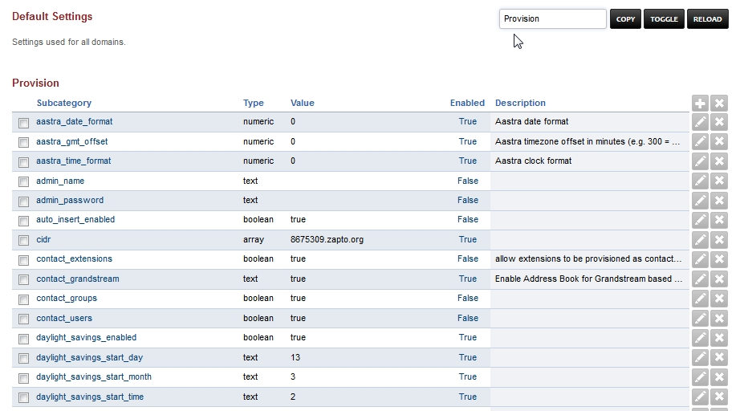

###################
Default Settings
###################

Settings used for all domains.  Branding can be done in this section and also adjust or copy settings to specific domains.

Default Settings have several different categories.

Adminer
^^^^^^^^^

FusionPBX version 4.2+ has Adminer disabled by default.  To use Adminer, you must enable this option with True. 

+--------------+----------------------------------------------------------------------------+
|auto_login    |  Set whether to auto-login to Adminer, or require a username and password. |
+--------------+----------------------------------------------------------------------------+

Cache
^^^^^^^

Option to use file cache for xml and not memcache.

+--------------+-------+----------------------------------+
|location      |  /tmp | Location for the file cache.     |
+--------------+-------+----------------------------------+
|method        |  file | Cache methods file and memcache. |
+--------------+-------+----------------------------------+

Call Center
^^^^^^^^^^^^^

Defaults for the amount of agent rows for Call Center.

+------------------+----+
| agent_add_rows   |  5 |
+------------------+----+
| agent_edit_rows  |  1 |
+------------------+----+

CDR
^^^^^

CDR Stat hour limit, call leg, format, limit, http_enabled, archive database, and storage type settings can be set here.

+-------------------------------+------------------------+-------------------------+---------------------------+--------------------------------------+
| Default Setting Subcategory   | Default Setting Name   | Default Setting Value   | Default Setting Enabled   | Default Setting Description          |
+===============================+========================+=========================+===========================+======================================+
| stat_hours_limit              | numeric                | 24                      | FALSE                     |                                      |
+-------------------------------+------------------------+-------------------------+---------------------------+--------------------------------------+
| b_leg                         | array                  | outbound                | FALSE                     |                                      |
+-------------------------------+------------------------+-------------------------+---------------------------+--------------------------------------+
| b_leg                         | array                  | inbound                 | FALSE                     |                                      |
+-------------------------------+------------------------+-------------------------+---------------------------+--------------------------------------+
| b_leg                         | array                  | local                   | FALSE                     |                                      |
+-------------------------------+------------------------+-------------------------+---------------------------+--------------------------------------+
| format                        | text                   | json                    | TRUE                      |                                      |
+-------------------------------+------------------------+-------------------------+---------------------------+--------------------------------------+
| limit                         | numeric                | 800                     | TRUE                      |                                      |
+-------------------------------+------------------------+-------------------------+---------------------------+--------------------------------------+
| http_enabled                  | boolean                | TRUE                    | TRUE                      |                                      |
+-------------------------------+------------------------+-------------------------+---------------------------+--------------------------------------+
| archive_database_driver       | text                   | pgsql                   | FALSE                     | Archive Database Driver              |
+-------------------------------+------------------------+-------------------------+---------------------------+--------------------------------------+
| archive_database_host         | text                   |                         | FALSE                     | IP/Hostname of Archive Database      |
+-------------------------------+------------------------+-------------------------+---------------------------+--------------------------------------+
| archive_database_password     | text                   |                         | FALSE                     | Archive Database Password            |
+-------------------------------+------------------------+-------------------------+---------------------------+--------------------------------------+
| archive_database_port         | text                   | 5432                    | FALSE                     | Archive Database Port                |
+-------------------------------+------------------------+-------------------------+---------------------------+--------------------------------------+
| archive_database_username     | text                   |                         | FALSE                     | Archive Database Username            |
+-------------------------------+------------------------+-------------------------+---------------------------+--------------------------------------+
| storage                       | text                   | db                      | TRUE                      |                                      |
+-------------------------------+------------------------+-------------------------+---------------------------+--------------------------------------+
| archive_database              | boolean                | FALSE                   | FALSE                     | Enable Dedicated CDR Database Access |
+-------------------------------+------------------------+-------------------------+---------------------------+--------------------------------------+
| archive_database_name         | text                   | fusionpbx               | FALSE                     | Archive Database Name                |
+-------------------------------+------------------------+-------------------------+---------------------------+--------------------------------------+

Dashboard
^^^^^^^^^^^

User level settings that control what is seen and not seen on the dashboard for each user access level.

+-----------------------------+----------------------+-----------------------+-------------------------+------------------------------------------------------------------------------------+
| Default Setting Subcategory | Default Setting Name | Default Setting Value | Default Setting Enabled | Default Setting Description                                                        |
+=============================+======================+=======================+=========================+====================================================================================+
| admin                       | array                | voicemail             | TRUE                    | Enable Dashboard Voicemail block for users in the admin group.                     |
+-----------------------------+----------------------+-----------------------+-------------------------+------------------------------------------------------------------------------------+
| admin                       | array                | missed                | TRUE                    | Enable Dashboard Missed Calls block for users in the admin group.                  |
+-----------------------------+----------------------+-----------------------+-------------------------+------------------------------------------------------------------------------------+
| admin                       | array                | recent                | TRUE                    | Enable Dashboard Recent Calls block for users in the admin group.                  |
+-----------------------------+----------------------+-----------------------+-------------------------+------------------------------------------------------------------------------------+
| admin                       | array                | limits                | FALSE                   | Enable Dashboard Domain Limits block for users in the admin group.                 |
+-----------------------------+----------------------+-----------------------+-------------------------+------------------------------------------------------------------------------------+
| admin                       | array                | counts                | TRUE                    | Enable Dashboard Domain Counts block for users in the admin group.                 |
+-----------------------------+----------------------+-----------------------+-------------------------+------------------------------------------------------------------------------------+
| admin                       | array                | ring_groups           | TRUE                    | Enable Dashboard Ring Group Forwarding controls for users in the admin group.      |
+-----------------------------+----------------------+-----------------------+-------------------------+------------------------------------------------------------------------------------+
| admin                       | array                | caller_id             | FALSE                   | Enable changing Caller ID name and number.                                         |
+-----------------------------+----------------------+-----------------------+-------------------------+------------------------------------------------------------------------------------+
| superadmin                  | array                | voicemail             | TRUE                    | Enable Dashboard Voicemail block for users in the superadmin group.                |
+-----------------------------+----------------------+-----------------------+-------------------------+------------------------------------------------------------------------------------+
| superadmin                  | array                | missed                | TRUE                    | Enable Dashboard Missed Calls block for users in the superadmin group.             |
+-----------------------------+----------------------+-----------------------+-------------------------+------------------------------------------------------------------------------------+
| superadmin                  | array                | recent                | TRUE                    | Enable Dashboard Recent Calls block for users in the superadmin group.             |
+-----------------------------+----------------------+-----------------------+-------------------------+------------------------------------------------------------------------------------+
| superadmin                  | array                | limits                | FALSE                   | Enable Dashboard Domain Limits block for users in the superadmin group.            |
+-----------------------------+----------------------+-----------------------+-------------------------+------------------------------------------------------------------------------------+
| superadmin                  | array                | counts                | TRUE                    | Enable Dashboard System Counts block for users in the superadmin group.            |
+-----------------------------+----------------------+-----------------------+-------------------------+------------------------------------------------------------------------------------+
| superadmin                  | array                | call_routing          | TRUE                    | Enable Dashboard Call Routing controls for users in the superadmin group.          |
+-----------------------------+----------------------+-----------------------+-------------------------+------------------------------------------------------------------------------------+
| superadmin                  | array                | caller_id             | FALSE                   | Enable changing Caller ID name and number.                                         |
+-----------------------------+----------------------+-----------------------+-------------------------+------------------------------------------------------------------------------------+
| superadmin                  | array                | ring_groups           | TRUE                    | Enable Dashboard Ring Group Forwarding controls for users in the superadmin group. |
+-----------------------------+----------------------+-----------------------+-------------------------+------------------------------------------------------------------------------------+
| user                        | array                | voicemail             | TRUE                    | Enable Dashboard Voicemail block for users in the users group.                     |
+-----------------------------+----------------------+-----------------------+-------------------------+------------------------------------------------------------------------------------+
| user                        | array                | missed                | TRUE                    | Enable Dashboard Missed Calls block for users in the users group.                  |
+-----------------------------+----------------------+-----------------------+-------------------------+------------------------------------------------------------------------------------+
| user                        | array                | recent                | TRUE                    | Enable Dashboard Recent Calls block for users in the users group.                  |
+-----------------------------+----------------------+-----------------------+-------------------------+------------------------------------------------------------------------------------+
| user                        | array                | call_routing          | TRUE                    | Enable Dashboard Call Routing controls for users in the users group.               |
+-----------------------------+----------------------+-----------------------+-------------------------+------------------------------------------------------------------------------------+
| user                        | array                | ring_groups           | TRUE                    | Enable Dashboard Ring Group Forwarding controls for users in the users group.      |
+-----------------------------+----------------------+-----------------------+-------------------------+------------------------------------------------------------------------------------+
| user                        | array                | caller_id             | FALSE                   | Enable changing Caller ID name and number.                                         |
+-----------------------------+----------------------+-----------------------+-------------------------+------------------------------------------------------------------------------------+
| admin                       | array                | call_routing          | TRUE                    | Enable Dashboard Call Routing controls for users in the admin group.               |
+-----------------------------+----------------------+-----------------------+-------------------------+------------------------------------------------------------------------------------+
| superadmin                  | array                | system                | TRUE                    | Enable Dashboard System Status block for users in the superadmin group.            |
+-----------------------------+----------------------+-----------------------+-------------------------+------------------------------------------------------------------------------------+
| agent                       | array                | call_center_agents    | TRUE                    | Enable Dashboard Call Center Agent Status block for users in the agent group.      |
+-----------------------------+----------------------+-----------------------+-------------------------+------------------------------------------------------------------------------------+

Destinations
^^^^^^^^^^^^^^^

+--------------------+--------------------------------------------------------+
|dialplan_details    |                                                        |
+--------------------+--------------------------------------------------------+

Domain
^^^^^^^

Editor
^^^^^^^^

Email
^^^^^^^

Fax
^^^^^^^

Follow Me
^^^^^^^^^^

Ivr Menu
^^^^^^^^^^

Limit
^^^^^^^

Login
^^^^^^^

`Provision <http://docs.fusionpbx.com/en/latest/advanced/default_settings/provision.html>`_
^^^^^^^^^^^

In the Provisioning section, there are a few key options that have to be set in order to turn auto provisioning on.

* **enabled** Must be enabled and set to **value true** and **enabled True**.  It is disabled by default.
* **http_auth_username** Must be enabled and set to **value true** and **enabled True**.  It is disabled by default. Be sure to use a strong username.
* **http_auth_password** Must be enabled and set to **value true** and **enabled True**.  It is disabled by default. Be sure to use a strong password.

Recordings
^^^^^^^^^^^

Ring Group
^^^^^^^^^^^^

Security
^^^^^^^^^^

Server
^^^^^^^^

Switch
^^^^^^^^

Theme
^^^^^^^

Time Conditions
^^^^^^^^^^^^^^^^

User
^^^^^

Voicemail
^^^^^^^^^^^

