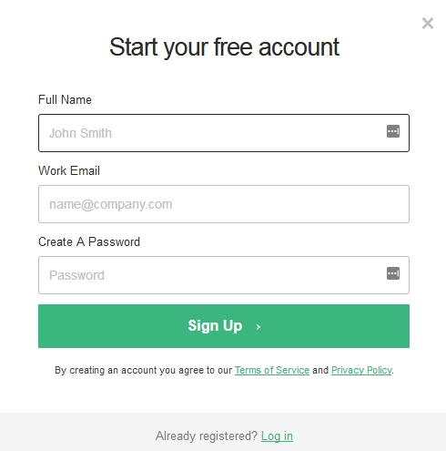
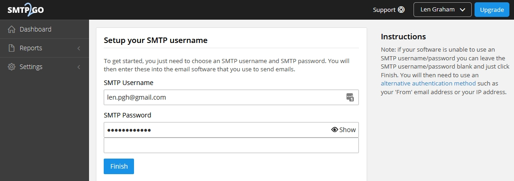
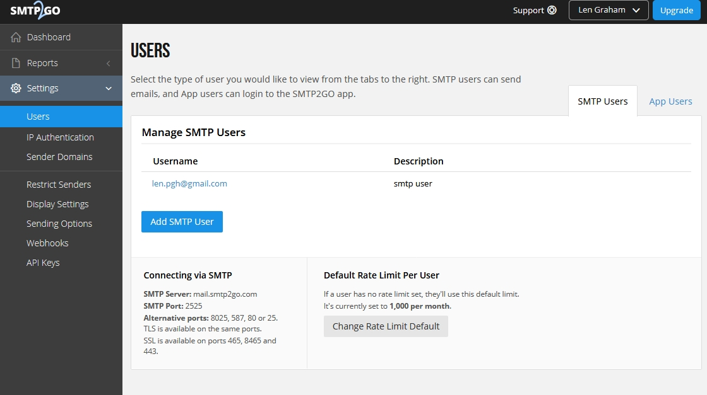
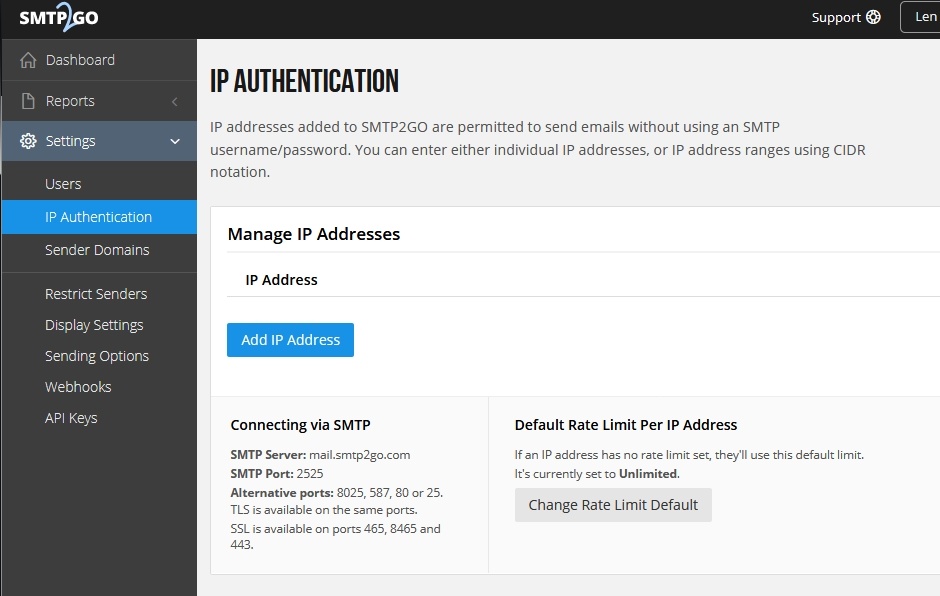
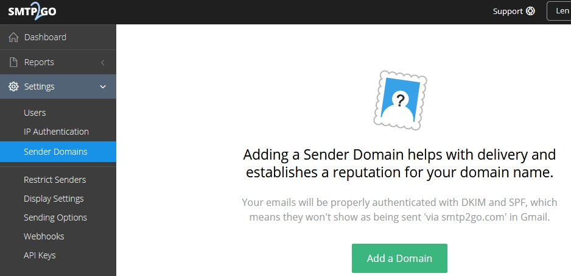

# SMTP2GO

SMTP2GO is a paid email service for sending email. They do however have
1,000 free messages a month and paid plans that are reasonable.

1.  Sign up for the service

2.  After you confirm your email, sign in. You can create an smtp user
    at this screen or in the next step.

3.  Go to Settings \> Users and create an smtp user or additional smtp
    users.

4.  You can set authentication by ip address. It\'s a good idea to set
    the limit here also from Unlimited to match which plan you choose.

5.  Set the domain to your domain to make delivery seem as it came right
    from your own mail server. This can help sending to strict email
    domains.

6.  From your FusionPBX server install go to Advanced \> Default
    Settings \> Email section.

+----------+-------+---------+--------+------------------------------+
| Default  | De    | Default | D      | Default Setting Description  |
| Setting  | fault | Setting | efault |                              |
| Sub      | Se    | Value   | S      |                              |
| category | tting |         | etting |                              |
|          | Name  |         | E      |                              |
|          |       |         | nabled |                              |
+==========+=======+=========+========+==============================+
| s        | text  | ma      | True   | > email providers server     |
| mtp[host |       | il.smtp |        | > address                    |
| ]{#host} |       | 2go.com |        |                              |
+----------+-------+---------+--------+------------------------------+
| s        | text  | <em     | True   | > smtp from emaill address   |
| mtp[from |       | ailaddr |        |                              |
| ]{#from} |       | ess@gma |        |                              |
|          |       | il.com> |        |                              |
+----------+-------+---------+--------+------------------------------+
| s        | nu    | 587     | True   | port number of the mail      |
| mtp[port | meric |         |        | server provider              |
| ]{#port} |       |         |        |                              |
+----------+-------+---------+--------+------------------------------+
| smt      | text  | Vo      | True   | > smtp from name             |
| p[from_n |       | icemail |        |                              |
| ame]{#fr |       |         |        |                              |
| om_name} |       |         |        |                              |
+----------+-------+---------+--------+------------------------------+
| s        | text  | TRUE    | True   | > smtp auth is required      |
| mtp[auth |       |         |        |                              |
| ]{#auth} |       |         |        |                              |
+----------+-------+---------+--------+------------------------------+
| s        | text  | <em     | True   | > Use the full email address |
| mtp[user |       | ailaddr |        |                              |
| name]{#u |       | ess@gma |        |                              |
| sername} |       | il.com> |        |                              |
+----------+-------+---------+--------+------------------------------+
| s        | text  | -----   | True   | > typically the email        |
| mtp[pass |       |         |        | > password                   |
| word]{#p |       |         |        |                              |
| assword} |       |         |        |                              |
+----------+-------+---------+--------+------------------------------+
| smtp[    | text  | tls     | True   | > tls or ssl depending on    |
| secure]{ |       |         |        | > the provider.              |
| #secure} |       |         |        |                              |
+----------+-------+---------+--------+------------------------------+
| s        | bo    | TRUE    | True   | set to false to ignore SSL   |
| mtp[vali | olean |         |        | certificate warnings e.g.    |
| date_cer |       |         |        | for self-signed certificates |
| tificate |       |         |        |                              |
| ]{#valid |       |         |        |                              |
| ate_cert |       |         |        |                              |
| ificate} |       |         |        |                              |
+----------+-------+---------+--------+------------------------------+
| method   | text  | s       | False  | smtp[\|sendmail\|](##S       |
|          |       | endmail |        | UBST##|sendmail|)mail\|qmail |
+----------+-------+---------+--------+------------------------------+
