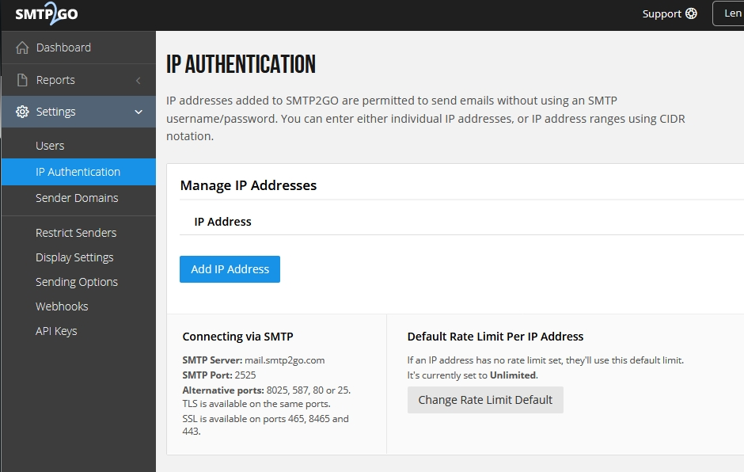

#########
SMTP2GO
#########

SMTP2GO is a paid email service for sending email.  They do however have 1,000 free messages a month and paid plans that are reasonable.

1. Sign up for the service

.. image:: ../../_static/images/advanced/default_settings/fusionpbx_smtp2go.jpg
        :scale: 85%

2. After you confirm your email, sign in.

.. image:: ../../_static/images/advanced/default_settings/fusionpbx_smtp2go3.jpg
        :scale: 85%

3. You can set authentication by ip address. It's a good idea to set the limit here also from Unlimited to match which plan you choose.

4. Set the domain to your domain to make delivery seem as it came right from your own mail server.  This can help sending to strict email domains.

.. image:: ../../_static/images/advanced/default_settings/fusionpbx_smtp2go2.jpg
        :scale: 85%

5. From your FusionPBX server install go to Advanced > Default Settings > Email section.

+-----------------------------+----------------------+----------------------------+-------------------------+-----------------------------------------------------------------------------------+
| Default Setting Subcategory | Default Setting Name | Default Setting Value      | Default Setting Enabled | Default Setting Description                                                       |
+=============================+======================+============================+=========================+===================================================================================+
| smtp_host                   | text                 | mail.smtp2go.com           | True                    |  email providers server address                                                   |
+-----------------------------+----------------------+----------------------------+-------------------------+-----------------------------------------------------------------------------------+
| smtp_from                   | text                 | emailaddress@gmail.com     | True                    |  smtp from emaill address                                                         |
+-----------------------------+----------------------+----------------------------+-------------------------+-----------------------------------------------------------------------------------+
| smtp_port                   | numeric              | 587                        | True                    | port number of the mail server provider                                           |
+-----------------------------+----------------------+----------------------------+-------------------------+-----------------------------------------------------------------------------------+
| smtp_from_name              | text                 | Voicemail                  | True                    |  smtp from name                                                                   |
+-----------------------------+----------------------+----------------------------+-------------------------+-----------------------------------------------------------------------------------+
| smtp_auth                   | text                 | TRUE                       | True                    |  smtp auth is required                                                            |
+-----------------------------+----------------------+----------------------------+-------------------------+-----------------------------------------------------------------------------------+
| smtp_username               | text                 | emailaddress@gmail.com     | True                    |  Use the full email address                                                       |
+-----------------------------+----------------------+----------------------------+-------------------------+-----------------------------------------------------------------------------------+
| smtp_password               | text                 | ************************** | True                    |   typically the email password                                                    |
+-----------------------------+----------------------+----------------------------+-------------------------+-----------------------------------------------------------------------------------+
| smtp_secure                 | text                 | tls                        | True                    |  tls or ssl depending on the provider.                                            |
+-----------------------------+----------------------+----------------------------+-------------------------+-----------------------------------------------------------------------------------+
| smtp_validate_certificate   | boolean              | TRUE                       | True                    | set to false to ignore SSL certificate warnings e.g. for self-signed certificates |
+-----------------------------+----------------------+----------------------------+-------------------------+-----------------------------------------------------------------------------------+
| method                      | text                 | sendmail                   | False                   | smtp|sendmail|mail|qmail                                                          |
+-----------------------------+----------------------+----------------------------+-------------------------+-----------------------------------------------------------------------------------+

