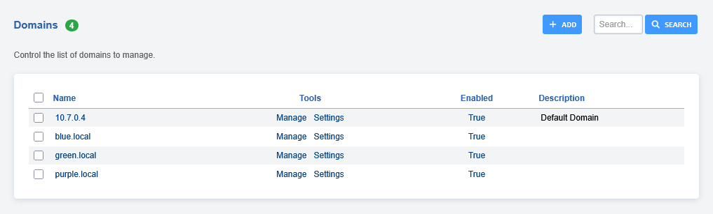

# Domains

Welcome to the adding a domain section. Here you will find how to add a
domain so that you can reach the specific tenant from the multi-tenant
domain side menu to configure and allow secure administration from the
world wide web. [Click here for the youtube
video](https://youtu.be/frMNh43GfUo)

<iframe width="100%" height="350" src="https://www.youtube.com/embed/frMNh43GfUo?rel=0" frameborder="0" ; encrypted-media" allowfullscreen></iframe>

## Adding a domain

Control the list of domains to manage.

There are several reasons to create a domain (tenant).   
One reason would be to organize customers and so customers have a unique login *ie*   
<superadmin@domain.tld> or <superadmin@subdomain.domain.tld> as the
username.

In this example we will create a domain.

- Navigate to Advanced then click Domains.

- Then click "**ADD**" on the right.

- You’ll now be prompted to enter your domain information. 

:::{note}   
Be sure to create an "A record" from your domain hosting account   
:::

- Click "**SAVE**" once entry is complete.

## Domain Selection

- You can select a different domain by clicking the domain icon on the top right.

- A menu will pop open on the right of the screen, then click on the domain that you want to manage.

:::{note}    
The domain select will only display if you have multiple domains.   
:::   

### [Domains Default Settings](/en/latest/advanced/default_settings.html#id7)

## Override a Default Setting for one domain

- On the Domains page, click "**Settings**" from the domain you wish to add settings for.

- Click "**ADD**" on the top right corner.

- Enter the setting that should be overridden for this domain, then press
  Save.

- The added setting will now be visible in the list .

