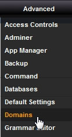
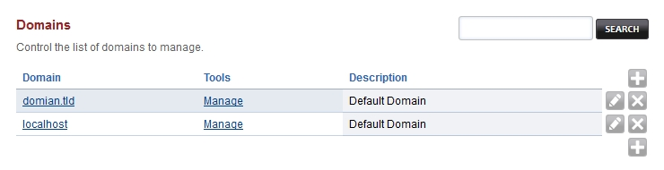
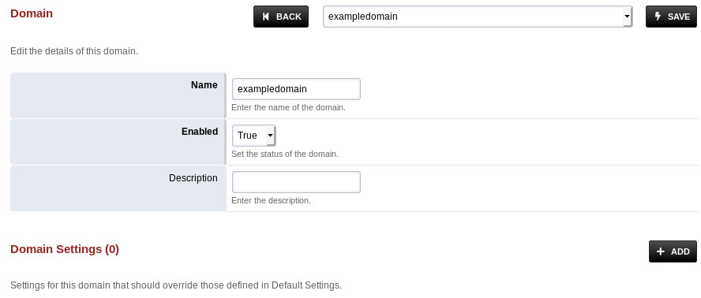
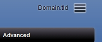
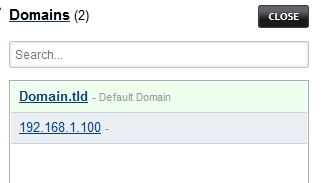

**********
Domains
**********

Welcome to the adding a domain section.  Here you will find how to add a domain so that you can reach the specific tenant from the multi-tenant domain side menu to configure and allow secure administration from the world wide web. `Click here for the youtube video`_

  

===============
Adding a domain
===============

Control the list of domains to manage.

There are several reasons to create a domain (tenant).  One reason would be to organize customers and so customers have a unique login *ie* superadmin@domain.tld or superadmin@subdomain.domain.tld as the username. 

In this example we will create a domain.  

Goto advanced then click Domains.

  
Then click the

.. image:: ../_static/images/plus.png
        :scale: 75%
 
on the right.

This will bring you to enter domain info. (Be sure to create an "A record" from your domain hosting account)

Click **save** once entry is complete.

================
Domain Selection
================

Changing to a different domain click the stack of three dashes on the top right

A menu will pop open on the right of the screen.  Click on the domain that you want to manage.  You will always see the domain you are in by looking at the top right beside the three stacked dashes.

.. _Click here for the youtube video: https://youtu.be/frMNh43GfUo
