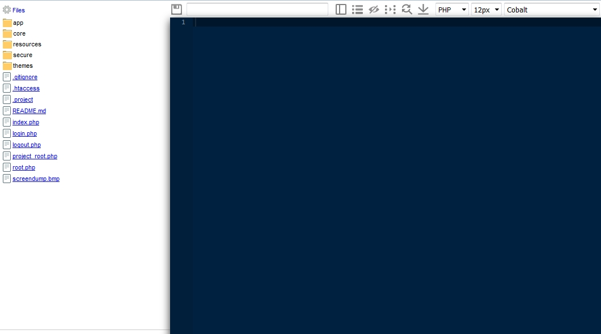
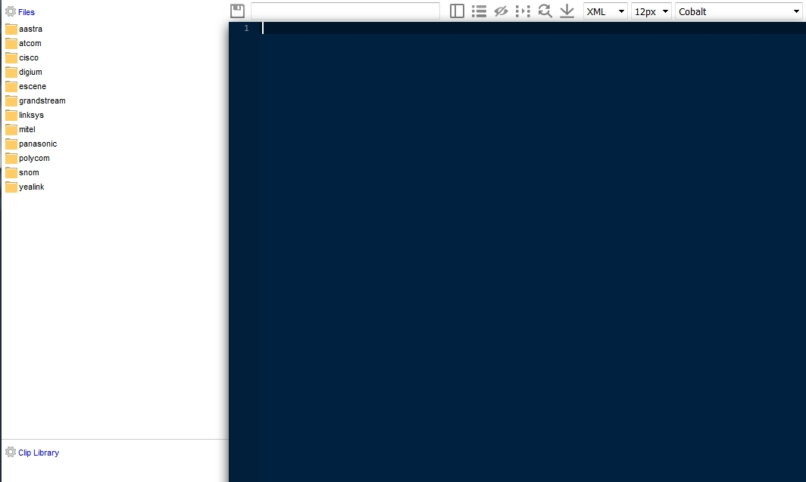
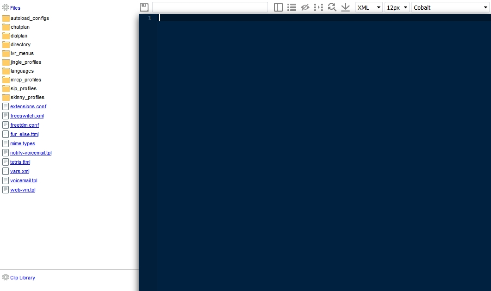

# Editors

File editor for PHP, XML, and Provisioning files.

## Install

    cd /var/www/fusionpbx/app
    git clone https://github.com/fusionpbx/fusionpbx-app-edit.git edit
    chown -R www-data:www-data /var/www/fusionpbx/app/edit

-   Run Advanced \> Upgrade \> Menu Defaults
-   Run Advanced \> Upgrade \> Permission Defaults
-   Log out and then Log back in

## Upgrade

    cd /var/www/fusionpbx/app/edit
    git pull

## PHP Editor

## Provisioning Editor

## XML Editor

## [Editors Default Settings](/en/latest/advanced/default_settings.html#id9)
