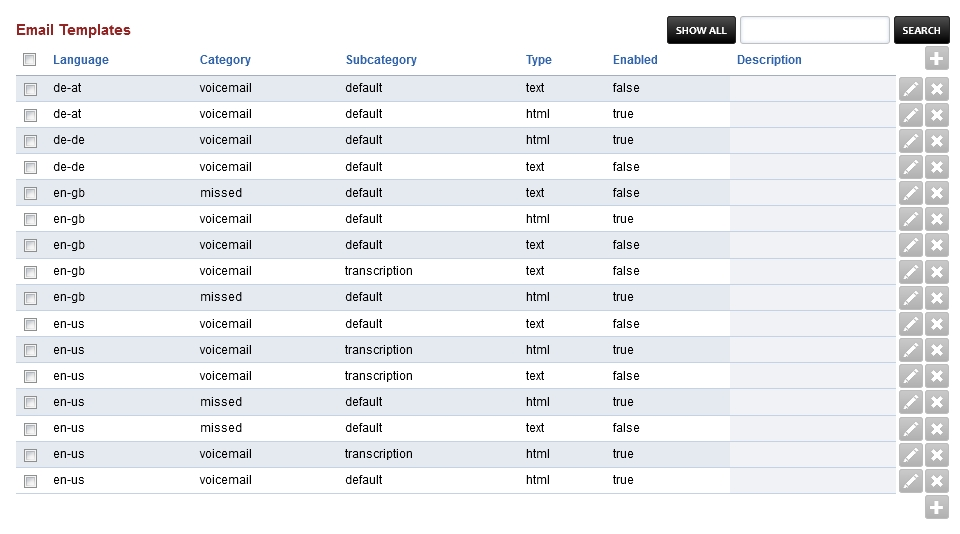
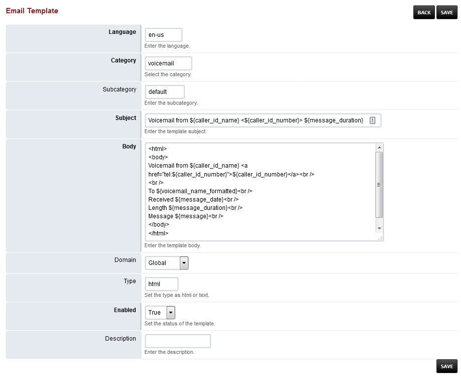

################
Email Templates
################

Email Templates provide an easy way to make custom notification emails for voicemail, voicemail transcription and missed calls.  The default format is set for html.  The other option would be for text.  This flexability will allow you to choose which suits you best.  If you choose text, you will have to change the **enabled** filed to true for text in each category.  Once those are changed, you will need to change html to false.

*  To edit one of the templates click the pencil icon.

Editing Email Templates
^^^^^^^^^^^^^^^^^^^^^^^^^

Click the edit pencil icon beside the template you want to edit.

