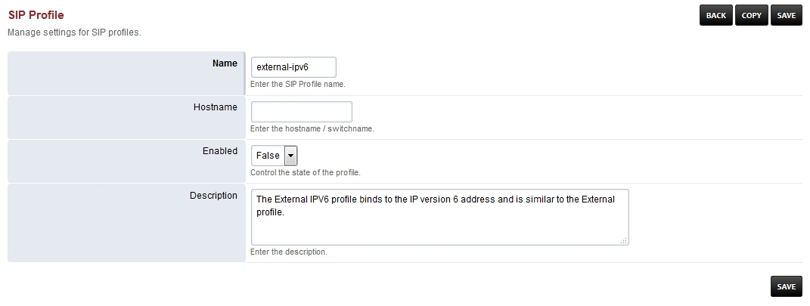

#############################
External ipv6 Sip Profile
#############################

*  **Hostname-** Should be left blank and is for advanced use.

+---------------------------+--------------------------------+-----------------------------+---------------------------------+
| SIP Profile Setting Name  | SIP Profile Setting Value      | SIP Profile Setting Enabled | SIP Profile Setting Description |
+===========================+================================+=============================+=================================+
| auth-calls                | FALSE                          | TRUE                        |                                 |
+---------------------------+--------------------------------+-----------------------------+---------------------------------+
| context                   | public                         | TRUE                        |                                 |
+---------------------------+--------------------------------+-----------------------------+---------------------------------+
| dbname                    | share_presence                 | FALSE                       |                                 |
+---------------------------+--------------------------------+-----------------------------+---------------------------------+
| debug                     | 0                              | TRUE                        |                                 |
+---------------------------+--------------------------------+-----------------------------+---------------------------------+
| dialplan                  | XML                            | TRUE                        |                                 |
+---------------------------+--------------------------------+-----------------------------+---------------------------------+
| disable-srv503            | TRUE                           | FALSE                       |                                 |
+---------------------------+--------------------------------+-----------------------------+---------------------------------+
| dtmf-duration             | 2000                           | TRUE                        |                                 |
+---------------------------+--------------------------------+-----------------------------+---------------------------------+
| dtmf-type                 | rfc2833                        | TRUE                        |                                 |
+---------------------------+--------------------------------+-----------------------------+---------------------------------+
| enable-100rel             | TRUE                           | FALSE                       |                                 |
+---------------------------+--------------------------------+-----------------------------+---------------------------------+
| enable-rfc-5626           | TRUE                           | FALSE                       |                                 |
+---------------------------+--------------------------------+-----------------------------+---------------------------------+
| ext-rtp-ip                | $${external_rtp_ip}            | FALSE                       |                                 |
+---------------------------+--------------------------------+-----------------------------+---------------------------------+
| ext-sip-ip                | $${external_sip_ip}            | FALSE                       |                                 |
+---------------------------+--------------------------------+-----------------------------+---------------------------------+
| force-register-db-domain  | $${domain}                     | FALSE                       |                                 |
+---------------------------+--------------------------------+-----------------------------+---------------------------------+
| force-register-domain     | $${domain}                     | FALSE                       |                                 |
+---------------------------+--------------------------------+-----------------------------+---------------------------------+
| hold-music                | $${hold_music}                 | TRUE                        |                                 |
+---------------------------+--------------------------------+-----------------------------+---------------------------------+
| inbound-codec-negotiation | generous                       | TRUE                        |                                 |
+---------------------------+--------------------------------+-----------------------------+---------------------------------+
| inbound-codec-prefs       | $${global_codec_prefs}         | TRUE                        |                                 |
+---------------------------+--------------------------------+-----------------------------+---------------------------------+
| local-network-acl         | localnet.auto                  | TRUE                        |                                 |
+---------------------------+--------------------------------+-----------------------------+---------------------------------+
| manage-presence           | FALSE                          | TRUE                        |                                 |
+---------------------------+--------------------------------+-----------------------------+---------------------------------+
| nonce-ttl                 | 60                             | TRUE                        |                                 |
+---------------------------+--------------------------------+-----------------------------+---------------------------------+
| odbc-dsn                  | $${dsn}                        | FALSE                       |                                 |
+---------------------------+--------------------------------+-----------------------------+---------------------------------+
| outbound-codec-prefs      | $${outbound_codec_prefs}       | TRUE                        |                                 |
+---------------------------+--------------------------------+-----------------------------+---------------------------------+
| presence-hosts            | $${domain}                     | FALSE                       |                                 |
+---------------------------+--------------------------------+-----------------------------+---------------------------------+
| rfc2833-pt                | 101                            | TRUE                        |                                 |
+---------------------------+--------------------------------+-----------------------------+---------------------------------+
| rtp-hold-timeout-sec      | 1800                           | TRUE                        |                                 |
+---------------------------+--------------------------------+-----------------------------+---------------------------------+
| rtp-ip                    | $${local_ip_v6}                | TRUE                        |                                 |
+---------------------------+--------------------------------+-----------------------------+---------------------------------+
| rtp-timeout-sec           | 300                            | TRUE                        |                                 |
+---------------------------+--------------------------------+-----------------------------+---------------------------------+
| rtp-timer-name            | soft                           | TRUE                        |                                 |
+---------------------------+--------------------------------+-----------------------------+---------------------------------+
| shutdown-on-fail          | TRUE                           | FALSE                       |                                 |
+---------------------------+--------------------------------+-----------------------------+---------------------------------+
| sip-capture               | no                             | TRUE                        |                                 |
+---------------------------+--------------------------------+-----------------------------+---------------------------------+
| sip-ip                    | $${local_ip_v6}                | TRUE                        |                                 |
+---------------------------+--------------------------------+-----------------------------+---------------------------------+
| sip-port                  | $${external_sip_port}          | TRUE                        |                                 |
+---------------------------+--------------------------------+-----------------------------+---------------------------------+
| sip-trace                 | no                             | TRUE                        |                                 |
+---------------------------+--------------------------------+-----------------------------+---------------------------------+
| tls                       | $${external_ssl_enable}        | TRUE                        |                                 |
+---------------------------+--------------------------------+-----------------------------+---------------------------------+
| tls-bind-params           | transport=tls                  | TRUE                        |                                 |
+---------------------------+--------------------------------+-----------------------------+---------------------------------+
| tls-cert-dir              | $${external_ssl_dir}           | TRUE                        |                                 |
+---------------------------+--------------------------------+-----------------------------+---------------------------------+
| tls-only                  | FALSE                          | TRUE                        |                                 |
+---------------------------+--------------------------------+-----------------------------+---------------------------------+
| tls-passphrase            |                                | TRUE                        |                                 |
+---------------------------+--------------------------------+-----------------------------+---------------------------------+
| tls-sip-port              | $${external_tls_port}          | TRUE                        |                                 |
+---------------------------+--------------------------------+-----------------------------+---------------------------------+
| tls-verify-date           | TRUE                           | TRUE                        |                                 |
+---------------------------+--------------------------------+-----------------------------+---------------------------------+
| tls-verify-depth          | 2                              | TRUE                        |                                 |
+---------------------------+--------------------------------+-----------------------------+---------------------------------+
| tls-verify-in-subjects    |                                | TRUE                        |                                 |
+---------------------------+--------------------------------+-----------------------------+---------------------------------+
| tls-verify-policy         | all|subjects_all               | FALSE                       |                                 |
+---------------------------+--------------------------------+-----------------------------+---------------------------------+
| tls-version               | $${sip_tls_version}            | TRUE                        |                                 |
+---------------------------+--------------------------------+-----------------------------+---------------------------------+
| track-calls               | FALSE                          | TRUE                        |                                 |
+---------------------------+--------------------------------+-----------------------------+---------------------------------+
| user-agent-string         | FreeSWITCH                     | TRUE                        |                                 |
+---------------------------+--------------------------------+-----------------------------+---------------------------------+
| zrtp-passthru             | TRUE                           | TRUE                        |                                 |
+---------------------------+--------------------------------+-----------------------------+---------------------------------+

