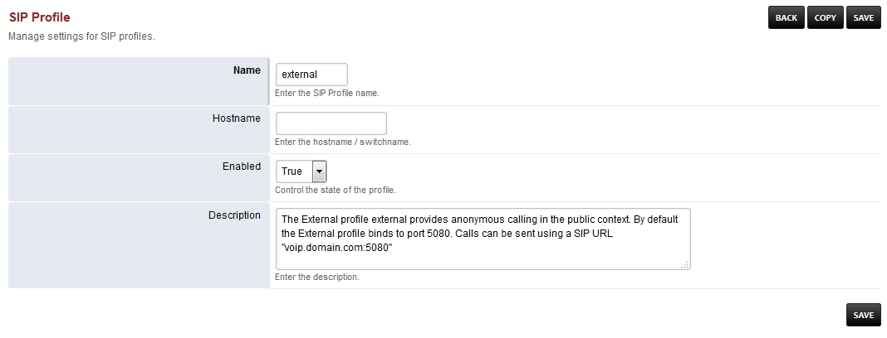

# External Sip Profile

  ------------------------------------------------------------------------------------------------------------
  SIP Profile Setting Name    SIP Profile Setting Value                   SIP Profile      SIP Profile Setting
                                                                          Setting Enabled  Description
  --------------------------- ------------------------------------------- ---------------- -------------------
  auth-calls                  FALSE                                       TRUE             

  context                     public                                      TRUE             

  dbname                      share[presence]{#presence}                  FALSE            

  debug                       0                                           TRUE             

  dialplan                    XML                                         TRUE             

  disable-srv503              TRUE                                        FALSE            

  dtmf-duration               2000                                        TRUE             

  dtmf-type                   rfc2833                                     TRUE             

  enable-100rel               TRUE                                        FALSE            

  enable-rfc-5626             TRUE                                        FALSE            

  ext-rtp-ip                  \$\${external[rtp_ip]{#rtp_ip}}             TRUE             

  ext-sip-ip                  \$\${external[sip_ip]{#sip_ip}}             TRUE             

  force-register-db-domain    \$\${domain}                                FALSE            

  force-register-domain       \$\${domain}                                FALSE            

  hold-music                  \$\${hold[music]{#music}}                   TRUE             

  inbound-codec-negotiation   generous                                    TRUE             

  inbound-codec-prefs         \$\${global[codec_prefs]{#codec_prefs}}     TRUE             

  local-network-acl           localnet.auto                               TRUE             

  manage-presence             FALSE                                       TRUE             

  nonce-ttl                   60                                          TRUE             

  odbc-dsn                    \$\${dsn}                                   FALSE            

  outbound-codec-prefs        \$\${outbound[codec_prefs]{#codec_prefs}}   TRUE             

  presence-hosts              \$\${domain}                                FALSE            

  rfc2833-pt                  101                                         TRUE             

  rtp-hold-timeout-sec        1800                                        TRUE             

  rtp-ip                      \$\${local[ip_v4]{#ip_v4}}                  TRUE             

  rtp-timeout-sec             300                                         TRUE             

  rtp-timer-name              soft                                        TRUE             

  shutdown-on-fail            TRUE                                        FALSE            

  sip-capture                 no                                          TRUE             

  sip-ip                      \$\${local[ip_v4]{#ip_v4}}                  TRUE             

  sip-port                    \$\${external[sip_port]{#sip_port}}         TRUE             

  sip-trace                   no                                          TRUE             

  tls                         \$\${external[ssl_enable]{#ssl_enable}}     TRUE             

  tls-bind-params             transport=tls                               TRUE             

  tls-cert-dir                \$\${external[ssl_dir]{#ssl_dir}}           TRUE             

  tls-only                    FALSE                                       TRUE             

  tls-passphrase                                                          TRUE             

  tls-sip-port                \$\${external[tls_port]{#tls_port}}         TRUE             

  tls-verify-date             TRUE                                        TRUE             

  tls-verify-depth            2                                           TRUE             

  tls-verify-in-subjects                                                  TRUE             

  tls-verify-policy           all\|subjects[all]{#all}                    FALSE            

  tls-version                 \$\${sip[tls_version]{#tls_version}}        TRUE             

  track-calls                 FALSE                                       TRUE             

  user-agent-string           FreeSWITCH                                  TRUE             

  zrtp-passthru               TRUE                                        TRUE             
  ------------------------------------------------------------------------------------------------------------
