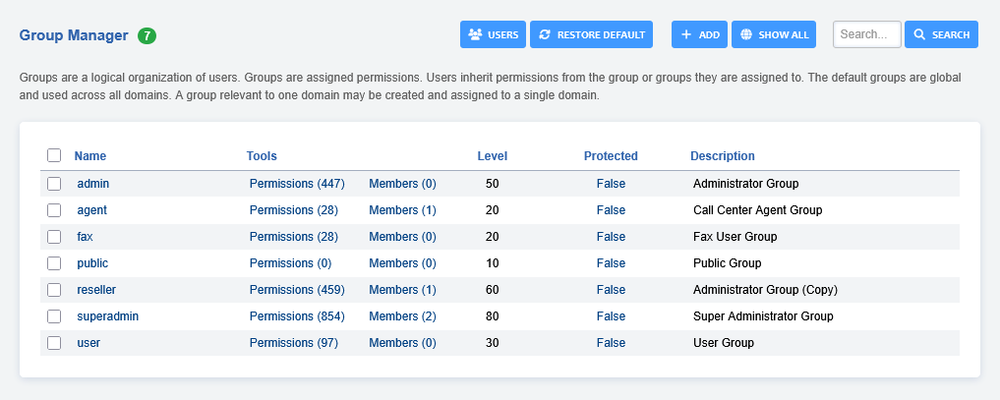
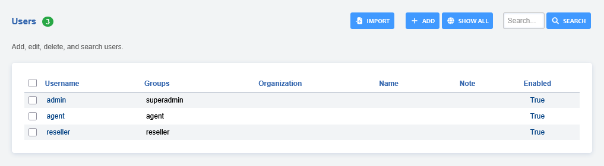
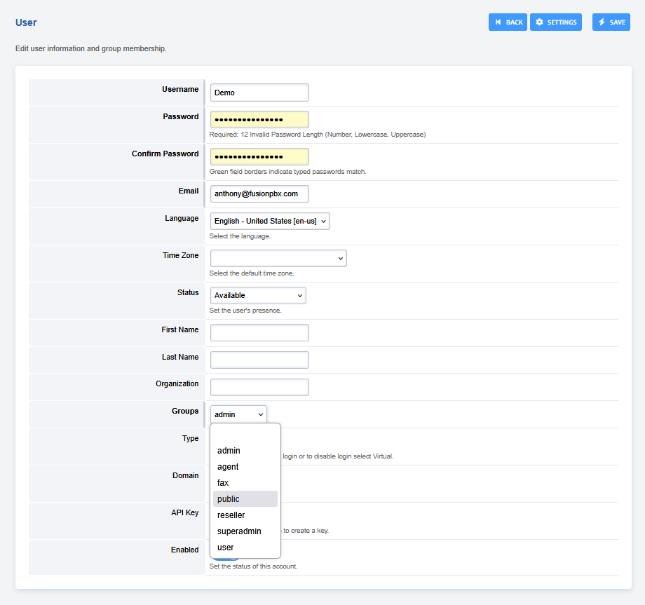

# Group Manager

Permit access levels to different group of users. The group permissions
allow customizing permissions for existing groups or custom groups.

-   **superadmin-** the global administrator
-   **admin-** the domain administrator
-   **users-** the group for regular users

 

## User Manager

Create, edit, remove users.

-   Goto **Advanced** > **Group Manager** and click **USERS** at the top right
    to create, edit or remove a user.
-   Click the "**ADD**" at the right to add a user or **click** 
    an existing user to edit.

-   Fill in the boxes with pertinent information.
-   **Group-** assign the user to a group. Be wise as to who has access
    to what.

