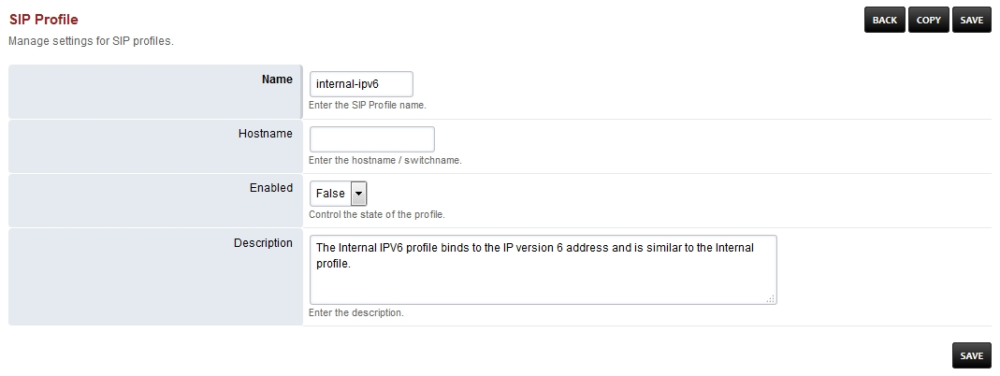

# Internal ipv6 Sip Profile

-   **Hostname-** Should be left blank and is for advanced use.

+-------------+-------------+-----+---------------------------------+
| > Name      | > Value     | > E | Description                     |
|             |             | nab |                                 |
|             |             | led |                                 |
+-------------+-------------+-----+---------------------------------+
| accept      | true        | >   |                                 |
| -blind-auth |             |  Fa |                                 |
|             |             | lse |                                 |
+-------------+-------------+-----+---------------------------------+
| accep       | true        | >   |                                 |
| t-blind-reg |             |  Fa |                                 |
|             |             | lse |                                 |
+-------------+-------------+-----+---------------------------------+
| alias       | <sip:10.0.  | >   |                                 |
|             | 1.251:5555> |  Fa |                                 |
|             |             | lse |                                 |
+-------------+-------------+-----+---------------------------------+
| apply-      | > domains   | > T |                                 |
| inbound-acl |             | rue |                                 |
+-------------+-------------+-----+---------------------------------+
| > apply-r   | > domains   | >   |                                 |
| egister-acl |             |  Fa |                                 |
|             |             | lse |                                 |
+-------------+-------------+-----+---------------------------------+
| > auth-     | > false     | > T |                                 |
| all-packets |             | rue |                                 |
+-------------+-------------+-----+---------------------------------+
| >           | \$\${i      | > T |                                 |
|  auth-calls | nternal[aut | rue |                                 |
|             | h_calls]{#a |     |                                 |
|             | uth_calls}} |     |                                 |
+-------------+-------------+-----+---------------------------------+
| >           | tr          | >   |                                 |
| bind-params | ansport=udp |  Fa |                                 |
|             |             | lse |                                 |
+-------------+-------------+-----+---------------------------------+
| >           | > aal2      | >   |                                 |
|  bitpacking |             |  Fa |                                 |
|             |             | lse |                                 |
+-------------+-------------+-----+---------------------------------+
| > context   | > public    | > T |                                 |
|             |             | rue |                                 |
+-------------+-------------+-----+---------------------------------+
| > debug     | > 0         | T   |                                 |
|             |             | rue |                                 |
+-------------+-------------+-----+---------------------------------+
| > dialplan  | > XML       | T   |                                 |
|             |             | rue |                                 |
+-------------+-------------+-----+---------------------------------+
| > di        | > false     | Fa  |                                 |
| sable-naptr |             | lse |                                 |
+-------------+-------------+-----+---------------------------------+
| > disab     | > true      | Fa  |                                 |
| le-register |             | lse |                                 |
+-------------+-------------+-----+---------------------------------+
| > d         | > true      | Fa  |                                 |
| isable-rtp- |             | lse |                                 |
| auto-adjust |             |     |                                 |
+-------------+-------------+-----+---------------------------------+
| >           | > false     | Fa  |                                 |
| disable-srv |             | lse |                                 |
+-------------+-------------+-----+---------------------------------+
| > dis       | > true      | Fa  |                                 |
| able-srv503 |             | lse |                                 |
+-------------+-------------+-----+---------------------------------+
| > disable-  | > true      | Fa  |                                 |
| transcoding |             | lse |                                 |
+-------------+-------------+-----+---------------------------------+
| > disab     | > true      | Fa  |                                 |
| le-transfer |             | lse |                                 |
+-------------+-------------+-----+---------------------------------+
| > dt        | > 2000      | T   |                                 |
| mf-duration |             | rue |                                 |
+-------------+-------------+-----+---------------------------------+
| > dtmf-type | > rfc2833   | T   |                                 |
|             |             | rue |                                 |
+-------------+-------------+-----+---------------------------------+
| en          | > true      | >   |                                 |
| able-100rel |             |  Fa |                                 |
|             |             | lse |                                 |
+-------------+-------------+-----+---------------------------------+
| enable-3pcc | > true      | Fa  |                                 |
|             |             | lse |                                 |
+-------------+-------------+-----+---------------------------------+
| enable-comp | > true      | Fa  |                                 |
| act-headers |             | lse |                                 |
+-------------+-------------+-----+---------------------------------+
| > e         | > false     | Fa  |                                 |
| nable-timer |             | lse |                                 |
+-------------+-------------+-----+---------------------------------+
| >           | > true      | Fa  |                                 |
|  extended-i |             | lse |                                 |
| nfo-parsing |             |     |                                 |
+-------------+-------------+-----+---------------------------------+
| >           | \$\${exte   | T   |                                 |
|  ext-rtp-ip | rnal[rtp_ip | rue |                                 |
|             | ]{#rtp_ip}} |     |                                 |
+-------------+-------------+-----+---------------------------------+
| >           | > \$\${exte | > T |                                 |
|  ext-sip-ip | rnal[rtp_ip | rue |                                 |
|             | ]{#rtp_ip}} |     |                                 |
+-------------+-------------+-----+---------------------------------+
| fo          | > \         | >   |                                 |
| rce-registe | $\${domain} |  Fa |                                 |
| r-db-domain |             | lse |                                 |
+-------------+-------------+-----+---------------------------------+
| force-regi  | > \         | >   |                                 |
| ster-domain | $\${domain} |  Fa |                                 |
|             |             | lse |                                 |
+-------------+-------------+-----+---------------------------------+
| forward-    |             | T   |                                 |
| unsolicited |             | rue |                                 |
| -mwi-notify |             |     |                                 |
| false       |             |     |                                 |
+-------------+-------------+-----+---------------------------------+
| >           | > \$\       | > T |                                 |
|  hold-music | ${hold[musi | rue |                                 |
|             | c]{#music}} |     |                                 |
+-------------+-------------+-----+---------------------------------+
| inbound-b   | > true      | >   |                                 |
| ypass-media |             |  Fa |                                 |
|             |             | lse |                                 |
+-------------+-------------+-----+---------------------------------+
| inb         | > generous  | > T |                                 |
| ound-codec- |             | rue |                                 |
| negotiation |             |     |                                 |
+-------------+-------------+-----+---------------------------------+
| inbound-    | > \$\${g    | > T |                                 |
| codec-prefs | lobal[codec | rue |                                 |
|             | _prefs]{#co |     |                                 |
|             | dec_prefs}} |     |                                 |
+-------------+-------------+-----+---------------------------------+
| in          | > true      | >   |                                 |
| bound-late- |             |  Fa |                                 |
| negotiation |             | lse |                                 |
+-------------+-------------+-----+---------------------------------+
| inbound-    | > true      | >   |                                 |
| proxy-media |             |  Fa |                                 |
|             |             | lse |                                 |
+-------------+-------------+-----+---------------------------------+
| in          |             | > T |                                 |
| bound-reg-f |             | rue |                                 |
| orce-matchi |             |     |                                 |
| ng-username |             |     |                                 |
| true        |             |     |                                 |
+-------------+-------------+-----+---------------------------------+
| mana        | > true      | > T |                                 |
| ge-presence |             | rue |                                 |
+-------------+-------------+-----+---------------------------------+
| max         | > 1000      | >   |                                 |
| -proceeding |             |  Fa |                                 |
|             |             | lse |                                 |
+-------------+-------------+-----+---------------------------------+
| multiple-re | > contact   | >   | Enables registrations on        |
| gistrations |             |  Fa | multiple endpoints              |
|             |             | lse |                                 |
+-------------+-------------+-----+---------------------------------+
| NDLB-broke  | > true      | >   |                                 |
| n-auth-hash |             |  Fa |                                 |
|             |             | lse |                                 |
+-------------+-------------+-----+---------------------------------+
| NDLB-       | > safe      | > T | Enables rport                   |
| force-rport |             | rue |                                 |
+-------------+-------------+-----+---------------------------------+
| NDLB-recei  |             | >   |                                 |
| ved-in-nat- |             |  Fa |                                 |
| reg-contact |             | lse |                                 |
| true        |             |     |                                 |
+-------------+-------------+-----+---------------------------------+
| nonce-ttl   | > 60        | > T |                                 |
|             |             | rue |                                 |
+-------------+-------------+-----+---------------------------------+
| odbc-dsn    | > \$\${dsn} | >   |                                 |
|             |             |  Fa |                                 |
|             |             | lse |                                 |
+-------------+-------------+-----+---------------------------------+
| outbound-   | > \$\${g    | > T |                                 |
| codec-prefs | lobal[codec | rue |                                 |
|             | _prefs]{#co |     |                                 |
|             | dec_prefs}} |     |                                 |
+-------------+-------------+-----+---------------------------------+
| pas         | > false     | >   |                                 |
| s-callee-id |             |  Fa |                                 |
|             |             | lse |                                 |
+-------------+-------------+-----+---------------------------------+
| p           | > true      | >   |                                 |
| ass-rfc2833 |             |  Fa |                                 |
|             |             | lse |                                 |
+-------------+-------------+-----+---------------------------------+
| pre         | \$\${d      |     |                                 |
| sence-hosts | omain},\$\$ |     |                                 |
|             | {local[ip_v |     |                                 |
|             | 6]{#ip_v6}} |     |                                 |
|             | False       |     |                                 |
+-------------+-------------+-----+---------------------------------+
| prese       | \$\${presen | > T |                                 |
| nce-privacy | ce[privacy] | rue |                                 |
|             | {#privacy}} |     |                                 |
+-------------+-------------+-----+---------------------------------+
| pres        | > true      | > T |                                 |
| ence-probe- |             | rue |                                 |
| on-register |             |     |                                 |
+-------------+-------------+-----+---------------------------------+
| presence-p  | > true      | >   |                                 |
| roto-lookup |             |  Fa |                                 |
|             |             | lse |                                 |
+-------------+-------------+-----+---------------------------------+
| record-path | \$\${       | > T |                                 |
|             | recordings[ | rue |                                 |
|             | dir]{#dir}} |     |                                 |
+-------------+-------------+-----+---------------------------------+
| reco        |             |     |                                 |
| rd-template |             |     |                                 |
| \${         |             |     |                                 |
| domain[name |             |     |                                 |
| ]{#name}}/a |             |     |                                 |
| rchive/\${s |             |     |                                 |
| trftime(%Y) |             |     |                                 |
| }/\${strfti |             |     |                                 |
| me(%b)}/\${ |             |     |                                 |
| strftime(%d |             |     |                                 |
| )}/\${uuid} |             |     |                                 |
| .\${record[ |             |     |                                 |
| ext]{#ext}} |             |     |                                 |
| True        |             |     |                                 |
+-------------+-------------+-----+---------------------------------+
| registr     |             | >   |                                 |
| ation-threa |             |  Fa |                                 |
| d-frequency |             | lse |                                 |
| 30          |             |     |                                 |
+-------------+-------------+-----+---------------------------------+
| ren         | > true      | >   |                                 |
| egotiate-co |             |  Fa |                                 |
| dec-on-hold |             | lse |                                 |
+-------------+-------------+-----+---------------------------------+
| rfc2833-pt  | > 101       | > T |                                 |
|             |             | rue |                                 |
+-------------+-------------+-----+---------------------------------+
| rtp-hold-   | > 1800      | > T |                                 |
| timeout-sec |             | rue |                                 |
+-------------+-------------+-----+---------------------------------+
| rtp-ip      | > \$\$      | > T |                                 |
|             | {local[ip_v | rue |                                 |
|             | 6]{#ip_v6}} |     |                                 |
+-------------+-------------+-----+---------------------------------+
| rtp-rewrite | > true      | >   |                                 |
| -timestamps |             |  Fa |                                 |
|             |             | lse |                                 |
+-------------+-------------+-----+---------------------------------+
| rtp-        | > 300       | > T |                                 |
| timeout-sec |             | rue |                                 |
+-------------+-------------+-----+---------------------------------+
| rtp         | > soft      | > T |                                 |
| -timer-name |             | rue |                                 |
+-------------+-------------+-----+---------------------------------+
| sess        | > 1800      | >   |                                 |
| ion-timeout |             |  Fa |                                 |
|             |             | lse |                                 |
+-------------+-------------+-----+---------------------------------+
| sip-ip      | \$\$        | > T |                                 |
|             | {local[ip_v | rue |                                 |
|             | 6]{#ip_v6}} |     |                                 |
+-------------+-------------+-----+---------------------------------+
| sip-port    | \$          | > T |                                 |
|             | \${internal | rue |                                 |
|             | [sip_port]{ |     |                                 |
|             | #sip_port}} |     |                                 |
+-------------+-------------+-----+---------------------------------+
| sip-trace   | > no        | > T |                                 |
|             |             | rue |                                 |
+-------------+-------------+-----+---------------------------------+
| s           | > true      | >   |                                 |
| uppress-cng |             |  Fa |                                 |
|             |             | lse |                                 |
+-------------+-------------+-----+---------------------------------+
| tls         | \$\${i      | > T |                                 |
|             | nternal[ssl | rue |                                 |
|             | _enable]{#s |     |                                 |
|             | sl_enable}} |     |                                 |
+-------------+-------------+-----+---------------------------------+
| tls-        | > tr        | > T |                                 |
| bind-params | ansport=tls | rue |                                 |
+-------------+-------------+-----+---------------------------------+
| t           | >           | > T |                                 |
| ls-cert-dir | \$\${intern | rue |                                 |
|             | al[ssl_dir] |     |                                 |
|             | {#ssl_dir}} |     |                                 |
+-------------+-------------+-----+---------------------------------+
| tls-only    | > false     | > T |                                 |
|             |             | rue |                                 |
+-------------+-------------+-----+---------------------------------+
| tls         |             | > T |                                 |
| -passphrase |             | rue |                                 |
+-------------+-------------+-----+---------------------------------+
| t           | > \$        | > T |                                 |
| ls-sip-port | \${internal | rue |                                 |
|             | [tls_port]{ |     |                                 |
|             | #tls_port}} |     |                                 |
+-------------+-------------+-----+---------------------------------+
| tls-        | > true      | > T |                                 |
| verify-date |             | rue |                                 |
+-------------+-------------+-----+---------------------------------+
| tls-v       | > 2         | > T |                                 |
| erify-depth |             | rue |                                 |
+-------------+-------------+-----+---------------------------------+
| tls-verify- |             | > T |                                 |
| in-subjects |             | rue |                                 |
+-------------+-------------+-----+---------------------------------+
| tls-ve      | > al        | >   |                                 |
| rify-policy | l\|subjects |  Fa |                                 |
|             | [all]{#all} | lse |                                 |
+-------------+-------------+-----+---------------------------------+
| tls-version | > \$\       | > T |                                 |
|             | ${sip[tls_v | rue |                                 |
|             | ersion]{#tl |     |                                 |
|             | s_version}} |     |                                 |
+-------------+-------------+-----+---------------------------------+
| unre        | > true      | >   |                                 |
| gister-on-o |             |  Fa |                                 |
| ptions-fail |             | lse |                                 |
+-------------+-------------+-----+---------------------------------+
| user-a      | >           | > T |                                 |
| gent-string |  FreeSWITCH | rue |                                 |
+-------------+-------------+-----+---------------------------------+
| vad         | > out       | >   |                                 |
|             |             |  Fa |                                 |
|             |             | lse |                                 |
+-------------+-------------+-----+---------------------------------+
