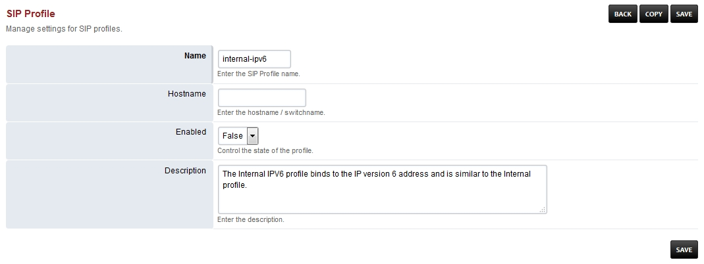

###########################
Internal ipv6 Sip Profile
###########################

*  **Hostname-** Should be left blank and is for advanced use.

+--------------------------+-------------------------+-----------+--------------------------------------------------------------+
|           Name           |         Value           |  Enabled  | Description                                                  |
+--------------------------+-------------------------+-----------+--------------------------------------------------------------+
| accept-blind-auth        | true                    |    False  |                                                              |
+--------------------------+-------------------------+-----------+--------------------------------------------------------------+
| accept-blind-reg         | true                    |    False  |                                                              |
+--------------------------+-------------------------+-----------+--------------------------------------------------------------+
| alias                    | sip:10.0.1.251:5555     |    False  |                                                              |
+--------------------------+-------------------------+-----------+--------------------------------------------------------------+
| apply-inbound-acl        |       domains           |    True   |                                                              |
+--------------------------+-------------------------+-----------+--------------------------------------------------------------+
|  apply-register-acl	   |    domains              |    False  |                                                              |
+--------------------------+-------------------------+-----------+--------------------------------------------------------------+
|  auth-all-packets        |    false                |    True   |                                                              |
+--------------------------+-------------------------+-----------+--------------------------------------------------------------+
|  auth-calls	           | $${internal_auth_calls} |    True   |                                                              |
+--------------------------+-------------------------+-----------+--------------------------------------------------------------+
|  bind-params             | transport=udp           |    False  |                                                              |
+--------------------------+-------------------------+-----------+--------------------------------------------------------------+
|  bitpacking	           |   aal2                  |    False  |                                                              |
+--------------------------+-------------------------+-----------+--------------------------------------------------------------+
|  context                 |   public                |  True     |                                                              |
+--------------------------+-------------------------+-----------+--------------------------------------------------------------+
|  debug                   |         0               | True      |                                                              |
+--------------------------+-------------------------+-----------+--------------------------------------------------------------+
|  dialplan                |         XML             | True      |                                                              |
+--------------------------+-------------------------+-----------+--------------------------------------------------------------+
|  disable-naptr           |       false             | False     |                                                              |
+--------------------------+-------------------------+-----------+--------------------------------------------------------------+
|  disable-register        |      true               | False     |                                                              |
+--------------------------+-------------------------+-----------+--------------------------------------------------------------+
|  disable-rtp-auto-adjust |       true              | False     |                                                              |
+--------------------------+-------------------------+-----------+--------------------------------------------------------------+
|  disable-srv             |      false              | False     |                                                              |
+--------------------------+-------------------------+-----------+--------------------------------------------------------------+
|  disable-srv503          |      true               | False     |                                                              |
+--------------------------+-------------------------+-----------+--------------------------------------------------------------+
|  disable-transcoding     |      true               | False     |                                                              |
+--------------------------+-------------------------+-----------+--------------------------------------------------------------+
|  disable-transfer        |      true               | False     |                                                              |
+--------------------------+-------------------------+-----------+--------------------------------------------------------------+
|  dtmf-duration           |      2000               | True      |                                                              |
+--------------------------+-------------------------+-----------+--------------------------------------------------------------+
|  dtmf-type               |    rfc2833              | True      |                                                              |
+--------------------------+-------------------------+-----------+--------------------------------------------------------------+
| enable-100rel            |     true                |  False    |                                                              |
+--------------------------+-------------------------+-----------+--------------------------------------------------------------+
| enable-3pcc              |     true                | False     |                                                              |
+--------------------------+-------------------------+-----------+--------------------------------------------------------------+
| enable-compact-headers   |     true                | False     |                                                              |
+--------------------------+-------------------------+-----------+--------------------------------------------------------------+
|  enable-timer            |     false               | False     |                                                              |
+--------------------------+-------------------------+-----------+--------------------------------------------------------------+
|  extended-info-parsing   |    true                 | False     |                                                              |
+--------------------------+-------------------------+-----------+--------------------------------------------------------------+
|  ext-rtp-ip              | $${external_rtp_ip}     | True      |                                                              |
+--------------------------+-------------------------+-----------+--------------------------------------------------------------+
|  ext-sip-ip              |  $${external_rtp_ip}    |  True     |                                                              |
+--------------------------+-------------------------+-----------+--------------------------------------------------------------+
| force-register-db-domain |   $${domain}            |  False    |                                                              |
+--------------------------+-------------------------+-----------+--------------------------------------------------------------+
| force-register-domain    |  $${domain}             |  False    |                                                              |
+--------------------------+-------------------------+-----------+--------------------------------------------------------------+
|forward-unsolicited-mwi-notify  false               | True      |                                                              |
+--------------------------+-------------------------+-----------+--------------------------------------------------------------+
|  hold-music              |  $${hold_music}         |  True     |                                                              |
+--------------------------+-------------------------+-----------+--------------------------------------------------------------+
| inbound-bypass-media     |  true                   |  False    |                                                              |
+--------------------------+-------------------------+-----------+--------------------------------------------------------------+
| inbound-codec-negotiation|  generous               |  True     |                                                              |
+--------------------------+-------------------------+-----------+--------------------------------------------------------------+
|inbound-codec-prefs       |  $${global_codec_prefs} |  True     |                                                              |
+--------------------------+-------------------------+-----------+--------------------------------------------------------------+
|inbound-late-negotiation  |  true                   |   False   |                                                              |
+--------------------------+-------------------------+-----------+--------------------------------------------------------------+
|inbound-proxy-media       |  true                   |   False   |                                                              |
+--------------------------+-------------------------+-----------+--------------------------------------------------------------+
|inbound-reg-force-matching-username    true         |   True    |                                                              |
+--------------------------+-------------------------+-----------+--------------------------------------------------------------+
|manage-presence           |  true                   |   True    |                                                              |
+--------------------------+-------------------------+-----------+--------------------------------------------------------------+
|max-proceeding            |  1000                   |   False   |                                                              |
+--------------------------+-------------------------+-----------+--------------------------------------------------------------+
|multiple-registrations    |  contact                |   False   | Enables registrations on multiple endpoints                  |
+--------------------------+-------------------------+-----------+--------------------------------------------------------------+
|NDLB-broken-auth-hash     |  true                   |   False   |                                                              |
+--------------------------+-------------------------+-----------+--------------------------------------------------------------+
|NDLB-force-rport          |  safe                   |   True    | Enables rport                                                |
+--------------------------+-------------------------+-----------+--------------------------------------------------------------+
|NDLB-received-in-nat-reg-contact      true          |   False   |                                                              |
+--------------------------+-------------------------+-----------+--------------------------------------------------------------+
|nonce-ttl                 |  60                     |   True    |                                                              |
+--------------------------+-------------------------+-----------+--------------------------------------------------------------+
|odbc-dsn                  |  $${dsn}                |   False   |                                                              |
+--------------------------+-------------------------+-----------+--------------------------------------------------------------+
|outbound-codec-prefs      |  $${global_codec_prefs} |   True    |                                                              |
+--------------------------+-------------------------+-----------+--------------------------------------------------------------+
|pass-callee-id            |  false                  |   False   |                                                              |
+--------------------------+-------------------------+-----------+--------------------------------------------------------------+
|pass-rfc2833              |  true                   |   False   |                                                              |
+--------------------------+-------------------------+-----------+--------------------------------------------------------------+
|presence-hosts            | $${domain},$${local_ip_v6}   False  |                                                              |
+--------------------------+-------------------------+-----------+--------------------------------------------------------------+
|presence-privacy          | $${presence_privacy}    |   True    |                                                              |
+--------------------------+-------------------------+-----------+--------------------------------------------------------------+
|presence-probe-on-register|  true                   |   True    |                                                              |
+--------------------------+-------------------------+-----------+--------------------------------------------------------------+
|presence-proto-lookup     |  true                   |   False   |                                                              |
+--------------------------+-------------------------+-----------+--------------------------------------------------------------+
|record-path               | $${recordings_dir}      |   True    |                                                              |
+--------------------------+-------------------------+-----------+--------------------------------------------------------------+
|record-template ${domain_name}/archive/${strftime(%Y)}/${strftime(%b)}/${strftime(%d)}/${uuid}.${record_ext}     True          |
+--------------------------+-------------------------+-----------+--------------------------------------------------------------+
|registration-thread-frequency        30             |   False   |                                                              |
+--------------------------+-------------------------+-----------+--------------------------------------------------------------+
|renegotiate-codec-on-hold |  true                   |   False   |                                                              |
+--------------------------+-------------------------+-----------+--------------------------------------------------------------+
|rfc2833-pt                |  101                    |   True    |                                                              |
+--------------------------+-------------------------+-----------+--------------------------------------------------------------+
|rtp-hold-timeout-sec      |  1800                   |  True     |                                                              |
+--------------------------+-------------------------+-----------+--------------------------------------------------------------+
|rtp-ip                    |  $${local_ip_v6}        |   True    |                                                              |
+--------------------------+-------------------------+-----------+--------------------------------------------------------------+
|rtp-rewrite-timestamps    |  true                   |   False   |                                                              |
+--------------------------+-------------------------+-----------+--------------------------------------------------------------+
|rtp-timeout-sec           |  300                    |   True    |                                                              |
+--------------------------+-------------------------+-----------+--------------------------------------------------------------+
|rtp-timer-name            |  soft                   |   True    |                                                              |
+--------------------------+-------------------------+-----------+--------------------------------------------------------------+
|session-timeout           |  1800                   |   False   |                                                              |
+--------------------------+-------------------------+-----------+--------------------------------------------------------------+
|sip-ip                    | $${local_ip_v6}         |   True    |                                                              |
+--------------------------+-------------------------+-----------+--------------------------------------------------------------+
|sip-port                  | $${internal_sip_port}   |   True    |                                                              |
+--------------------------+-------------------------+-----------+--------------------------------------------------------------+
|sip-trace                 |  no                     |   True    |                                                              |
+--------------------------+-------------------------+-----------+--------------------------------------------------------------+
|suppress-cng              |  true                   |   False   |                                                              |
+--------------------------+-------------------------+-----------+--------------------------------------------------------------+
|tls                       | $${internal_ssl_enable} |   True    |                                                              |
+--------------------------+-------------------------+-----------+--------------------------------------------------------------+
|tls-bind-params           |  transport=tls          |   True    |                                                              |
+--------------------------+-------------------------+-----------+--------------------------------------------------------------+
|tls-cert-dir              |  $${internal_ssl_dir}   |   True    |                                                              |
+--------------------------+-------------------------+-----------+--------------------------------------------------------------+
|tls-only                  |  false                  |   True    |                                                              |
+--------------------------+-------------------------+-----------+--------------------------------------------------------------+
|tls-passphrase            |                         |   True    |                                                              |
+--------------------------+-------------------------+-----------+--------------------------------------------------------------+
|tls-sip-port              |  $${internal_tls_port}  |   True    |                                                              |
+--------------------------+-------------------------+-----------+--------------------------------------------------------------+
|tls-verify-date           |  true                   |   True    |                                                              |
+--------------------------+-------------------------+-----------+--------------------------------------------------------------+
|tls-verify-depth          |  2                      |   True    |                                                              |
+--------------------------+-------------------------+-----------+--------------------------------------------------------------+
|tls-verify-in-subjects    |                         |   True    |                                                              |
+--------------------------+-------------------------+-----------+--------------------------------------------------------------+
|tls-verify-policy         |  all|subjects_all       |   False   |                                                              |
+--------------------------+-------------------------+-----------+--------------------------------------------------------------+
|tls-version               |  $${sip_tls_version}    |   True    |                                                              |
+--------------------------+-------------------------+-----------+--------------------------------------------------------------+
|unregister-on-options-fail|  true                   |   False   |                                                              |
+--------------------------+-------------------------+-----------+--------------------------------------------------------------+
|user-agent-string         |  FreeSWITCH             |   True    |                                                              |
+--------------------------+-------------------------+-----------+--------------------------------------------------------------+
|vad                       |  out                    |   False   |                                                              |
+--------------------------+-------------------------+-----------+--------------------------------------------------------------+

