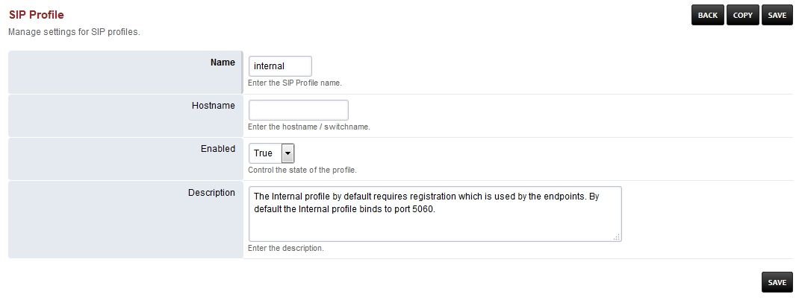

#######################
Internal Sip Profile
#######################

*  **Hostname-** Should be left blank and is for advanced use.

+--------------------------+-------------------------+-----------+--------------------------------------------------------------+
|           Name           |         Value           |  Enabled  | Description                                                  |
+--------------------------+-------------------------+-----------+--------------------------------------------------------------+
| accept-blind-auth        | true                    |    False  |                                                              |
+--------------------------+-------------------------+-----------+--------------------------------------------------------------+
| accept-blind-reg         | true                    |    False  |                                                              |
+--------------------------+-------------------------+-----------+--------------------------------------------------------------+
| aggressive-nat-detection | true                    |    True   |                                                              |
+--------------------------+-------------------------+-----------+--------------------------------------------------------------+
| alias                    | sip:10.0.1.251:5555     |    False  |                                                              |
+--------------------------+-------------------------+-----------+--------------------------------------------------------------+
| apply-inbound-acl	   |       domains           |    True   |                                                              |
+--------------------------+-------------------------+-----------+--------------------------------------------------------------+
|  apply-nat-acl           |      nat.auto           |    True   |                                                              |
+--------------------------+-------------------------+-----------+--------------------------------------------------------------+
|  apply-register-acl	   |    domains              |    False  |                                                              |
+--------------------------+-------------------------+-----------+--------------------------------------------------------------+
|  auth-all-packets	   |    false                |    True   |                                                              |
+--------------------------+-------------------------+-----------+--------------------------------------------------------------+
|  auth-calls	           | $${internal_auth_calls} |    True   |                                                              |
+--------------------------+-------------------------+-----------+--------------------------------------------------------------+
|  auto-jitterbuffer-msec  |   60                    |    False  |                                                              |
+--------------------------+-------------------------+-----------+--------------------------------------------------------------+
|  auto-rtp-bugs           |                         |    False  |                                                              |
+--------------------------+-------------------------+-----------+--------------------------------------------------------------+
|  bind-params             | transport=udp           |    False  |                                                              |
+--------------------------+-------------------------+-----------+--------------------------------------------------------------+
|  bitpacking	           |   aal2                  |    False  |                                                              |
+--------------------------+-------------------------+-----------+--------------------------------------------------------------+
|  caller-id-type          |   rpid                  |  False    |                                                              |
+--------------------------+-------------------------+-----------+--------------------------------------------------------------+
|  caller-id-type	   |    pid                  |  False    |                                                              |
+--------------------------+-------------------------+-----------+--------------------------------------------------------------+
|  caller-id-type	   |   none                  |  False    |                                                              |
+--------------------------+-------------------------+-----------+--------------------------------------------------------------+
| challenge-realm	   |   auto_to               |  True     |                                                              |
+--------------------------+-------------------------+-----------+--------------------------------------------------------------+
|  cid-in-1xx              |   false                 |  False    |                                                              |
+--------------------------+-------------------------+-----------+--------------------------------------------------------------+
|  context                 |   public                |  True     |                                                              |
+--------------------------+-------------------------+-----------+--------------------------------------------------------------+
|  dbname                  |   share_presence        | False     |                                                              |
+--------------------------+-------------------------+-----------+--------------------------------------------------------------+
|  debug                   |         0               | True      |                                                              |
+--------------------------+-------------------------+-----------+--------------------------------------------------------------+
| delete-subs-on-register  |         false           | False     |                                                              |
+--------------------------+-------------------------+-----------+--------------------------------------------------------------+
|  dialplan                |         XML             | True      |                                                              |
+--------------------------+-------------------------+-----------+--------------------------------------------------------------+
|  disable-naptr           |       false             | False     |                                                              |
+--------------------------+-------------------------+-----------+--------------------------------------------------------------+
|  disable-register        |      true               | False     |                                                              |
+--------------------------+-------------------------+-----------+--------------------------------------------------------------+
|  disable-rtp-auto-adjust |       true              | False     |                                                              |
+--------------------------+-------------------------+-----------+--------------------------------------------------------------+
|  disable-srv             |      false              | False     |                                                              |
+--------------------------+-------------------------+-----------+--------------------------------------------------------------+
|  disable-srv503          |      true               | False     |                                                              |
+--------------------------+-------------------------+-----------+--------------------------------------------------------------+
|  disable-transcoding     |      true               | False     |                                                              |
+--------------------------+-------------------------+-----------+--------------------------------------------------------------+
|  disable-transfer        |      true               | False     |                                                              |
+--------------------------+-------------------------+-----------+--------------------------------------------------------------+
|  dtmf-duration           |      2000               | True      |                                                              |
+--------------------------+-------------------------+-----------+--------------------------------------------------------------+
|  dtmf-type               |    rfc2833              | True      |                                                              |
+--------------------------+-------------------------+-----------+--------------------------------------------------------------+
| enable-100rel            |     true                |  False    |                                                              |
+--------------------------+-------------------------+-----------+--------------------------------------------------------------+
| enable-3pcc              |     true                | False     |                                                              |
+--------------------------+-------------------------+-----------+--------------------------------------------------------------+
| enable-compact-headers   |     true                | False     |                                                              |
+--------------------------+-------------------------+-----------+--------------------------------------------------------------+
|  enable-timer            |     false               | False     |                                                              |
+--------------------------+-------------------------+-----------+--------------------------------------------------------------+
|  extended-info-parsing   |    true                 | False     |                                                              |
+--------------------------+-------------------------+-----------+--------------------------------------------------------------+
|  ext-rtp-ip              | $${external_rtp_ip}     | True      |                                                              |
+--------------------------+-------------------------+-----------+--------------------------------------------------------------+
|  ext-sip-ip              |  $${external_rtp_ip}    |  True     |                                                              |
+--------------------------+-------------------------+-----------+--------------------------------------------------------------+
| force-register-db-domain |   $${domain}            |  False    |                                                              |
+--------------------------+-------------------------+-----------+--------------------------------------------------------------+
| force-register-domain    |  $${domain}             |  False    |                                                              |
+--------------------------+-------------------------+-----------+--------------------------------------------------------------+
|force-subscription-domain |  $${domain}             |   False   |                                                              |
+--------------------------+-------------------------+-----------+--------------------------------------------------------------+
|force-subscription-expires|   60                    | False     |                                                              |
+--------------------------+-------------------------+-----------+--------------------------------------------------------------+
|forward-unsolicited-mwi-notify  false               | True      |                                                              |
+--------------------------+-------------------------+-----------+--------------------------------------------------------------+
|  hold-music              |  $${hold_music}         |  True     |                                                              |
+--------------------------+-------------------------+-----------+--------------------------------------------------------------+
| inbound-bypass-media     |  true                   |  False    |                                                              |
+--------------------------+-------------------------+-----------+--------------------------------------------------------------+
| inbound-codec-negotiation|  generous               |  True     |                                                              |
+--------------------------+-------------------------+-----------+--------------------------------------------------------------+
|inbound-codec-prefs       |  $${global_codec_prefs} |  True     |                                                              |
+--------------------------+-------------------------+-----------+--------------------------------------------------------------+
|inbound-late-negotiation  |  true                   |   False   |                                                              |
+--------------------------+-------------------------+-----------+--------------------------------------------------------------+
|inbound-proxy-media       |  true                   |   False   |                                                              |
+--------------------------+-------------------------+-----------+--------------------------------------------------------------+
|inbound-reg-force-matching-username    true         |   True    |                                                              |
+--------------------------+-------------------------+-----------+--------------------------------------------------------------+
|liberal-dtmf              |  true                   |   False   |                                                              |
+--------------------------+-------------------------+-----------+--------------------------------------------------------------+
|local-network-acl         |  localnet.auto          |   True    |                                                              |
+--------------------------+-------------------------+-----------+--------------------------------------------------------------+
|log-auth-failures         |  true                   |   True    |                                                              |
+--------------------------+-------------------------+-----------+--------------------------------------------------------------+
|manage-presence           |  true                   |   True    |                                                              |
+--------------------------+-------------------------+-----------+--------------------------------------------------------------+
|manage-shared-appearance  |  true                   |   True    |                                                              |
+--------------------------+-------------------------+-----------+--------------------------------------------------------------+
|manual-redirect           |  true                   |   False   |                                                              |
+--------------------------+-------------------------+-----------+--------------------------------------------------------------+
|max-proceeding            |  1000                   |   False   |                                                              |
+--------------------------+-------------------------+-----------+--------------------------------------------------------------+
|media-option              |bypass-media-after-att-xfer  False   |                                                              |
+--------------------------+-------------------------+-----------+--------------------------------------------------------------+
|media-option              |resume-media-on-hold     |   False   |                                                              |
+--------------------------+-------------------------+-----------+--------------------------------------------------------------+
|minimum-session-expires   |  120                    |   False   |                                                              |
+--------------------------+-------------------------+-----------+--------------------------------------------------------------+
|multiple-registrations    |  contact                |   False   | Enables registrations on multiple endpoints                  |
+--------------------------+-------------------------+-----------+--------------------------------------------------------------+
|nat-options-ping          |  true                   |   False   |                                                              |
+--------------------------+-------------------------+-----------+--------------------------------------------------------------+
|NDLB-broken-auth-hash     |  true                   |   False   |                                                              |
+--------------------------+-------------------------+-----------+--------------------------------------------------------------+
|NDLB-force-rport          |  safe                   |   True    | Enables rport                                                |
+--------------------------+-------------------------+-----------+--------------------------------------------------------------+
|NDLB-received-in-nat-reg-contact      true          |   False   |                                                              |
+--------------------------+-------------------------+-----------+--------------------------------------------------------------+
|nonce-ttl                 |  60                     |   True    |                                                              |
+--------------------------+-------------------------+-----------+--------------------------------------------------------------+
|odbc-dsn                  |  $${dsn}                |   False   |                                                              |
+--------------------------+-------------------------+-----------+--------------------------------------------------------------+
|outbound-codec-prefs      |  $${global_codec_prefs} |   True    |                                                              |
+--------------------------+-------------------------+-----------+--------------------------------------------------------------+
|pass-callee-id            |  false                  |   False   |                                                              |
+--------------------------+-------------------------+-----------+--------------------------------------------------------------+

  	
