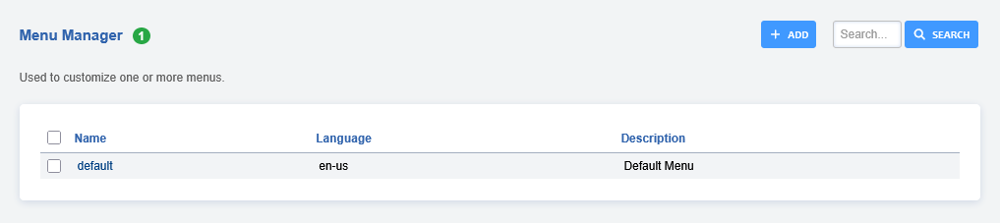

# Menu Manager

Used to customize one or more menus.

:::(note)   
Make sure you mark any customized menu items as protected. Running App Defaults    
on the upgrade page, all unprotected items will be reset to their default values.   
:::   

## Menu Icons

You can change the menu icon by first selecting the menu item you wish to customize,   
in this example we'll be changing the **Applications** icon.

You will see a setting for **Icon** and **Icon color**. You can then open the dropdown   
list or select the icon on the right to open the grid list.

Once you've made a selcection, hit save and reload.
