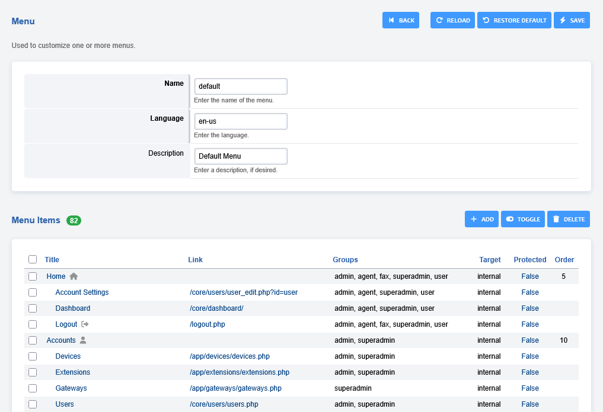

# Menu Manager

Used to customize one or more menus.

:::(note)   

:::   

## Menu Icons

You can change the menu icon by first selecting the menu item you wish to customize,   
from here you will see a dropdown list under "**Icon**".

