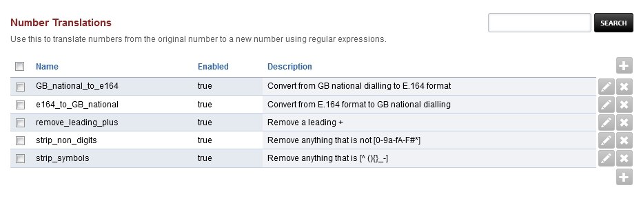

####################
Number Translations
####################

Use this to translate numbers from the original number to a new number using regular expressions.

Activating mod-translate:
 * Install the package "freeswitch-mod-translate". If using Debian Package then use the following command "apt install freeswitch-mod-translate"
 * Configure the module to your likes via the GUI: Advanced -> Number Translations. 
 * Activate the module in FusionPBX Advanced -> Modules in the Applications section

The documentation for mod-translate can be found under https://freeswitch.org/confluence/display/FREESWITCH/mod_translate

To use mod-translate to modify inbound calls before they hit the dialplan the following setting for the SIP-profile must be modified:
  dialplan "XML" -> dialplan "Translate,XML"
  
  With FreeSwitch 1.8.x it is now possible to specify the translation profile to be used:
  dialplan "XML" -> dialplan "Translate:my_profile1,XML"
  
To activate this setting, the SIP-profile needs to be restarted and the cache flushed.
