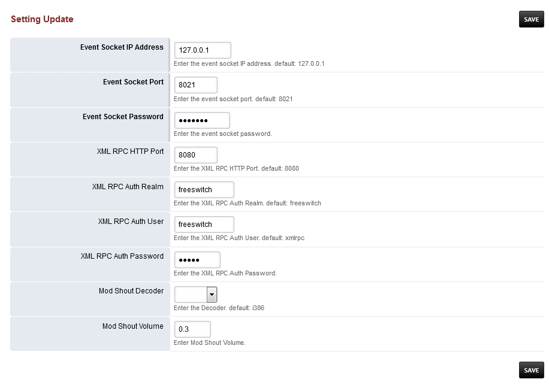

###################
Settings
###################

Switch settings for event socket ip address, event socket port, event socket password, xml rpc http port, xml rpc auth realm, xml rpc auth user, xml rpc auth password, mod shout decoder, and mod shout volume.

