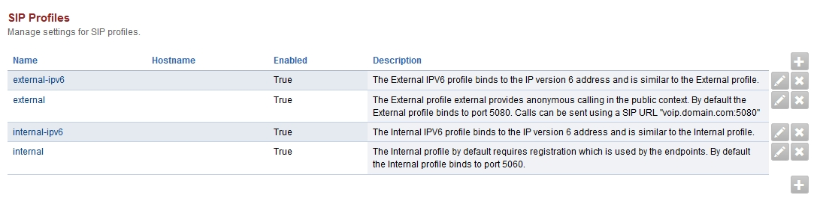

################
Sip Profiles
################

*  Advanced -> SIP Profiles

Internal
=========

Internal sip profiles (port 5060/5061) require registration or access controls cidr rang to allow the IP address in without SIP authentication.

External
=========

External sip profiles (port 5080-5081) allow anonymous connection to FusionPBX but is often targeted by lame spammers.

