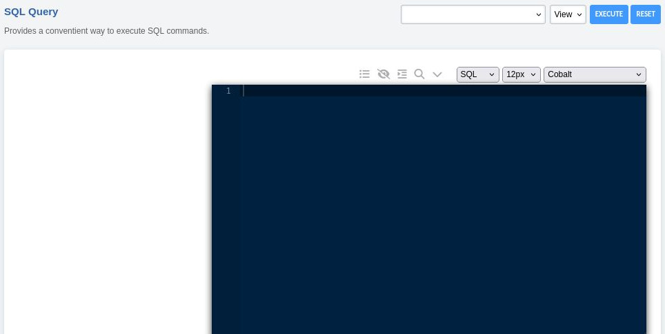

##########
SQL Query
##########

The SQL Query tool is an optional feature that can run SQL commands, show the contents of the database, and set the type to view results in the browser CSV, or SQL.

Install
--------

::

 cd /var/www/fusionpbx/app
 git clone https://github.com/fusionpbx/fusionpbx-app-sql_query.git sql_query
 chown -R www-data:www-data /var/www/fusionpbx/app/sql_query
 php /var/www/fusionpbx/core/upgrade/upgrade.php

- Run Advanced > Upgrade > Menu Defaults
- Run Advanced > Upgrade > Permission Defaults
- Log out and then Log back in

Upgrade
--------

::

 cd /var/www/fusionpbx/app/sql_query
 git pull
