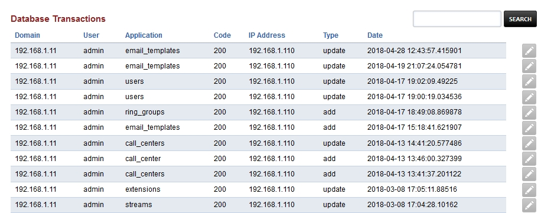

###################
Transactions
###################

A list of databse changes (transactions) made by all users while logged into FusionPBX.  Changes include domain, user, application changed, web response code, ip address user was logged into at the time, type of change, and date change was made.  Click the edit pencil icon to view more details.

