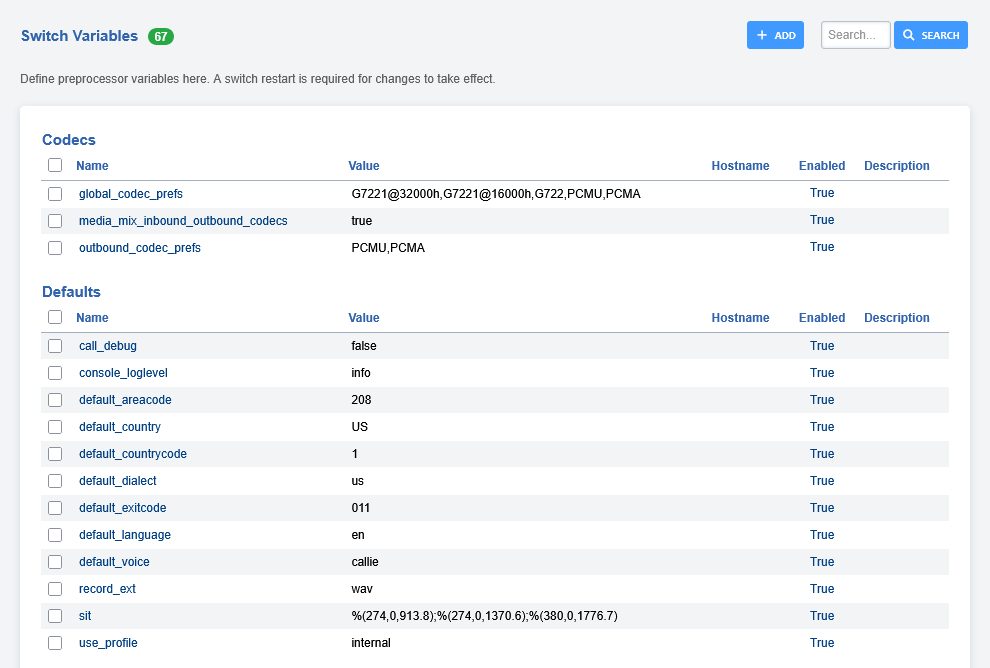

# Variables

Define preprocessor switch variables here.

List of all variable categories.

- Codecs
- Defaults
- IP Address
- Music on Hold
- Ringtones
- Security
- Sip
- Sip Profile:External
- Sip Profile:Internal
- Sound
- Tones
- Xmpp
