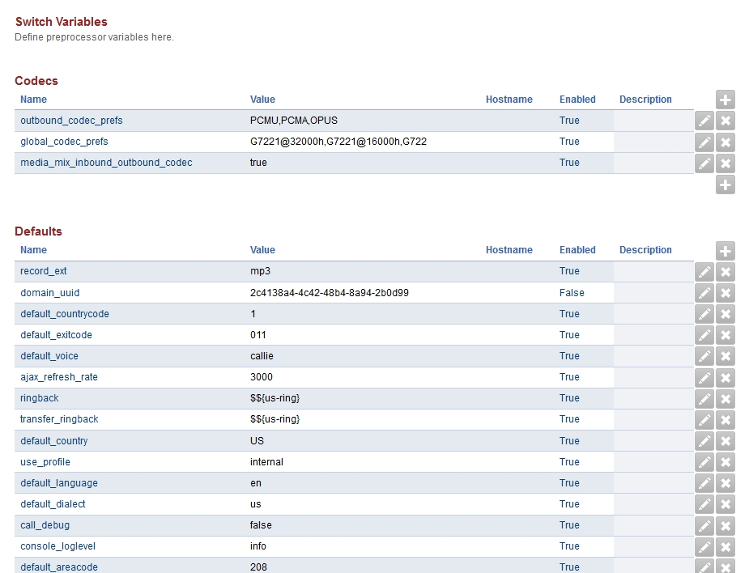

###################
Variables
###################

Define preprocessor switch variables here.

Variables have several different categories.

Codecs
^^^^^^^^^

Defaults
^^^^^^^^^^^

IP Address
^^^^^^^^^^^^

Music on Hold
^^^^^^^^^^^^^^^^

Ringtones
^^^^^^^^^^^^

Sip
^^^^^^^^

Sip Profile:External
^^^^^^^^^^^^^^^^^^^^^^
external_ssl_enable:    true

external_sip_port:      5080

external_ssl_dir:       $${conf_dir}/tls

external_tls_port:      5081

Sip Profile:Internal
^^^^^^^^^^^^^^^^^^^^^^
internal_sip_port:	5060

internal_ssl_dir:	$${conf_dir}/tls

internal_ssl_enable:	false

internal_tls_port:      5061

Sound
^^^^^^^^

Tones
^^^^^^^^

Xmpp
^^^^^^^^^

