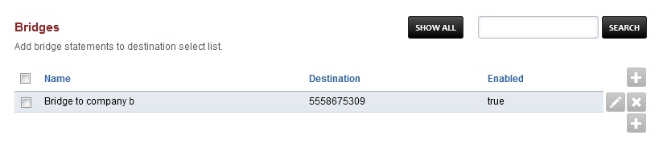

##########
Bridges
##########

Bridge statements are used to send calls directly to other destinations like another PBX, Carrier or External SIP to TDM Gateway and more. The bridge statements are added to destination select list.

* Click the Plus icon to add a bridge
* Click the edit icon on the right to edit a bridge
* Click the X to delete a bridge

Bridge Examples
^^^^^^^^^^^^^^^^^

Bridges are how ring groups are made.  The code in FusionPBX simplifys that for you.  You can however manually do what ring groups do and with bridges.

**Bridge Statement advanced options**

* For multiple destinations. Multiple destinations are allowed as long as you use a  ,  |  or  :_:
::

 Comma , Means simultaneous
 Pipe |  Means In a sequence
 colon under score colon  :_: Means Enterprise

**Loopback to an external number**

::

 loopback/12085551234
 
**Loopback to multiple external numbers simultaneously**

::

 loopback/12085551234,loopback/12085552222,loopback/12085553333
 
**To another sip server, sip gateway, or another carrier**

::

 sofia/internal/$1@xxx.xxx.xxx.xxx:5060

**To a user**

::

 user/1001
 or
 sofia_contact(*/501@example.fusionpbx.com)

**Using LCR**

::

 lcr/12085551234
 
**Using variables**

::

 {abc=123}sofia/internal/$1@xxx.xxx.xxx.xxx:5060
 
**Using variables in sequence with a sip server**

::

 {abc=123}sofia/internal/$1@xxx.xxx.xxx.xxx:5060|sofia/internal/$1@xxx.xxx.xxx.xxx:5060
 

**Using variables in sequence with a sip server**

::

 [server=d1]sofia/internal/$1@xxx.xxx.xxx.xxx:5060|[server=d2]sofia/internal/$1@xxx.xxx.xxx.xxx:5060 

