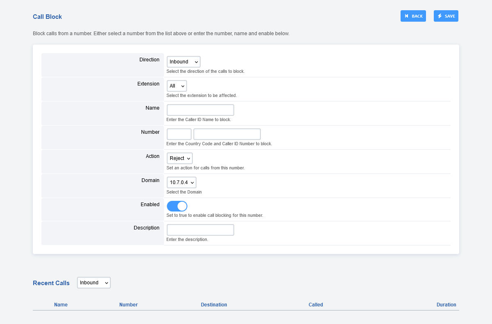

# Call block

The Call Block application can be used to block *inbound* or *outbound*
calls, based on the Caller ID Name and/or Number (for inbound calls), or
the Destination Number (for outbound calls).

**Creating a New Call Block**

To create a new Call Block, click the **Add** button at the top-right of
the Call Block list page. A simple form will be presented\...

**Field Descriptions**

**Direction** - Select the direction of the calls you wish to block
(*Inbound* or *Outbound*)

**Extension** - Select which extension (if any) the Call Block should
affect.

**Name** - Enter the Caller ID Name that should be blocked. (Note: An
**exact, case-sensitive** match is necessary, but this field can be
considered optional if a Number is specified.)

**Number** - Enter the Country Code (eg. US = \'1\') and the number to
block. For *Inbound* calls, enter the calling party\'s number. For
*Outbound* calls, enter the Destination Number. (Note: An *exact match*
is necessary, but this field can be considered optional if a Number is
specified.)

**Action** - The action to take if the Name and/or Number is matched:
Reject the call, play a busy signal, transfer to a specific extension,
or voicemail box, etc.

**Enabled** - True or False

**Description** - The reason for blocking the number (? - you decide ;).

*Note: Call Blocks can also be added in bulk using the Recent Calls list
below the form.*

**Outbound Call Blocking**

Outbound call blocking requires an additional dialplan entry.

If one doesn\'t exist already, add a new **call-direction** Outbound
Route to set `call_direction=outbound`.

**Be sure to set \*Continue\* to True, or dialplan execution will never
reach your existing Outbound Routes!**

*Note: The screen capture example above could be for 10-digit numbers,
such as those in the U.S, so you may want to adjust the regular
expression used to match the destination number format being used in
your current Outbound Routes.*

## Troubleshooting

Its usually sufficient to add the Number (Caller ID Number) to block and
leave the Name (Caller ID Name) empty.

------------------------------------------------------------------------
