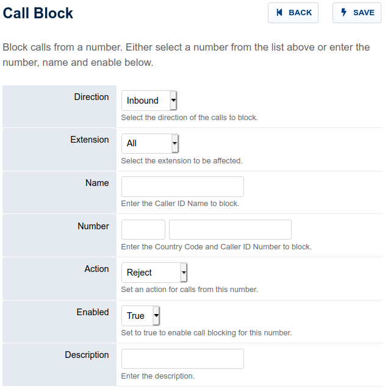

##############
Call block
##############

A list of numbers from which to block calls.

.. image:: ../_static/images/fusionpbx_call_block1.jpg
        :scale: 85%

*  To block a call click on the **plus** icon on the right
*  Fill out the fields with pertinent information
|   Action:
|   **Reject-** Will reject the call
|   **Busy-** Will send a busy signal
|   **Hold-** Will put the call on hold
|   **Voicemail-** Will send the call to the specified voicemail box
|

**Enhanced call-blocking introduced in Master branch 2.5.0:**
Call-blocking does an exact match on the inbound caller-id number by default. 
This behaviour can be changed to use SQL "like" comparison or regex based comparison by adding the following variable to the Default Settings:

