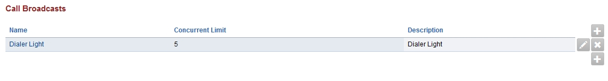
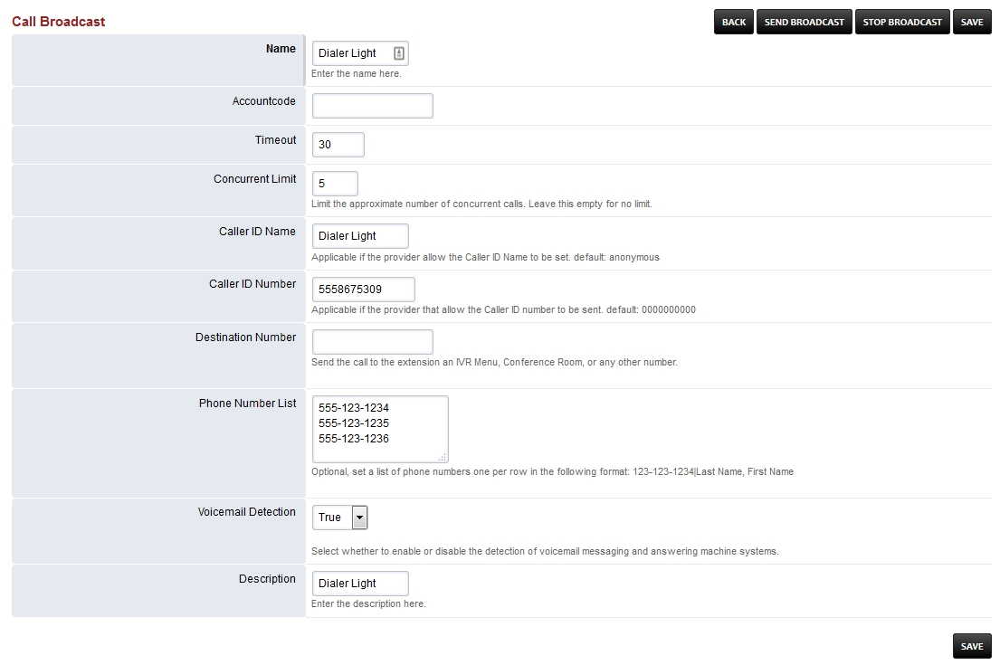

####################
Call Broadcast
####################

Broadcast calls (a light dialer) to a defined list of phone numbers.

*  To create a call broadcast click the **plus** on the right

Fill in the following fields

*  **Name-** Name for the Call Broadcast.

*  **Accountcode** Used by some billing systems.

*  **Timeout-**  Amount of time till hangup.

*  **Concurrent Limit-** Used to pace the calls calls if the timeout was 60 and the concurent
limit is 100 then we would schedule 100 calls every 60 seconds.

*  **Caller ID Name-** Name that will be used on outbound caller id.

*  **Caller ID Number-** Number that will be used on outbound caller id.

*  **Destination Number-**  This is the internal number to call. Send the call to an IVR Menu or
some other number. If sending to a conference room make sure the room
has a pin number or something that requires user input you don't want to
add voiemail messages into the conference room.

::

 For example *9198

*  **Phone Number List-**  List of phone numbers to call in the call broadcast.
This is the external number to call. Set a list of phone numbers one per
row in the following format: 123-123-1234|Last Name, First Name

| ``5551231234|example 1``
| ``5551231234|example 2``
| ``5551231234|example 3``

*  **Voicemail Detection-** Set **True or false** to detect an answering machine.

*  **Description** Help organize and label what the call broadcast is for.

*  Once you have everything filled out click the **Call Broadcast name** you just created. On the top right click the **Send Broadcast** button to start the call broadcast.  To stop the call broadcast click **STOP BROADCAST** on the top right.

Uses `sched_api`_ to schedule an API call in the future. Is used to
schedule calls to the provided number/extensions and send them to the
extension an IVR Menu, Conference Room, or any other number. Could be
used among other things to schedule a Conference.

.. _sched_api: https://www.freeswitch.org/confluence/display/FREESWITCH/mod_commands
