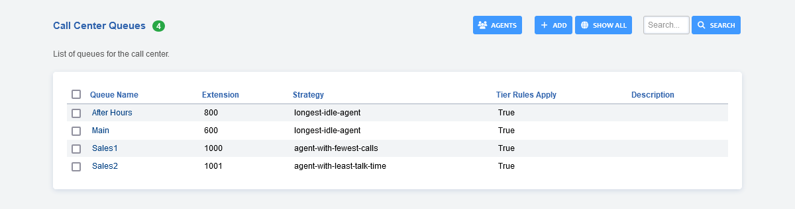
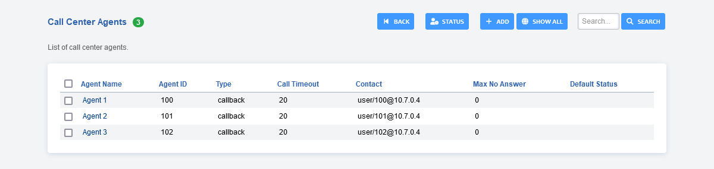
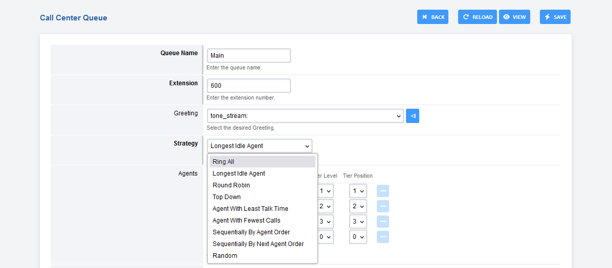

# Call Center Queues

List of queues for the call center.

-   To add a Call Center Queue, click the **Add** button in the top
    right

# Call Center Agents

List of call center agents.

-   From Apps \> Call Center click Agents at the top right to access
    Call Center Agents
-   Click the Add button on the top right to add agents (make sure to
    set Agent ID!)
-   Set the Agent Password, or add agent[authorized]{#authorized}=true
    to the dialplan for \*22 if you do not want to require a PIN to log
    in
-   If you want to enable Follow Me or Call Forwarding for an Agent, set
    the contact string to loopback/\<extension\>

# Call Center Agent Fields

-   **Agent Name:** Name of the agent. When adding agents to the Call
    Center, this is what you will see to describe the agent
-   **Type:** 2 types supported, callback and uuid-standby. callback
    will try to reach the agent via the contact fields value.
    uuid-standby will try to directly bridge the call using the agent
    uuid
-   **Call Timeout:** Time to ring the agent before deeming them
    unavailable
-   **Username:** Associate a system user with this call center agent
-   **Agent ID:** An ID that can be used to log the agent in and out of
    the call center
-   **Agent Password:** A password to log the agent into the call
    center. This is not used if you have added
    agent[authorized]{#authorized}=true to the dialplan for \*22
-   **Contact:** A dropdown to select which extension should be used to
    contact the agent
-   **Status:** The default status that the agent in the call center
-   **No Answer Delay Time:** The time the system will wait to attempt a
    call to the agent again if they did not answer within the Call
    Timeout
-   **Max No Answer:** Max attempts to call the agent. For example, when
    set to 1, if the agent does not answer within the first Call
    Timeout, they will not get another chance to answer the call. If set
    to 2, the agent will have two attempts to answer the call
-   **Wrap Up Time:** The amount of time between calls the agent will be
    allocated
-   **Reject Delay Time:** If an agent rejects a call manually then this
    is the time to wait before a call is offered to them
-   **Busy Delay Time:** If the agent is on Do Not Disturb, wait this
    defined time before trying him again

# Call Center Strategies

-   **Ring All:** All agents ring simultaneously.
-   **Longest Idle Agent:** The agent will ring who idles the longest
    depending on their tier level.
-   **Round Robin:** Will ring the next agent available in line.
-   **Top Down:** Agent rings in order starting from one.
-   **Ring Progressively:** Agents will ring the same as top-down and
    will progress until each agent ends up ringing.
-   **Agent With Least Talk Time:** Rings the Agent will ring that has
    the least time talking.
-   **Agent With Fewest Calls:** Agent will ring that has the least
    calls.
-   **Sequentially By Agent Order:** Agents will ring in a sequence by
    the tier and the tiers order.
-   **Sequentially By Next Agent Order:** Agents will ring in a sequence
    by the tier and the tiers order.
-   **Random:** Rings Agents will ring randomly in not particular order.

# Agents

Select agents from the drop down list and specify tier level and tier
position.

# Music On Hold

Select the desired hold music. Music on hold,
[streams](http://docs.fusionpbx.com/en/latest/applications/streams.html)
and ringtones can be used.

# Record

Save the recording

# Time base score

-   **Queue:** Caller in queue time will start. If the caller goes to
    another queue the time will start over.
-   **System:** Caller in queue will have their wait calculated as soon
    as they enter the system. If a caller chooses the wrong queue, when
    they get to the correct queue the timer won\'t start over again.

# Time base score - Seconds

This field is left blank by default which means the option will not be
added to the XML Dialplan. If you populate the field with a number then
the time base score will be set in the dialplan when entering the call
center. This can be used to prioritize one call center queue over
another.

**Example 1:** You may have two calls come into the system. Caller 1
entered before Caller 2. Caller 2 however has entered the \"VIP\" call
center queue. Freeswitch will deliver the call that has the longest
\"time base score\" to the agent. By setting the \"time base score -
seconds\" you can tell Freeswitch that Caller 2 has \"waited\" longer
that Caller 1 even if it isn\'t true. This will allow the \"VIP\" queue
to be answered first.

**Example 2:** Similar to the example above, you may want to prioritize
one queue over another however you may want a threshold at which the two
then become equal. For example, if Caller 1 is waiting for an agent more
than 5 minutes, their call should be equal in priority to Caller 2. In
this case, set the \"time base score - seconds\" of the \"VIP\" queue to
be 300 (5 min). This will mean that the \"VIP\" queue will get only a
5min head start on the regular queue.

# Max Wait Time

A value of 0 is the default and equals an infinate amount of time. Any
other numeric value is calculated in seconds.

# Max Wait Time with No Agent

Enter the max wait time with no agent. FusionPBX sets the default to 90
seconds and the **Timeout Action** will be used if there are no agents
available.

# Max Wait Time with No Agent Time Reached

Enter the max wait time with no agent. FusionPBX sets the default to 30
seconds and the **Timeout Action** will be used if there are no agents
available.

# Timeout Action

Set the action to perform when the max wait time is reached.

# Tier Rules Apply

-   **True:** Set the tier rule rules apply to true. The defined tiers
    will be used.
-   **False:** Set the tier rule rules apply to false. All tiers will be
    used.

# Tier Rule Wait Second

30 seconds is default. Enter the tier rule wait seconds.

# Tier Rule Wait Multiply Level

-   **True:** The amount of seconds the caller waits until the next
    tier. This value will increase(multiply) if **Tier Rule Wait
    Multiply Level** is marked true.
-   **False:** **Tier Rule Wait Multiply Level** is marked false then
    after the set amount of seconds pass the tiers in order will execute
    with no wait.

# Tier Rule No Agent No Wait

-   **True:** Setting is enabled.
-   **False:** Setting is disabled.

# Discard Abandoned After

Default is 900 seconds. Sets the discard abandonded after seconds.

# Abandoned Resume Allowed

-   **True:** Setting is enabled. Permits a call to resume their
    posistion in the queue but only in the amount of seconds set in
    **discard abandonded after** .
-   **False:** Setting is disabled.

# Caller ID Name Prefix

Set a prefix on the caller ID name.

# Announce Sound

A sound to play to a caller every announce sound seconds. Needs the full
path to the .wav file.

# Announce Frequency

How often the announce sound is played in seconds.

# Exit Key

Keys to quit the current queue waiting.

# Description

Enter a description to help organize and define what the queue is for.

# Agent Call Center Login

Agents can login to call center with \*22 from the phone or via the
FusionPBX web interface. Admin and Super Admin accounts can also log
other agents in or out.

-   Login then go to Status \> [Agent
    Status](http://docs.fusionpbx.com/en/latest/status/agent_status.html)

## [Call Center Default Settings](/en/latest/advanced/default_settings.html#id3)
