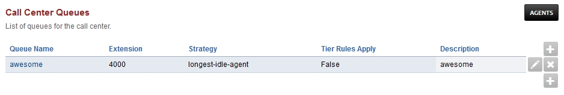
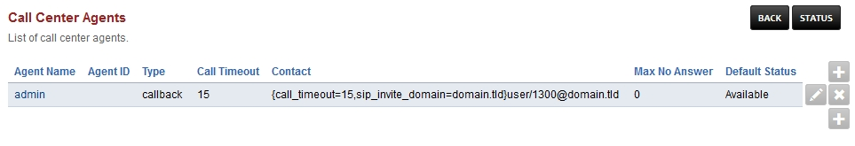

############
Call Center
############

List of queues for the call center.

Call Center Queues
=====================

*  To add a Call Center Queue **click** the plus edit icon on the right

*  Once a Queue is created click the edit pencil icon on the right.  At the top right you can view, stop, start, restart and save the queue

Call Center Strategies
=========================

.. image:: ../_static/images/call_center/fusionpbx_call_center_strategy.jpg
        :scale: 85%

| **agent-with-least-talk-time:**  Rings the Agent will ring that has the least time talking.
| **agent-with-fewest-calls:**  Agent will ring that has the least calls.
| **longest-idle-agent:**  The agent will ring who idles the longest depending on their tier level.
| **ring-all:**  All agents ring simultaneously.
| **random:**  Rings Agents will ring randomly in not particular order.
| **ring-progressively:**  Agents will ring the same as top-down and will progress until each agent ends up ringing.
| **round-robin:**  Will ring the next agent available in line.
| **sequentially-by-agent-order:**  Agents will ring in a sequence by the tier and the tiers order.
| **top-down:**  Agent rings in order starting from one.

Call Center Agents
====================

List of call center agents.

*  From Apps > Call Center click Agents at the top right to access Call Center Agents
*  Click the plus icon on the top right to add agents

