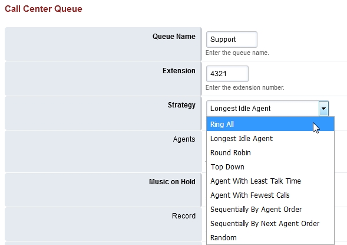

############
Call Center
############

List of queues for the call center.

.. image:: ../_static/images/fusionpbx_call_center1.jpg
        :scale: 85%

Call Center Queues
=====================

.. image:: ../_static/images/fusionpbx_call_center_queue.jpg
        :scale: 85%

*  To add a Call Center Queue **click** the plus edit icon on the right

*  Once a Queue is created click the edit pencil icon on the right.  At the top right you can view, stop, start, restart and save the queue

Call Center Strategies
=========================

 

* **Agent With Least Talk Time:**  Rings the Agent will ring that has the least time talking.
* **Agent With Fewest Calls:**  Agent will ring that has the least calls.
* **Longest Idle Agent:**  The agent will ring who idles the longest depending on their tier level.
* **Ring All:**  All agents ring simultaneously.
* **Random:**  Rings Agents will ring randomly in not particular order.
* **Ring Progressively:**  Agents will ring the same as top-down and will progress until each agent ends up ringing.
* **Round Robin:**  Will ring the next agent available in line.
* **Sequentially By Agent Order:**  Agents will ring in a sequence by the tier and the tiers order.
* **Top Down:**  Agent rings in order starting from one.

Time base score
=================

* **Queue:** Caller in queue time will start.  If the caller goes to another queue the time will start over.
* **System:** Caller in queue will have their wait calculated as soon as they enter the system.  If a caller chooses the wrong queue, when they get to the correct queue the timer won't start over again.

Call Center Agents
====================

List of call center agents.

.. image:: ../_static/images/fusionpbx_call_center_agents.jpg
        :scale: 85%

*  From Apps > Call Center click Agents at the top right to access Call Center Agents
*  Click the plus icon on the top right to add agents

Max Wait Time
==============

A value of 0 is the default and equals an infinate amount of time.  Any other numeric value is calculated in seconds.

Max Wait Time with No Agent
============================

Enter the max wait time with no agent. FusionPBX sets the default to 90 seconds and the **Timeout Action** will be used if there are no agents available. 

Max Wait Time with No Agent Time Reached
=========================================

Enter the max wait time with no agent. FusionPBX sets the default to 30 seconds and the **Timeout Action** will be used if there are no agents available.

Timeout Action
===============

Set the action to perform when the max wait time is reached.

Tier Rules Apply
=================

* **True:** Set the tier rule rules apply to true.  The defined tiers will be used.
* **False:** Set the tier rule rules apply to false.  All tiers will be used.

Tier Rule Wait Second
======================

* **True:** The ammount of seconds the caller waits until the next tier.  This value will increase(multiply) if **Tier Rule Wait Multiply Level** is marked true.
* **False:** **Tier Rule Wait Multiply Level** is marked false then after the set ammount of seconds pass the tiers in order will execute with no wait.
  

Agent Call Center Login
==================

Agents can login to call center with *22 from the phone or via the FusionPBX web interface.
