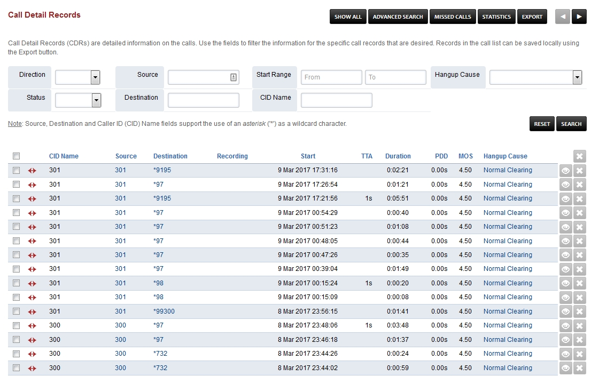

#########################
Call Detail Records
#########################

Call Detail Records (CDRs) are detailed information on the calls. Use the fields to filter the information for the specific call records that are desired. Records in the call list can be saved locally using the Export button. 




*  **CID Name** Caller ID Name
*  **Source** Where the call came from
*  **Destination** Where the call went to
*  **Recording** A link will appear if the call recorded
*  **Start** Time the call entered the system
*  **TTA** Time To Answer the call
*  **Duration** How long the call was
*  **PDD** Post Dial Delay
*  **MOS** Mean Opinion Score is a measure of voice call quality
*  **Hangup Cause** Details about the entire calls. Usually will be "Normal Clearing"

**Call Detail Records** are detailed information on the calls. The information contains
source, destination, duration, and other useful call details. Use the
fields to filter the information for the specific call records that are
desired. Then view the calls in the list or download them as comma
seperated file by using the **CSV** button.

Note that this page makes use of XML CDR for reporting.

Post Dial Delay (PDD)
~~~~~~~~~~~~~~~~~~~~~

Post Dial Delay (PDD) is experienced by the sender as the time from the
sending of the final dialed digit to the point at which the sender hears
ring tone or other in-band information. In other words, the PDD would be
the time from when the sender sends the INVITE to receiving the first
ringing response.

That said, PDD does not take into account the time it takes the receiver
to hear the call coming in due to the various factors on how they are
setup for inbound calls. For example, call forwarding may affect the
time it takes the receiver to know that someone is calling because of
call forwarding. The sender might hear a ring tone almost instantly from
the time it dials the final digit because they sent out an INVITE, but
the receiver of the call might have setup inbound calls to be forwarded
to their cell phone, in which now the call must travel through their
phone system, to their phone system's gateway carrier to deliver the
sender's call to the receiver's cell phone carrier network in order for
the cell phone carrier to deliver the sender's call to the receiver's
cell phone.

Recordings
~~~~~~~~~~

Any calls which have the entry in the name column underlined (ie. the
name is a link) have a recording available. Clicking on the name will
playback the recording in a new window. In such cases the number entry
will also be a link - clicking on this link will download the recording
to your computer as a wav file.

Possible issues
~~~~~~~~~~~~~~~

No records showing up under Apps-Call Detail Records
^^^^^^^^^^^^^^^^^^^^^^^^^^^^^^^^^^^^^^^^^^^^^^^^^^^^

Possible causes:

**1. The module is disabled**

- Make sure the XML CDR module is enabled and running in the Menu -> Advanced -> Modules.

**2. Wrong xml_cdr.conf.xml config**

- check <param name="url" value="http://127.0.0.1/app/xml_cdr/v_xml_cdr_import.php"/> and adapt it to your situation.

* Compare your version (advanced-script editor-files-autoload_configs-xml_cdr.conf.xml) with the current default one that is included in FusionPBX (advanced-php editor-files-includes-templates-conf-autoload_configs-xml_cdr.conf.xml). If it is different copy the default one over yours.
* Then edit the line <param name="url" value="http://{v_domain}/mod/xml_cdr/v_xml_cdr_import.php"/> and replace {v_domain} with the domain or IP address of your FusionPBX server.
* Then edit the line <param name="cred" value="{v_user}:{v_pass}"/> and replace {v_user} with a complex name of upper and lowercase and numeric characters so it is really ugly and secure, and do the same for v_pass.
* Make each of them completely unique.
* Be aware that these don't have to match anything else on your server at all.  This is because FusionPBX does something very simple but clever here.  The xml_cdr module uses this account when it does an http post to FusionPBX of the new data.  FusionPBX looks at the same xml_cdr.conf.xml file that the module uses in order to check if the module is using a valid account and password.  Since they both look at the same config file they are using the same account and password and will happily talk to each other!

Once you've made these changes you can save the file. You could restart your server, or you could reloadxml and then restart the xml_cdr module.  Either is ok, it is up to you. Then your changes will have taken effect and you should no longer lose your menu bar when looking at CDR information. 

XML CDR configuration
~~~~~~~~~~~~~~~~~~~~~

For more detailed configuration go to the XML editor (Menu -> Advanced -> XML Editor) and
in autoload configs look at xml_cdr.conf.xml

.. note::
       
 By default only the a-leg of the call is logged therefore if you make a recording of the b-leg you won't be able to retrieve it using the Call Detail Records.  If you want the b-leg as well you need to change log-b-leg=true in this config.

Harddrive space usage
~~~~~~~~~~~~~~~~~~~~~

.. note::

 XML CDR data adds up fast, therefore you may need to clear this data at some point in the future.  By default freeswitch keeps this in (source install) /usr/local/freeswitch/log/cdr-csv or (package install) /var/log/freeswitch/xml_cdr and inside that by year, month and day.  Recordings also take up space and have to be manually deleted if you want the space back these are kept in (source install) /usr/local/freeswitch/recordings/{Domian_Name} or (package install) /etc/freeswitch/recordings/{Domain Name} and inside that by year, month and day.


`CDR Default Settings`_
~~~~~~~~~~~~~~~~~~~~~~~~~~


.. _CDR Default Settings: /en/latest/advanced/default_settings.html#id4
.. _CDR: http://en.wikipedia.org/wiki/Call_detail_record
.. _```http://localhost/mod/xml_cdr/v_xml_cdr_import.php```: http://localhost/mod/xml_cdr/v_xml_cdr_import.php
