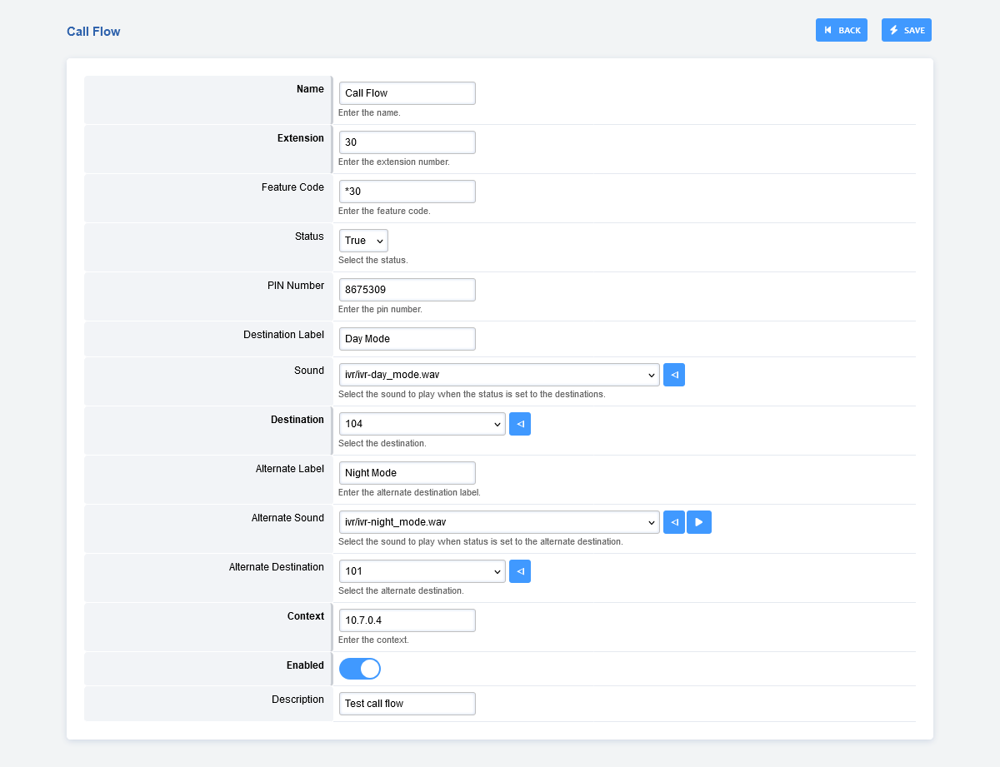

# Call Flows

Direct calls between two destinations by calling a feature code.

 

-   **Name:** Define the name of the call flow.
-   **Extension:** Define what extension to use. (This will make an
    extension not already created)
-   **Feature Code:** Define what \* number to use (must be entered to
    assign a BLF button to a call flow)
-   **Context:** Domain context (typically leave as is)
-   Status: Define what currently is in use.
-   Pin Number: Define a pin number in order to execute either mode.
-   **Destination:** Define where the call will go in the intial mode.
-   Sound: Define the sound that will play once mode is engaged.
-   Destination: Define what the destination will be.
-   Alternative Label: Label that will show when alternative mode is in
    use.
-   Alternative Sound: Define the sound that will play once alternative
    mode is engaged.
-   **Alternative Destination:** Define where the call will go in the
    alternative mode.
-   **Description:** Label what this call flow does.

 

### Call Flow Example

In the Call Flow example below we have the name as Call Flow. Make the
Extension number 30 that didn\'t exist until now. Create the feature
code as a *code with*30. Keep the context as-is with
[training.fusionpbx.com](https://fusionpbx.com/app/www/training_detail.php)
. Select a Status to show which mode. Make a PIN to help secure the call
flow. Make the detination label as Day Mode. Select a sound to
auditorially indicate which mode is activated. Choose a destination for
the alternative mode. Make the alternative detination label as Night
Mode. Select an alternative sound to auditorially indicate which mode is
activated. Choose a destination for the alternative mode. Finally, enter
a description to describe what this call flow does.

 

 

### Call Flow Button Control (BLF) 

Call Flows can be assigned to a button of a phone to give users easy
access to toggling it on and off. This requires a modification to the
`/etc/freeswitch/autoload_configs/lua.conf.xml` file.

Uncomment the
`<param name="startup-script" value="blf_subscribe.lua flow"/>` line.
and restart freeswitch.

Next, make sure that the Feature Code is programmed.

Finally, program a BLF button that has a value of `flow+*<featurecode>`.
For example, `flow+*7000`.
