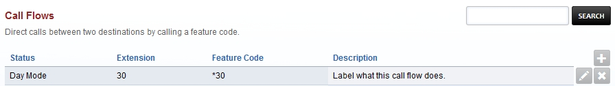
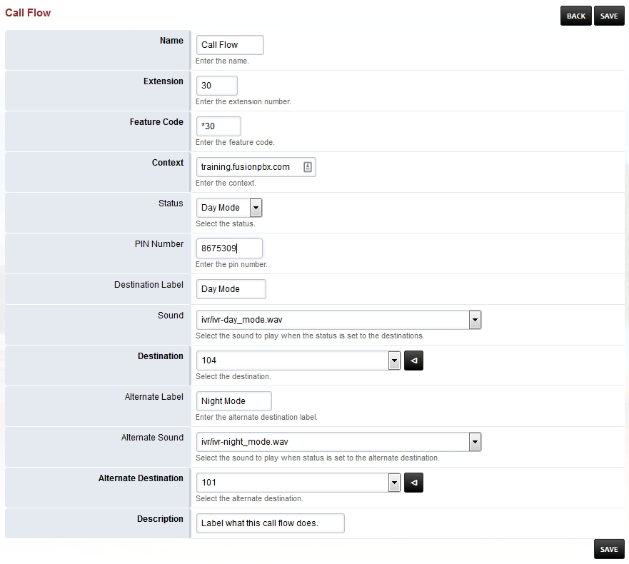

*****************
Call Flows
*****************

Direct calls between two destinations by calling a feature code.

|
|

*  **Name:** Define the name of the call flow.
*  **Extension:** Define what extension to use. (This will make an extension not already created)
*  **Feature Code:** Define what *  number to use
*  **Context:** Domain context (typically leave as is)
*  Status: Define what currently is in use.
*  Pin Number: Define a pin number in order to execute either mode.
*  **Destination:** Define where the call will go in the intial mode.
*  Sound: Define the sound that will play once mode is engaged.
*  Destination: Define what the destination will be.
*  Alternative Label: Label that will show when alternative mode is in use.
*  Alternative Sound: Define the sound that will play once alternative mode is engaged.
*  **Alternative Destination:** Define where the call will go in the alternative mode.
*  **Description:** Label what this call flow does.

|
|

Call Flow Example
^^^^^^^^^^^^^^^^^^

In the Call Flow example below we have the name as Call Flow.  Make the Extension number 30 that didn't exist until now. Create the feature code as a *code with *30.  Keep the context as-is with `training.fusionpbx.com`_ . Select a Status to show which mode. Make a PIN to help secure the call flow. Make the detination label as Day Mode. Select a sound to auditorially indicate which mode is activated. Choose a destination for the alternative mode. Make the alternative detination label as Night Mode. Select an alternative sound to auditorially indicate which mode is activated. Choose a destination for the alternative mode. Finally, enter a description to describe what this call flow does.

|
|

.. _training.fusionpbx.com: https://fusionpbx.com/app/www/training_detail.php
