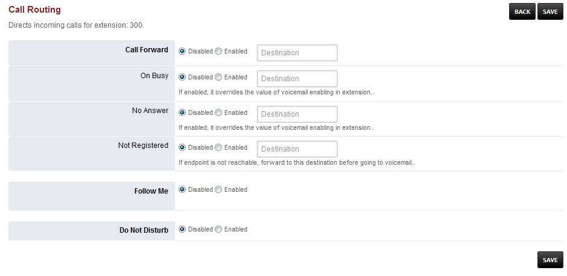

################
Call Routing
################

Directs incoming calls for the extension

*  To access call routing goto Accounts > click the edit pencil icon on the right of the extension

*  Click **CALL ROUTING** on the top right

Call Forward and Do No Disturb
^^^^^^^^^^^^^^^^^^^^^^^^^^^^^^^

This will allow phones to sync CFWD and DND over SIP.

A few things need to be configured to enable this feature and restart freeswitch:

Uncomment this line in lua.conf.xml.

::

 <hook event="PHONE_FEATURE_SUBSCRIBE" subclass="" script="app.lua feature_event"/>

Add to Default Settings:

::

 Category = device
 Subcategory = feature_sync
 Type = boolean
 Value = true

Enable Feature Sync on the Device
~~~~~~~~~~~~~~~~~~~~~~~~~~~~~~~~~~~~

* Yealink
  
  *  Web Interface -> Features -> General Information -> Feature Key Synchronization set to Enabled
  * Config Files -> features.feature_key_sync.enable
  * Might be addition settings needed for the latest firmware. I tested with 81.0.110

* Polycom
  
  * reg.{$row.line_number}.serverFeatureControl.cf="1"
  * reg.{$row.line_number}.serverFeatureControl.dnd="1"

* Cisco SPA
  
  * <Feature_Key_Sync_1_ group="Ext_1/Call_Feature_Settings">Yes</Feature_Key_Sync_1_>

