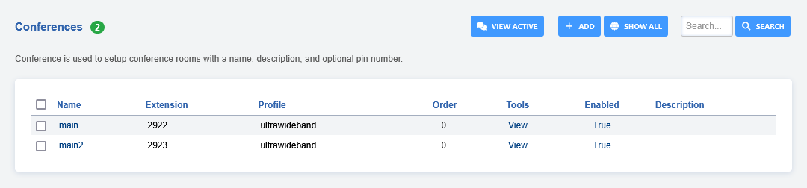
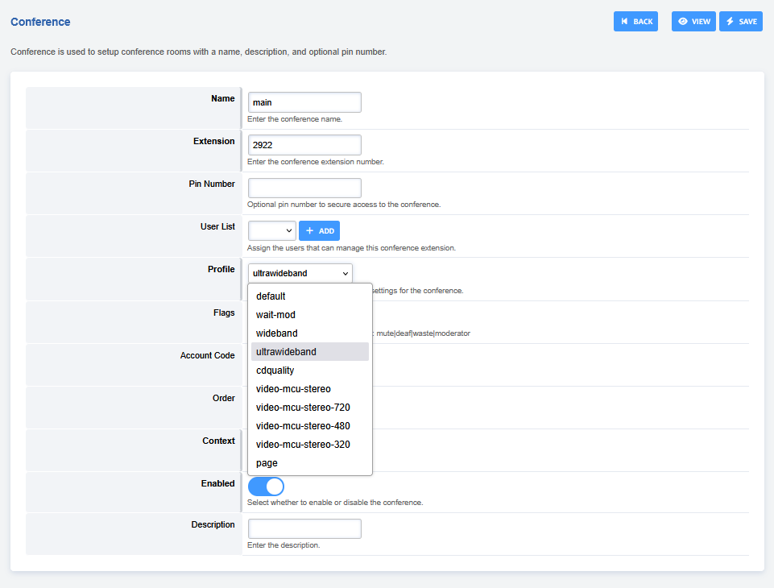
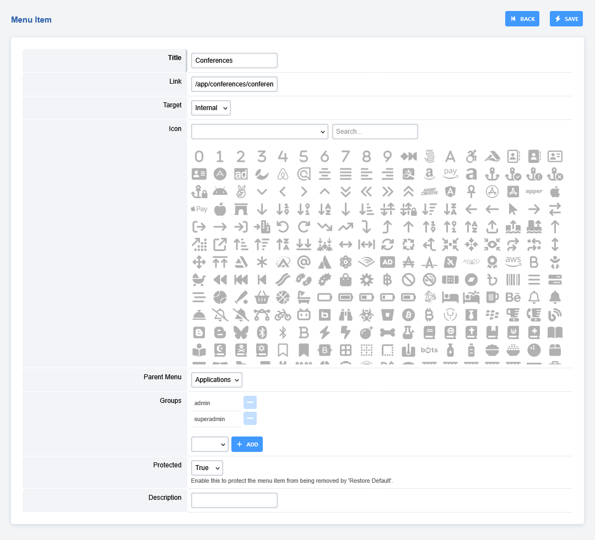

# Conference

Conferences is used to setup conference rooms with a name, description,
and optional pin number.

>**Note:** For advanced conferencing use Apps -\> Conference Center

## Conference Settings

-   **Name:** Name for the conference.

-   **Extension:** The number for the extension the user will dial.(Be
    sure it doesn\'t exist before creating it.)

-   **Pin Number:** If you want to add a layer of security to enter the
    conference.

-   **Profile:**

     -   Default- The default audio quality rate and video.
     -   wait-mod- Wait Mod setting.
     -   wideband- Wideband audio quality rate and video.
     -   ultra-wideband- Ultra wideband quality rate and video.
     -   cdquality- CD Quality rate and video.
     -   page- Page setting.

-   **Flags:** mute[\|deaf\|](##SUBST##|deaf|)waste\|moderator (Other
    values are available also)

-   **Order:** The order of the conference.

-   **Enabled:** If the conference is enabled.

-   **Description:** A way to organize what the conference purpose is.

## Enable Conferences

By default Conferences use to be hidden from the menu.

-   To add Conferences to the menu goto **Advanced \> Menu Manager** and
    click the pencil edit icon on the right
-   Then click the pencil edit icon on the right of **Conferences**

-   Select from the **Groups** dropdown list superadmin and click
    **add** then **save**
-   Custom icons can also be added to **Conferences** in the dropdown menu

