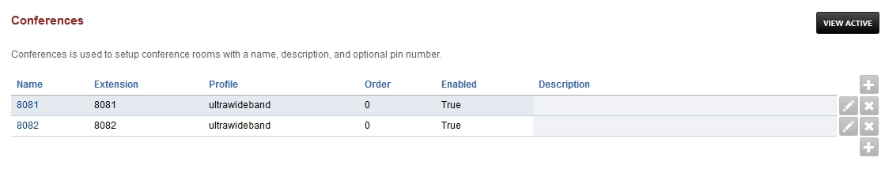
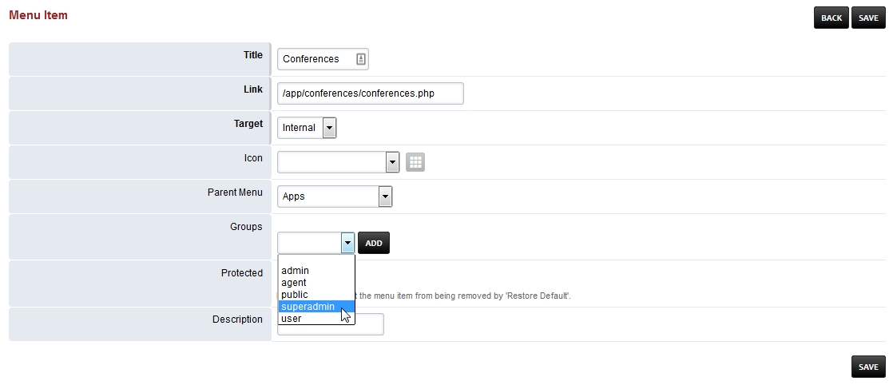

##############
Conference
##############

Conferences is used to setup conference rooms with a name, description, and optional pin number.

Enable Conference
==================

By default Conferences are hidden from the menu.

*  To add Conferences to the menu goto **Advanced > Menu Manager** and click the pencil edit icon on the right
*  Then click the pencil edit icon on the right of **Conferences**

*  Select from the **Groups** dropdown list superadmin and click **add** then **save**  

