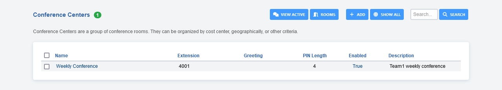
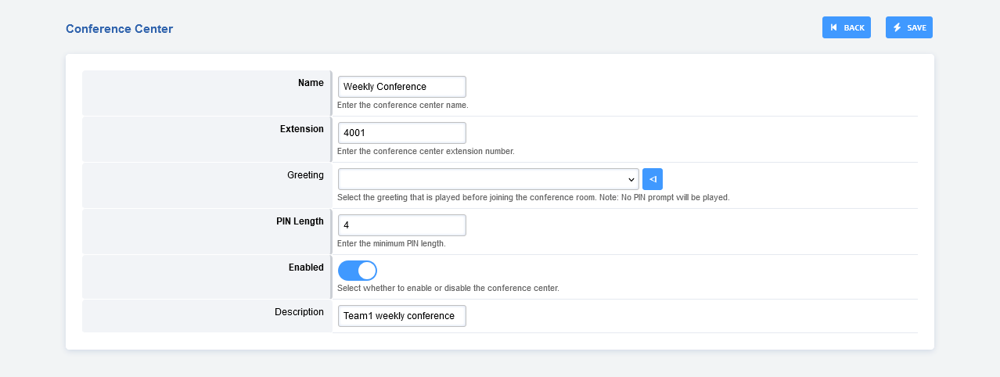
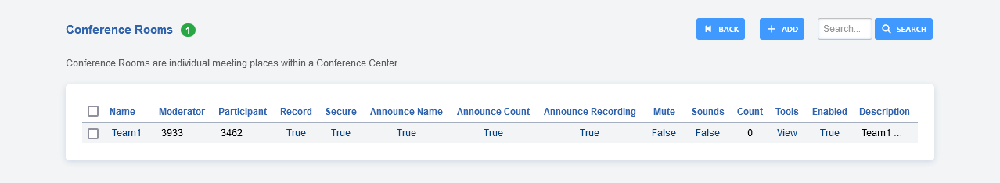
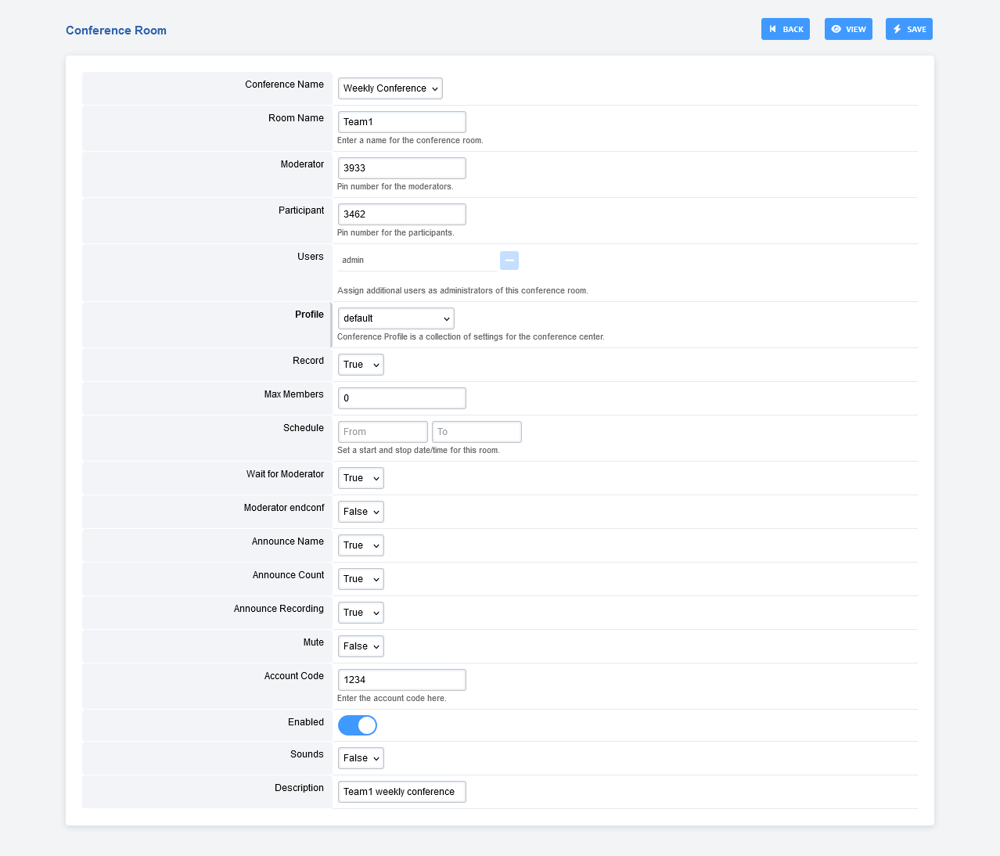

# Conference Center

Conference Centers are a group of conference rooms. They can be
organized by cost center, geographically, or other criteria.

-   To access the **Conference Center**, go to **Apps** > **Conference Center**
-   To view rooms click the **ROOMS** button at the top.

:::{note}    
For basic conferencing use Apps > Conferences.   
:::

## Conference Center Options

-   **Name:** Name of the Conference Center.
-   **Extension:** Extension of the Conference Center. (Be sure to not
    use an extension already in use)
-   **Greeting:** Choose a greeting to play.
-   **PIN Length:** Add a layer of security for entering the Conference
    Center.
-   **Enabled:** Enable or disable the Conference Center.
-   **Description:** A way to organize what the Conference Center is
    for.

## Conference Center Rooms

**Apps** > **Conference Center** > Click **Rooms** at the top right. This will
take you to the **Conference Center Rooms**. 

From here you can create or edit a room.

### Conference Center Rooms Settings

